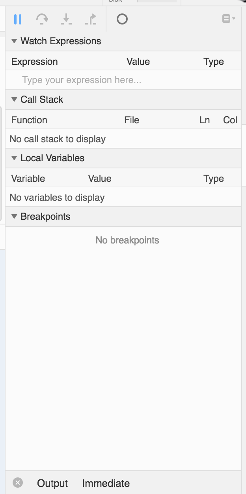
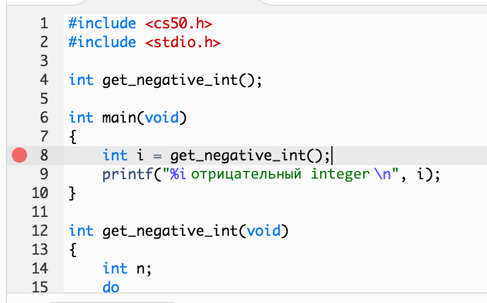
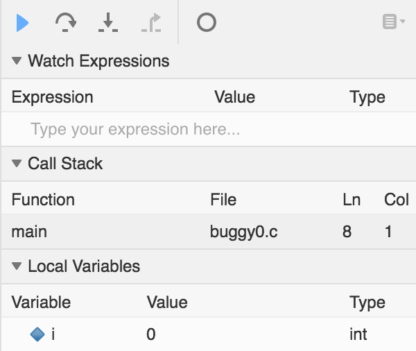
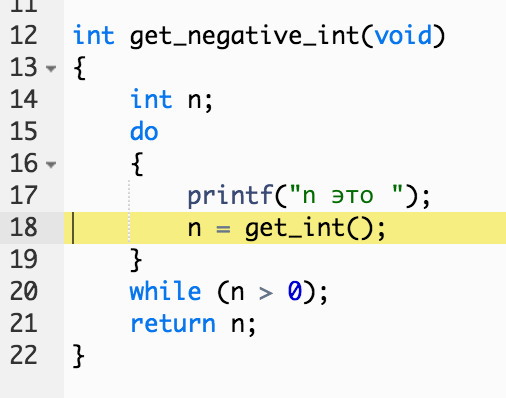

# Лекция 2

## В Прошлый Раз

Мы познакомились с программированием используя Scratch и на позапрошлой неделе немного изучили Си.

Наша первая, не очень сложная программа, выводила на экран `hello, world`:
```c
#include <stdio.h>

int main(void)
{
    printf("hello, world\n");
}
```
В действительности тут задействовано много "магии" (кота Вжух), но для нас было важно, чтобы вы в первую очередь освоили основные концепции программирования, поэтому мы и начали со Scratch'a.

Синтаксис - это основной источник боли и семейных недопониманий между человеком и его не до конца любимым языком программирования, поэтому давайте поговорим о том, как решать проблемы (в нашем случае программные, а не семейные).

Мы также научились пользоваться CS50 IDE (Среда Разработки).

Охватили такие концепции как:

* функции

* циклы

* переменные

* Булево выражения

* условия

Познакомились с функцией Си `printf` - его аналогом в Scratch выступил фиолетовый блок `сказать`.

Мы поняли, как добавлять библиотеку CS50 с ее удобными функциями:

* `get_char`

* `get_double`

* `get_float`

* `get_int`

* `get_long_long`

* `get_string`

* …​

Типы данных:

* `bool`

* `char`

* `double`

* `float`

* `int`

* `long long`

* `string`

* …​

Также мы узнали об ограниченности компьютерного вычисления, как например **integer overflow** (переполнение целого числа) или **float imprecision** (неточность десятичных дробных чисел), которые могут нанести ущерб, в некоторых случаях даже человеческому здоровью.

## Дебаггинг (поиск ошибок)

Обычно ошибки любят выдавать наши компиляторы `make` или `clang`. Давайте намеренно допустим ошибку:
```c
int main(void)
{
    printf("hello, world\n");
}
```
При попытке компиляции мы получим следующую ошибку:
```
~/workspace/ $ make buggy0

clang -ggdb3 -O0 -std=c11 -Wall -Werror -Wshadow    buggy0.c  -lcs50 -lm -o buggy0

buggy0.c:3:5: error: implicitly declaring library function 'printf' with type 'int (const char *, ...)' [-Werror]

    printf("hello, world\n");

    ^

buggy0.c:3:5: note: include the header <stdio.h> or explicitly provide a declaration for 'printf'

1 error generated.

make: *** [buggy0] Error 1
```
Первая строчка под нашей командой, начинающаяся со слова `clang`, не указывает на ошибку - это просто `make` делает свою работу.

Двигаемся дальше. Следующая строка говорит нам, что в 3 строке, начиная с 5 символа в файле `buggy0.c` присутствует ошибка. Она указывает, что мы объявляем библиотечную функцию 'printf' (`implicitly declaring a library function 'printf'`) и совсем необязательно, чтобы мы понимали каждую часть этого сообщения, но мы можем догадываться, что обозначают некоторые ее участки. Объявить функцию - это все равно, что упомянуть ее или сказать, что она есть. Вспомните, что в прошлый раз, перед тем как мы могли бы использовать функцию, нам нужно было сперва объявить ее прототип.

Вместо того, чтобы самим создавать (писать или реализовывать) функцию `printf`, мы должны включить в наш код файл, в котором содержится его имплементация (реализация или создание...не знаю как еще объяснить =). ) через добавление строки `#include <stdio.h>` в наш код, в самую верхнюю его часть. (О да, все это нам поведала эта маленькая ошибка!)

Теперь все должно заработать, если мы попытаемся `make` (создать) наш новый файл.
```c
#include <stdio.h>

int main(void)
{
    printf("hello, world\n");
}
```
Давайте разберем еще одну, содержащую ошибку, программу:
```c
#include <stdio.h>

int main(void)
{

    string s = get_string();
    printf("hello, %s\n", s);
}
```
Ого, попытка `make` (создать) эту программу привела к возникновению целых 7 ошибок. Но мы посмотрим на первую ошибку сверху, т.к. обычно там и находится причина всех наших головных болей. Что же мы видим:
```
buggy0.c:5:5: error: use of undeclared identifier 'string'; did you mean 'stdin'?

    string s = get_string();

    ^~~~~~

    stdin
```
Мы точно хотим использовать `string` (тип переменной строка или текст), так почему же жалуется наш компилятор? Дело в том, что оба `string` и `get_string()` являются "уроженцами" (находятся в) библиотеки CS50, поэтому мы должны ее (библиотеку cs50 или `cs50.h`) тоже `#include` (включить) в наш код.

Давайте теперь 10 раз выведем на экран символ `#`:
```c
#include <stdio.h>

int main(void)
{
    for (int i = 0; i <= 10; i++)
    {
        printf("#\n");
    }
}
```
Помните, что цикл `for, подобный этому, создает переменную, и присваивает ей значение для начала отсчета; потом проверяет, повторили ли мы цикл необходимое количество раз, а уже затем запускает код, находящийся внутри фигурных скобок, добавляя единицу к установленной для отсчета переменной.

Все это скомпилируется без каких-либо проблем, но когда мы запустим созданную программу, то увидим 11 `#` символов, а не 10, как мы планировали.

Поэтому давайте добавим новую функцию из библиотеки CS50 - `eprintf`, которая выводит на экран ошибки (или что-либо другое, что мы хотим особо подчеркнуть):
```c
#include <cs50.h>
#include <stdio.h>

int main(void)
{
    for (int i = 0; i <= 10; i++)
    {
        printf("#\n");
        eprintf("i теперь %i\n", i);
    }
}
```
Результат:
```
~/workspace/ $ ./buggy0
#
buggy0:buggy0.c:9: i теперь 0
#
buggy0:buggy0.c:9: i теперь 1
#
buggy0:buggy0.c:9: i теперь 2
#
buggy0:buggy0.c:9: i теперь 3
#
buggy0:buggy0.c:9: i теперь 4
#
buggy0:buggy0.c:9: i теперь 5
#
buggy0:buggy0.c:9: i теперь 6
#
buggy0:buggy0.c:9: i теперь 7
#
buggy0:buggy0.c:9: i теперь 8
#
buggy0:buggy0.c:9: i теперь 9
#
buggy0:buggy0.c:9: i теперь 10
```
То есть функция `eprintf` сообщает нам название программы, название файла из которого она была скомпилирована и номер строки, в которой она ( `eprintf` ) выполняется.

Интересно, что между 0 и 10 в действительности существует 11 чисел, так как мы начали считать с 0. Поэтому мы можем изменить наш цикл и сказать ему остановиться, когда он дойдет до 10 с помощью `i < 10`. Или можно начать отсчет с `int i = 1`. Но настоящий джентльмен (ниндзя-программист) ведет отсчет начиная с самого низкого числа 0 и остановится прежде, чем дойдет до самого большого числа желаемых повторов ( `i < 10` ).

Исправим нашу ошибку, далее удалим `eprintf` и эту программу можно считать завершенной.

Разберем еще один случай:
```c
#include <cs50.h>
#include <stdio.h>

int get_negative_int();

int main(void)
{
    int i = get_negative_int();

    printf("%i отрицательный integer\n", i); 

    // вы уже должны помнить, что такое "integer"
}

int get_negative_int(void)
{
    int n;

    do
    {
        printf("n это ");
        n = get_int();
    }
    while (n > 0);

    return n;
}
```
Тут много чего происходит, но мы можем и с этим разобраться. Внутри `get_negative_int` (получить отрицательный `int`) мы создаем новую переменную `n` и будем просить пользователя ввести `int` (целое число), пока он не перестанет нам давать `n > 0`. Потом функция нашей программы вернет это число.

Внутри скобок функции `get_negative_int()` есть слово `void` (пустота, ничего), это из-за того что она (функция) не принимает никаких аргументов. Другое слово `int`, стоящее перед ней, обозначает тип данных, которые мы получим от результата деятельности этой функции.

Наша программа компилируется, поэтому скорее всего у нас только логическая ошибка. Давайте запустим ее и попробуем ввести пару чисел:
```
~/workspace/ $ ./buggy3
n это 1
n это 2
n это 3
n это 50
n это -50
-50 отрицательный integer
~/workspace/ $ ./buggy3
n это -1
-1 отрицательный integer
~/workspace/ $ ./buggy3
n это -2
-2 отрицательный integer
~/workspace/ $ ./buggy3
n это 0
0 отрицательный integer
```
Хм, похоже что все работает, кроме вот этого самого последнего случая. Мы могли бы попробовать посмотреть и поискать, где именно в нашем коде возникает эта ошибка. Но что если наша программа будет намного сложнее этой и наш алгоритм действий может оказаться не самым эффективным. Нам определенно пригодились бы хорошие "инструменты".

Представляем вам инструмент CS50 называемый `debug50`, который позволяет нам запускать нашу программу по одной строке - шаг за шагом, линия за линией и смотреть, что происходит с программой на определенных этапах ее выполнения.

Давайте запустим:
```
~/workspace/ $ debug50 ./buggy3

n это
```
Справа появилась панель с огромным количеством непонятных процессов:



Но если мы дадим нашей программе число, она поступит точно также, как и в прошлый 

раз, т.е. скажет, что она **exiting** (выходит или завершает свою работу):
```
~/workspace/ $ debug50 ./buggy3

n это -1

-1 отрицательный integer

Child exited with status 0

GDBserver exiting \\ Вот здесь

~/workspace/ $
```
Это всего лишь означает, что наша программа завершила свою работу и поэтому debugger (дебаггер, отладчик, искатель ошибок) тоже прекращает свое выполнение.

Поэтому можно нажать на пустое пространство, находящееся левее номера строки, чтобы установить красную точку. Эта точка говорит нашему дебаггеру, что на этом месте ему нужно остановить выполнение программы:



Теперь, если мы запустим ту же самую программу, мы остановимся на этой строке, и дебаггер скажет нам о наших переменных следующее:



Давайте нажмем на кнопку находящуюся сверху рядом с синим треугольником (которую можно прочитать как `Step Over` (переступить), если вы проведете над ней указатель мышки). Она и управляет передвижением линии.

Теперь в нашем терминале мы увидим запрос на ввод данных (нас будут просить ввести данные - короче, можно писать любое число) и если мы наберем `-1`, то увидим, что наша переменная изменилась в дебаггере. Также мы увидим на какой линии находимся, если посмотрим под разделом `Call Stack` в дебаггере. Опять нажав на кнопку `Step Over` (переступить), мы увидим как в терминале отобразится число `-1`. И наконец, нажав `Step Ove`r (переступить) в последний раз, программа завершится, и все процессы, как это было прежде, остановят свою работу.

Давайте его (дебаггер) запустим еще раз, используя ту же самую команду (`debug50...`), но на этот раз вместо того, чтобы нажимать `Step Over`, мы нажмем на соседнюю с ней кнопку (стрелка, направленная вниз) и `Step Into` ( зайдем ) в функцию.

Мы сразу же окажемся у первого выражения нашей функции `get_negative_int` (те, что были до этого, только объявляли переменные и конструкции, ничего при этом не выполняя) :



Мы введем число `0` и нажмем `Step Over` (переступить), так как следующая строчка кода - это `get_int`, и мы знаем, что она работает как надо.

Но теперь мы оказались на последней строке `return n;` ( вернуть n ), выйдя за пределы цикла. (Помните, что вся суть этой программы - получить отрицательное число!)

Наша переменная `n` равняется `0` и условием было `while (n > 0`) или `пока (n > 0)`.

Так как `0` не больше `0`, цикл прерывает свое бесконечное повторение и нас не просят снова вводить число.

В итоге нам нужно было изменить только условие на `while (n >= 0)` и теперь наша программа будет корректно работать.

Есть еще один способ, более бытовой, так называемый **rubber duck debugging** или метод утёнка. Очень удобная техника для программиста, если он работает один, представлять, что у него есть [резиновый утенок](https://www.theharvardshop.com/collections/cs50/products/ddb50rubberducks), которому он будет объяснять свой код. Иногда слышать свое же объяснение, которое мы произносим вслух может быть лучшим способом осознания того, где в коде находится ошибка!

## Криптография

Давайте теперь создадим наше первое приложение, которое часто применяется в реальной жизни - crytography (криптография), или возможность отправлять и принимать засекреченные (зашифрованные) сообщения.

Мы смотрели короткий [ролик](https://www.youtube.com/watch?v=YykUe3Jz7Ew) из фильма "Рождественская История", в котором ребенок, Ральфи, декодирует (расшифровывает) с помощью кольца секретное послание, услышанное им из радиоприемника, подбирая к каждой услышанной букве соответствующую ей из дешифратора. И все эти усилия только для того, чтобы обнаружить рекламу Ovaltine - популярного много лет назад напитка.

Этот метод можно классифицировать как шифрование секретным ключом, где как отправителю, так и получателю известно секретное значение, код или фраза, которую можно применить для шифрования или расшифровки (дешифровки) информации.

Криптографию можно реализовать используя алгоритм, который будет принимать, а потом и выводить данные.

Принимаемые данные - это ключ и обычный текст или сообщение в незашифрованном виде, которое может прочитать любой человек. А на выходе у нас шифрованный текст или зашифрованное сообщение, которое может прочесть (расшифровать) только тот, у кого есть ключ.

Давайте для начала попытаемся понять, что же из себя на самом деле представляет `string`. Это последовательность символов в массиве (список элементов, располагающихся друг за другом), находящихся в памяти.

Если бы мы хотели сохранить в памяти имя `Zamyla` (Замайла), мы бы поместили каждый символ в квадратик:
```

-------------------------
| Z | a | m | y | l | a |
-------------------------
```

И это важно, так как мы хотим поочередно менять каждый символ (букву). К примеру `A` на `B` и `B` на `C`.

Давайте разделим эти буквы следующим способом:
```c
#include <cs50.h>
#include <stdio.h>
#include <string.h>

int main(void)
{
    string s = get_string();

    for (int i = 0; i < strlen(s); i++)
    {
        printf("%c\n", s[i]);
    }
}
```
Сперва мы добавляем новую библиотеку `string.h`, в которой есть функции, помогающие работать с текстом. Потом мы получаем от пользователя текст `s` и, чтобы узнать его длину, мы воспользуемся функцией `strlen(s)`. Далее выведем на экран символ, находящийся внутри `s[i]`. `s[i]` это просто запись, дающая возможность получить то, что находится в заданной ячейке (квадратике) массива (а переменная типа `string` - это массив символов). Цикл начинается с `i`, которой присвоено значение `0`. Мы поставим эту переменную `i` в массив и в итоге будем иметь выражение `s[0]`, которое нам дает первый символ текста (в массиве "s" находится текст "Zamyla"), потом `s[1]`, затем `s[2]` и так далее, до тех пор пока все символы строки не будут выведены на экран:
```
Z
a
m
y
l
a
```
Но что произойдет, если пользователь наберет слишком длинный текст или сделает то, что приведет к ошибке? `get_string()` и некоторые другие функции в Си могут возвращать особое значение `NULL`. Для безопасности лучше всего проверять равен ли `s` значению `NULL` до того, как мы попытаемся что-либо с ним сделать:
```c
#include <cs50.h>
#include <stdio.h>
#include <string.h>

int main(void)
{
    string s = get_string();

    if (s != NULL)
    {
        for (int i = 0; i < strlen(s); i++)
        {
            printf("%c\n", s[i]);
        }
    }
}
```
Оператор `!=` в Си означает "не равен". `get_string` может вернуть либо текстовое значение, либо `NULL`, поэтому мы можем записать `if (если) s != NULL`, т.к. если `s` не равен `NULL`, то это по-любому текст.

Теперь наша программа будет выводить на экран каждую букву в новой строке. Но как бы нам улучшить дизайн кода? Вспомните, что цикл `for` сперва инициализирует значение (создает переменную и присваивает ей значение), потом проверяет условие, и уже затем, после каждой итерации (перебирания или каждого прохождения цикла), увеличивает значение ранее инициализированной переменной. По завершению каждого цикла мы проверяем `i < strlen(s)`. `strlen()` это вызываемая нами функция, которой мы передаем в виде аргумента массив символов `s`, и полученный результат (какое-то значение) этой функции ( `strlen()` ) используем для сравнения с `i`. Каждый раз мы подсчитываем длину текста (функция `strlen()` только для этого и предназначена), хотя зачем нам это делать несколько раз, если результат будет всегда одним и тем же? Поэтому лучше сделать следующим образом:
```c
#include <cs50.h>
#include <stdio.h>
#include <string.h>

int main(void)
{
    string s = get_string();

    if (s != NULL)
    {
        for (int i = 0, n = strlen(s); i < n; i++)
        {
            printf("%c\n", s[i]);
        }
    }
}
```
Мы сделали наш код, на первый взгляд, немного эльфийским (непонятным), но мы всего лишь создаем еще одну новую переменную `n` и присваиваем ей длину `s`. Теперь в условии мы всегда будем сравнивать два обычных числа и нам не придется каждый раз высчитывать длину текста (т.е. мы воспользуемся функцией `strlen()` только один раз).

Для улучшения стиля нашего кода, т.к. названия наших переменных слишком короткие и мало о чем нам говорят, мы можем добавить комментарии с пояснениями в наш код:
```c
#include <cs50.h>
#include <stdio.h>
#include <string.h>

int main(void)

{

    // попросить пользователя ввести данные
    string s = get_string();

    // для уверенности что get_string точно вернет текст, а не какое-нибудь непонятное значение или NULL.
    if (s != NULL)
    {
        // итерация (последовательное перебирание) символов, находящихся внутри s
        for (int i = 0, n = strlen(s); i < n; i++)
        {
            // вывести на экран i'ый (1-ый, 2-ой, 3-ий и т.д., зависит от значения переменной i на конкретной итерации) символ s
            printf("%c\n", s[i]);
        }
    }
}
```
Мы объяснили самые интересные строчки нашего кода обычным (доступным) языком. Оператор `//` в начале строки превращает ее в комментарий - это значит, что компилятор будет игнорировать эти строки. Но теперь код могут понять не только эльфы, но и люди!

В Си есть еще одна особенность, называемая `typecasting` (приведение или преобразование типа), которая позволяет изменить тип данных с одного на другой. Символы хранятся в памяти в виде бинарных чисел, поэтому мы можем преобразовывать их так, как нам хочется.

Вспомните, что стандарт ASCII сопоставляет числа с буквами. Вот пример:
```
A   B   C   D   E   F   G   H   I  ...

65  66  67  68  69  70  71  72  73  ...

a   b   c   d   e   f   g   h   i   ...

97  98  99  100 101 102 103 104 105 ...
```
Мы можем поэкспериментировать, используя эту программу:
```c
#include <stdio.h>

int main(void)
{
    for (int i = 65; i < 65 + 26; i++)
    {
        printf("%c это %i\n", (char) i, i);
    }
}
```
Мы выведем на экран `i` в виде символа (буквы) благодаря его преобразованию (`typecasting`'у), используя `(char) i`. Таким образом мы говорим программе воспринимать `i` как букву.

Теперь, если мы скомпилируем и запустим нашу программу, получим:
```
A это 65
B это 66
C это 67
...
Z это 90
```
На самом деле мы можем просто написать `printf("%c это %i\n", i, i);` и `i` будет также выведена в виде символа (буквы), т.к. `printf` знает, что `%c` воспринимает только символы, поэтому формат (или тип) `i` будет изменен на символьный.

Но подождите, значит, если мы можем воспринимать числа как символы, то и символы мы можем наоборот представлять числами:
```c
#include <stdio.h>

int main(void)
{
    for (char c = 'A'; c <= 'Z'; c++)
    {
        printf("%c это %i\n", c, c);
    }
}
```
Теперь мы пользуемся `c`, как если бы это был `integer i` (целое число "i"), и эта конструкция итерирует (перебирает) все заглавные буквы точно также, как это мы делали в предыдущем примере. И так как у символов есть соответствующие им `integer` значения (спасибо ASCII), мы можем их сравнивать друг с другом.

Есть другой набор символов ASCII: у строчной (маленькой) буквы есть значение, которое равно на 32 значения выше такой же, но только заглавной буквы.

Может мы можем просто применить следующее:
```c
#include <cs50.h>
#include <stdio.h>
#include <string.h>

int main(void)
{
    string s = get_string();

    if (s != NULL)
    {
        for (int i = 0, n = strlen(s); i < n; i++)
        {
            if (s[i] >= 'a' && s[i] <= 'z')
            {
                printf("%c", s[i] - ('a' - 'A'));
            }
            else
            {
                printf("%c", s[i]);
            }
        }

        printf("\n");
    }
}
```
С первыми несколькими строками мы уже знакомы, в которых мы получаем текст от пользователя и перебираем каждый символ этого текста.

Внутри цикла для каждого символа, если он между `a` и `z` включительно, т.е. если это строчная (маленькая) буква, мы выводим на экран результат выражения `s[i] - ('a' - 'A')` - от символа мы отнимаем разницу между маленькой и большой буквой. В итоге мы получаем заглавную (большую) букву! (Мы могли бы просто использовать число `32`, но нашим способом мы хотели показать, откуда мы взяли это число.)

В противном случае, если нам попалась не строчная буква (значение), мы ее просто выводим на экран.

Вместо того, чтобы каждый раз писать такую длинную программу, мы можем просто использовать функцию Си `toupper` (в заглавную), которую можно найти в библиотеке `ctype.h` (как мы узнали, что нам нужно подключить именно эту библиотеку? - Открыли в интернете документацию):
```c
#include <cs50.h>
#include <ctype.h>
#include <stdio.h>
#include <string.h>

int main(void)
{
    string s = get_string();

    if (s != NULL)
    {
        for (int i = 0, n = strlen(s); i < n; i++)
        {
            // islower() - проверяет буква маленькая или нет и возвращает булеан результат: "истина" или "ложь"
            if (islower(s[i]))
            {
                printf("%c", toupper(s[i]));
            }
            else
            {
                printf("%c", s[i]);
            }
        }

        printf("\n");
    }
}
```
В действительности `toupper` (в заглавную) меняет только строчные буквы, поэтому мы могли бы просто написать так:
```c
#include <cs50.h>
#include <ctype.h>
#include <stdio.h>
#include <string.h>

int main(void)
{
    string s = get_string();

    if (s != NULL)
    {
        for (int i = 0, n = strlen(s); i < n; i++)
        {
            printf("%c", toupper(s[i]));
        }

        printf("\n");
    }
}
```
Мы можем использовать команду `man toupper` в нашем терминале для открытия документации функции toupper. Мы используем эту команду, чтобы побольше узнать о функциях или командах, к примеру, таких как `man strlen` или `man printf` (там все на английском, но в интернете вы можете найти ее на русском. Пользуйтесь гуглом). Используйте кнопки вверх и вниз чтобы пролистывать терминал и кнопку <kbd>q</kbd>, чтобы выйти из документации.

И даже, если бы функции `toupper` не было в Си, примером правильного дизайна было бы имплементировать (создать) ее как отдельную функцию, так как наша функция `main` в таком виде будет понятнее.

Давайте еще больше разберем тип переменной `string` - создадим свою версию функции `strlen`:
```c
#include <cs50.h>
#include <stdio.h>

int main(void)
{
    string s = get_string();
    int n = 0;

    while (s[n] != '\0')
    {
        n++;
    }

    printf("%i\n", n);
}
```
Как обычно мы получаем текст, потом создаем переменную `n`, которая будет хранить кое-какое число. Мы присвоим ей `0`. И пока `s[n]`, символ с данным индексом в `s` (т.е. `n` - это индекс или номер символа в массиве `s`), не выдаст `\0`, мы будем увеличивать `n`.

Но почему же этот метод работает? Оказывается, тексты сохраняются отдельными символами, и последний (символ) `\0` будет обозначать конец сохраненного текста. Поэтому текст в памяти будет выглядеть как-то так:
```

------------------------------
| Z | a | m | y | l | a | \0 |
------------------------------
```
Мы можем представить нашу компьютерную память в виде сетки:
```

-----------------------------------
| Z | a | m | y  | l | a | \0 | A |
-----------------------------------
| n | d | i | \0 |   |   |    |   |
-----------------------------------
|   |   |   |    |   |   |    |   |
-----------------------------------
|   |   |   |    |   |   |    |   |
-----------------------------------
```
Далее представим, что каждый байт памяти (каждый квадратик этой сетки) пронумерован от `0` до `31`, т.к. в этой сетке у нас всего 32 байта. И чтобы отследить, где начинается текст, нам достаточно знать начало нашего текста в памяти (в случае с `Zamyla` (Замайлой) `0`, а с `Andi` (Энди) `7`).

И символ `\0` говорит Си, что здесь текст заканчивается.

Integer'ы и другие типы данных абсолютно одинаково хранятся в памяти, даже если будут занимать больше байтов.

Как только мы поймем, что данные - это просто байты в памяти, мы сможем манипулировать ими, как захотим, и сможем совершать над ними любые операции, создавая соответствующие программы.

## Аргументы Командной Строки

Давайте применим то, что мы изучили, и подробнее изучим аргументы командной строки.

Мы использовали в качестве старта нашей программы функцию `int main(void)`. Здесь ключевое слово `void` указывало, что наша программа не принимает никаких аргументов.

Но что, если бы мы захотели написать программы, которые принимали бы данные, вводимые в командной строке - слова, которые будут идти после названия запускаемой программы в терминале (командной строки)? К примеру, мы могли бы запустить `make hello` или `make cough0`. Второе слово `hello` здесь являлось бы аргументом для нашей программы `make`.

Оказывается, мы можем запустить нашу программу, используя такую конструкцию функции `main`: `int main(int argc, string argv[])`. И эта функция будет принимать аргументы командной строки.

Наша программа получит два аргумента. Первый является `integer`'ом с названием `argc` (argument count или счетчик аргументов), который дает нам знать, сколько аргументов нам предоставили. Вторым будет массив или список текстов под названием `argv` (argument vector или вектор аргументов). Если коротко: `argc` — количество, `argv` — сам массив аргументов. Получить доступ к элементам списка (массива) текстов можно с помощью того же самого синтаксиса, который мы использовали для доступа к символам текста (так как текст - массив или список символов). Вот так `argv[0]`.

Давайте реализуем:
```c
#include <cs50.h>
#include <stdio.h>

int main(int argc, string argv[])
{
    if (argc == 2)
    {
        printf("hello, %s\n", argv[1]);
    }
    else
    {
        printf("hello, world\n");
    }
}
```
Если мы запустим эту программу с кое-каким аргументом командной строки, эта программа сработает следующим образом:
```
~/workspace/ $ ./argv0 hello
hello, hello
```
В коде мы написали `argv[1]`, т.к. в `argv[0]` всегда хранится название самой программы (первое введенное слово).

Если запустить программу без каких-либо аргументов - вот так `./argv0`, то значением `argc` будет `1`, поэтому на экран выводится `hello, world`.

Давайте так и сделаем, чтобы посмотреть, как пройдет итерация массива:
```c
#include <cs50.h>
#include <stdio.h>

int main(int argc, string argv[])
{
    for (int i = 0; i < argc; i++)
    {
        printf("%s\n", argv[i]);
    }
}
```
Эта программа, проходя через индексы от `0` до `argc` (который, кстати, говорит нам количество слов или аргументов в `argv`), выводит на экран каждый аргумент (слово, текст) находящиеся в argv.

Можем еще круче закрутить нашу программу. Так как мы знаем, что `argv` представляет из себя массив строк или текста, а каждый текст является массивом символов, мы можем напрямую обращаться к символам, используя `argv`:
```c
#include <cs50.h>
#include <stdio.h>
#include <string.h>

int main(int argc, string argv[])
{
    // итерация текстов массива argv
    for (int i = 0; i < argc; i++)
    {
        // итерация символов текущего текста
        for (int j = 0, n = strlen(argv[i]); j < n; j++)
        {
            // вывести на экран j-ый символ i-го текста
            printf("%c\n", argv[i][j]);
        }

        printf("\n");
    }
}
```
Наружный цикл `for` с переменной `i` производит итерацию (перебирание) каждого слова (текста) в массиве `argv`.

Внутренний цикл `for` с переменной `j` смотрит на `argv[i]` и по-очереди выводит на экран каждый находящийся в нем символ ( `argv[i]`, который в таком виде представляет из себя одно слово).

Потом внутренний цикл повторяется для следующего слова.

Используя `argv[i][j]` мы можем отдельно доставать символы из массива `argv`.

Давайте посмотрим, что же возвращает функция `main`? Оказывается, `main` всегда по-умолчанию возвращает какое-то значение (число). Если программа срабатывает без каких-либо ошибок, она выдает `0`. Число не равное нулю всегда используется для представления ошибок.

Продемонстрируем:
```c
#include <cs50.h>
#include <stdio.h>

int main(int argc, string argv[])
{
    if (argc != 2)
    {
        printf("вы не ввели аргумент командной строки\n");
        return 1;
    }

    printf("hello, %s\n", argv[1]);

    return 0;
}
```
Теперь, если программа будет запущена без каких-либо аргументов, она завершит свою работу и вернет (`return`) `1`.

В противном случае мы дадим ей аргумент и получим от нее (программы) на выходе (когда программа будет завершаться) - `0`

Мы можем увидеть код выхода программы (номер ошибки) следующим образом:
```
~/workspace/ $ ./exit
вы не ввели аргумент командной строки
~/workspace/ $ echo $?
1
```
`$?` - магический символ, позволяющий посмотреть код выхода ранее запущенной программы. `echo` - программа командной строки, которая выводит текстовую строку, указанную в качестве аргумента.

Мы возможно редко будем пользоваться этими кодами ошибок, но дебаггеры и другие программы будут обращать на них внимание для выявления каких-либо возможных ошибок.

Не забывайте, массив представляет из себя кусок непрерывной памяти с прилегающими друг к другу элементами. И в основном с одинаковыми типами данных, как например массивы с `integer`'ами или символами (characters). Нам понадобится эта конструкция для решения более сложных задач таких, например, как сортировка или поиск.