# Лекция 4

## В Прошлый Раз

В прошлый раз мы разбирали числа - их сортировка и поиск среди них, с помощью таких алгоритмов как:

* линейный поиск

* бинарный поиск

* пузырьковая сортировка

* сортировка выбором

* сортировка вставками

* сортировка слиянием

Познакомились с основными терминами, определяющими эффективность выполнения алгоритмов (измеряется в количестве проделанных шагов):

* *n<sup>2</sup>*

* *n log n*

* *n*

* *log n*

* *1*

* *…​*

Также мы узнали, что для обозначения времени выполнения алгоритмов используют:

* *O* - худшее время выполнения работы алгоритма

* *Ω* - лучшее время выполнения работы

* *Θ* - одинаковое время выполнения работы двух вышеприведенных случаев

## Строки (Strings)

Теперь мы более подробно разберем строки (strings) и посмотрим на то, как они на самом деле хранятся компьютером.

Рассмотрим `compare0.c`:
```c
#include <cs50.h>
#include <stdio.h>

int main(void)
{
    printf("s: ");
    string s = get_string();

    printf("t: ");
    string t = get_string();

    if (s == t)
    {
        printf("одинаковые\n");
    }
    else
    {
        printf("разные\n");
    }
}
```
Похоже, что эта программа принимает две строки от пользователя, а потом сравнивает их между собой.

Однако, если мы предоставим программе одинаковые строки, то она скажет нам, что они разные.

Хм, какая-то мистика. Попробуем скопировать строку:
```c
#include <cs50.h>
#include <ctype.h>
#include <stdio.h>
#include <string.h>

int main(void)
{

    printf("s: ");
    string s = get_string();

    if (s == NULL)
    {
        return 1;
    }

    string t = s;

    if (strlen(t) > 0)
    {
        t[0] = toupper(t[0]);
    }

    printf("s: %s\n", s);
    printf("t: %s\n", t);

    return 0;
}
```
Теперь мы получаем строку `s` от пользователя, копируем ее в строку `t`, а затем делаем первую букву строки `t` заглавной.

Но, когда мы запустим программу, она опять будет вести себя так, как мы и предполагали. Обе первые буквы `s` и `t` - заглавные!

Еще один пример:
```c
#include <stdio.h>

void swap(int a, int b);

int main(void)
{
    int x = 1;
    int y = 2;

    printf("x is %i\n", x);
    printf("y is %i\n", y);
    printf("Swapping...\n");
    swap(x, y);
    printf("Swapped.\n");
    printf("x is %i\n", x);
    printf("y is %i\n", y);
}

void swap(int a, int b)
{
    int tmp = a;
    a = b;
    b = tmp;
}
```
У нас есть функция `swap` (менять), которая принимает в качестве параметров два значения `a` и `b`, а затем меняет их местами. Берет `a`, помещает её значение во временную переменную `tmp`, затем сохраняет значение `b` в `a`. В конце, берет значение переменной `tmp`, которая хранит первоначальное значение `a`, и помещает его в `b`.

Но, когда мы запустим данную программу, она не поменяет местами значения `x` и `y`, находящиеся в функции `main`.

Открываем debugger (отладчик), перешагиваем (**step over**) каждую строчку кода нашей программы:

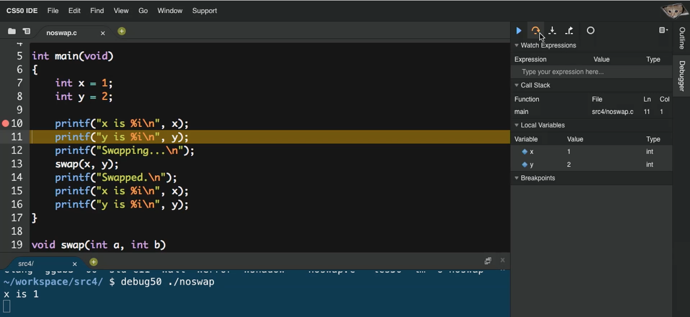{:height="100%" width="100%"}

Заходим (**step into**) в функцию `swap`. Видим, что аргументам `a` и `b` были присвоены значения `x` и `y`. Но, вернувшись в функцию `main`, мы увидим, что значения `x` и `y` остались неизменными.

## Память

Оказывается, память программам предоставляется операционной системой, а области памяти выделяются следующим способом:

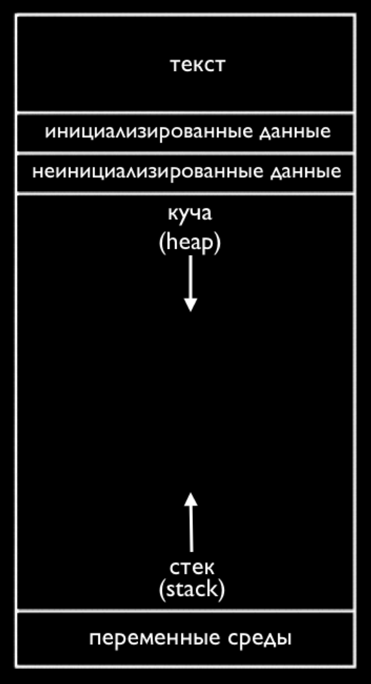{:height="30%" width="30%"}

Если мы представим память в виде прямоугольника (сетки байтов), каждая область (содержащая огромное количество байтов) может быть обозначена так, как показано выше.

В верхней части находится кусок памяти под названием "текст". Здесь хранится машинный код (единицы и нули) вашей программы.

Ниже идут данные или переменные, которыми пользуется ваша программа.

Далее идет то, что мы зовем стеком. "Самая нижняя часть" нашей компьютерной памяти или область с высоким содержанием адресов, которая используется для функций. Самый низ стека содержит кусок памяти, в котором хранится наша функция `main` вместе с любыми локальными переменными или аргументами:

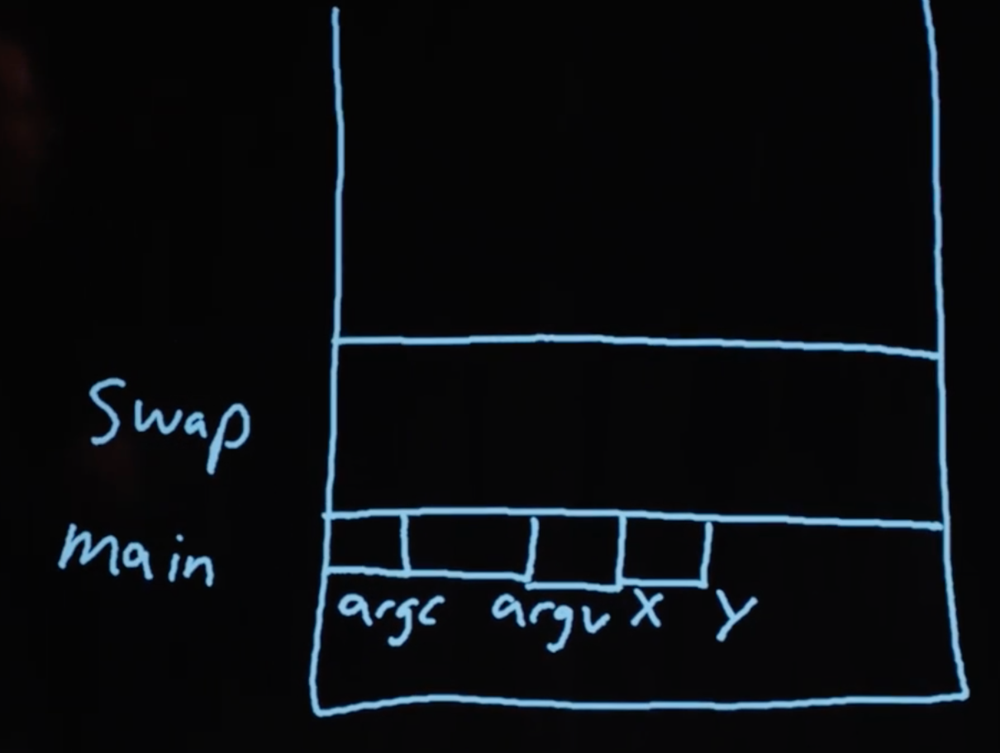{:height="30%" width="30%"}

Следующая вызванная функция, к примеру `swap`, будет иметь свой собственный кусок памяти.

Можно заметить, что каждый квадрат или байт имеет свой адрес и хранит какое-то значение. Теперь у нас есть лучшее понимание того, что мы видели ранее:

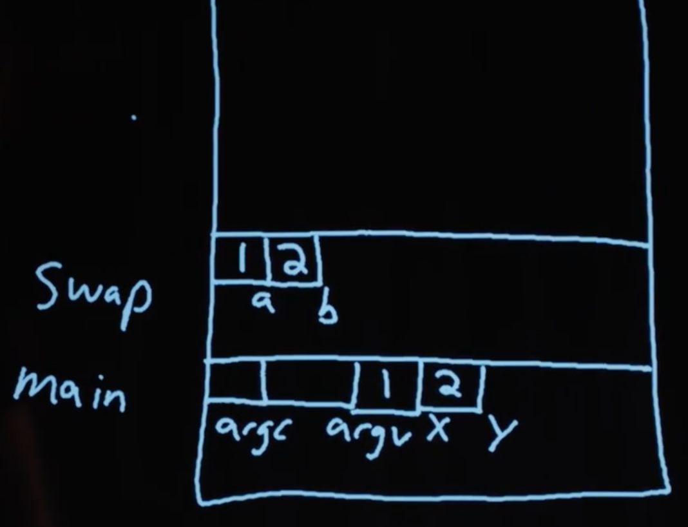{:height="30%" width="30%"}

Функции `swap` аргументы передаются в виде копий.

Как только `swap` завершает свою работу и возвращает нас к предыдущей функции, ее часть (или область, которая была выделена `swap`'у) в стеке помечается как "пригодный для дальнейшего использования" (т.к. она вернулась). `main` все еще видит `x` и `y` с не измененными значениями.

И когда мы ранее сравнивали `s` и `t`, мы на самом деле сравнивали между собой два адреса памяти. В действительности, когда мы вызываем функцию `get_string()`, мы храним все символы `string`'a где-то в памяти компьютера (так как мы не знаем насколько большим будет string). Если мы вызовем `get_string` и пользователь введет `Zamyla`, символы, к примеру, могут быть сохранены в памяти начиная с адреса `123` (Вспомните, что `string` - это массив символов, каждый из которых находится в байте, в наборе последовательно расположенных друг за другом байтов). В нашем `s` будет хранится значение `123`.

И, когда мы опять вызовем `get_string`, чтобы получить еще одну строку `t` (или что-то другое, что бы ни ввел пользователь), это будет сохранено где-то в другой части памяти. Поэтому у `t` может быть значение `234`, если вторая строка (string) хранилась бы начиная с байта `234`. (Этот адрес "динамически выделяется" библиотекой C, так как мы не можем заранее знать насколько большим будет строка.)

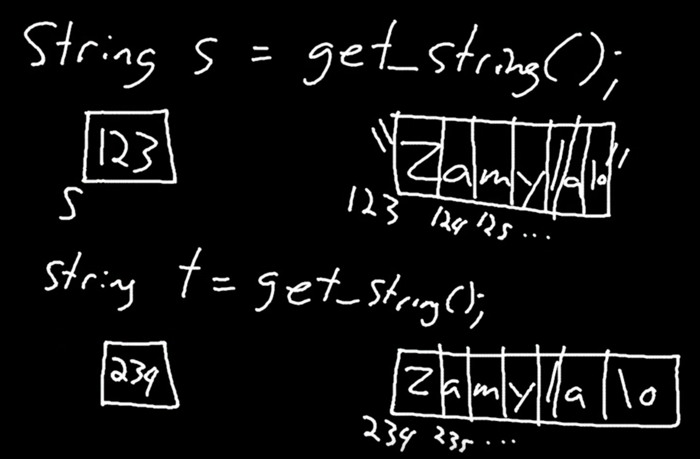{:height="30%" width="30%"}

Когда мы пытались сделать букву строки заглавной, на самом деле мы просто поместили в `t` адрес строки, на которую указывала `s`:

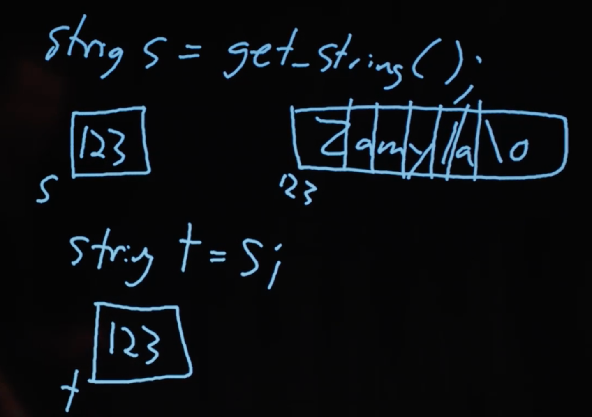{:height="30%" width="30%"}

Мы можем просто представить `s` и `t` в виде "указателей" на интересующие нас значения. В итоге тип переменной `string` оказался всего лишь указателем на символ (начало текста). (Вспомните также, что конец строки достигается благодаря символу `\0`, поэтому нам не нужно запоминать длину текста или адрес последнего символа.)

Так как же нам сравнить строки?
```c
#include <cs50.h>
#include <stdio.h>
#include <string.h>

int main(void)
{
    printf("s: ");
    char *s = get_string();

    printf("t: ");
    char *t = get_string();

    if (s != NULL && t != NULL)
    {
        if (strcmp(s, t) == 0)
        {
            printf("одинаковые\n");
        }
        else
        {
            printf("разные\n");
        }
    }
}
```
Теперь, зная что на самом деле возвращает `get_string`, мы можем изменить тип нашей переменной `s` на `char *` - указатель на символ. Все это время библиотека CS50 позволяла писать вместо `char *` более легкий для понимания тип `string`.

Оказывается существует библиотечная функция `strcmp`, которая сравнивает строки и возвращает `0`, если они одинаковые. И `strcmp`, скорее всего, делает это используя цикл, просматривая и сравнивая по отдельности каждый `i`й символ обеих строк.

Чтобы сделать копию строки, мы сделаем кое-что интересное:
```c
#include <cs50.h>
#include <ctype.h>
#include <stdio.h>
#include <string.h>

int main(void)
{
    printf("s: ");
    char *s = get_string();

    if (s == NULL)
    {
        return 1;
    }

    char *t = malloc((strlen(s) + 1) * sizeof(char));

    if (t == NULL)
    {
        return 1;
    }

    for (int i = 0, n = strlen(s); i <= n; i++)
    {
        t[i] = s[i];
    }

    if (strlen(t) > 0)
    {
        t[0] = toupper(t[0]);
    }

    printf("s: %s\n", s);
    printf("t: %s\n", t);

    free(t);

    return 0;
}
```
Как обычно получаем текст `s`, но затем, чтобы задать `t`, мы воспользуемся еще новой функцией библиотеки Си под названием `malloc`. Она выделяет память, которой мы далее сможем пользоваться. Количеством запрашиваемой памяти будет длина `s` (плюс 1, чтобы `\0` завершила строку), умноженная на размер одного символа. И если `malloc` вернет `NULL` переменной `t` - значит что-то пошло не так (возможно у нас закончилась память), поэтому наша программа должна проверять такого рода случаи, возвращая ошибку.

Теперь мы можем тщательно пройтись через всю строку и еще на один символ далее, чтобы скопировать текст вместе с конечным символом `\0`. Потом у нас будет копия текста `s` в переменной `t`. Меняя что-то в `t`, мы более не будем затрагивать `s`.

В конце нашей программы мы должны привыкнуть вызывать функцию `free` (освободить) на нашу вручную выделенную память, которую функция `free` помечает как "пригодную для повторного использования".

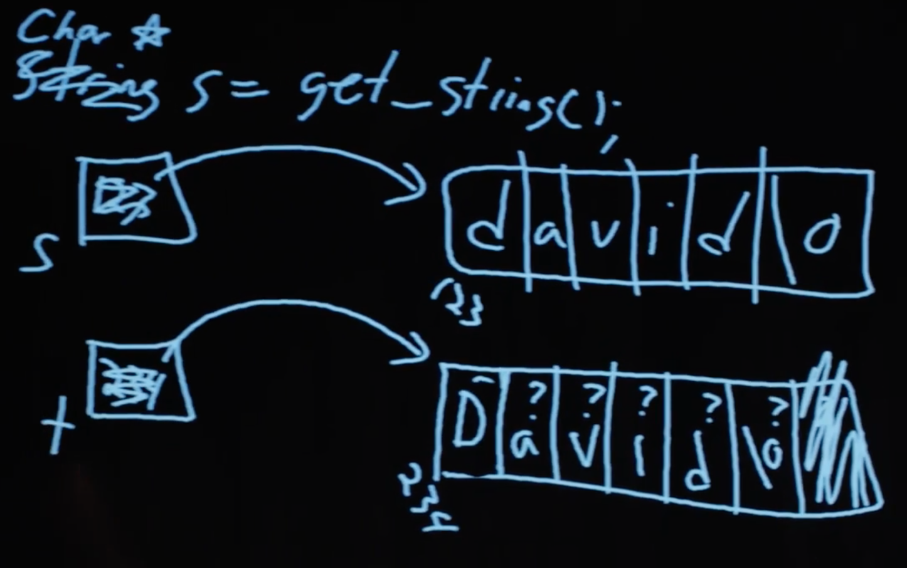{:height="30%" width="30%"}

## Указатели

Поправим `swap`:
```c
#include <stdio.h>

void swap(int *a, int *b);

int main(void)
{
    int x = 1;
    int y = 2;

    printf("x это %i\n", x);
    printf("y это %i\n", y);
    printf("Swapping (Меняю)...\n");
    swap(&x, &y);
    printf("Swapped (Поменял)!\n")
    printf("x это %i\n", x);
    printf("y это %i\n", y);
}

void swap(int *a, int *b)
{
    int tmp = *a;
    *a = *b;
    *b = tmp;
}
```
Теперь мы передаем адреса двух переменных функции `main` (`x` и `y`), таким образом напрямую меняя их значения. Оператор `&` позволяет получить адрес переменной. Чтобы перейти по адресу к самому хранимому значению используется оператор `*`. (Не путать с объявлением указателя, что будет выглядеть как-то так `char *` или так `int *`. Объявить - значит сказать "мне пожалуйста новую переменную, которая будет хранить указатель на `char` или `int`").

Теперь у нашей функции `swap` будут адреса переменных `main`'а (`x` и `y`). Плюс возможность менять местами значения этих переменных (при помощи временной переменной `tmp`):

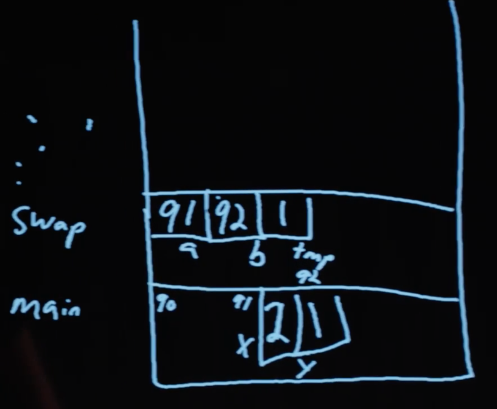{:height="30%" width="30%"}

Познакомившись с указателями, мы сможем писать более элегантный (непонятный, но делающих нас умнее!) код:
```c
#include <cs50.h>
#include <stdio.h>
#include <string.h>

int main(void)
{
    // получить текст
    char *s = get_string();

    if (s == NULL)
    {
        return 1;
    }

    // вывести строку, по одному символу на каждую строку
    for (int i = 0, n = strlen(s); i < n; i++)
    {
        printf("%c\n", *(s+i));
    }
}
```
Эта программа просто выводит текст, по одному символу в строку. Так как `s` является указателем на первый символ строки (хранит адрес первого символа) то, если мы добавим к нему `i`, значит мы получим адрес, находящийся на `i` символа ниже текущего адреса. К примеру, если первый символ начинался бы на адресе `123`, третий символ (на 2 ниже) будет иметь адрес `125`. Поэтому мы можем применить знак `*`, чтобы получить символ находящийся по этому адресу. (До этого мы пользовались `s[i]` - по сути одно и тоже. У Си есть такая фишка как "синтаксический сахар" - удобно использовать и легко читать (код), но не обязательно применять, так как мы можем проделать данное действие другим способом.)

В тоже время, теперь стало намного легче допустить ошибку в коде:
```c
int main(void)
{
    int *x;
    int *y;

    x = malloc(sizeof(int));

    *x = 42;

    *y = 13;

    y = x;

    *y = 13;
}
```
Мы выделяем память, которая может хранить `int` и указываем на нее переменной `x`. Затем мы задаем значение `42` с помощью `*x = 42`, так как у нас есть кусок доступной памяти.

Но следующая строка кода не будет работать и приведет к завершению работы нашей программы, т.к. y указывает на …​ какой-то участок в памяти и мы просто меняем это непонятное значение на `13`. Когда мы объявляем переменную, под нее выделяется какой-то участок памяти, с случайным мусорным значением.

Посмотрите короткую [анимацию](https://youtu.be/ZJ-vWw56Tqk), где рассказывается об указателях.

## Больше Памяти

Еще одна проблема - утечка памяти. Если мы выделим огромное количество памяти и не вызовем функцию `free` (освободить), т.е. не пометим ее как "пригодна для повторного использования", тогда у нашего компьютера будет оставаться все меньше и меньше памяти.

`valgrind` - еще один инструмент командной строки, который можно использовать для поиска этих самых утечек.

Давайте запустим:
```c
// http://valgrind.org/docs/manual/quick-start.html#quick-start.prepare.

#include <stdlib.h>

void f(void)
{
    int *x = malloc(10 * sizeof(int));
    x[10] = 0;
}

int main(void)
{
    f();
    return 0;
}
```
Мы вызовем функцию `f`, которая будет выделять память для 10 int'ов и не будет освобождать ее. Также `f` будет пытаться получить доступ к 10'му элементу данного массива int'ов. Но, так как мы начинаем считать от `0`, `x[10]` будет не 10'ым, а 11'ым элементом. Для этого элемента мы не выделяли памяти, поэтому он (элемент) хранит в ней (памяти) какое-то другое значение, возможно даже повышенной важности.

Если мы сохраним код в файле `memory.c` и пропишем `make memory`, мы сможем запустить `valgrind --leak-check=full ./memory`.

Увидим следующее:
```
Invalid write of size 4

    at 0x4005FF: f (memory.c:21)

    by 0x400623: main (memory.c:26)

...

40 bytes in 1 blocks are definitely lost in loss record 1 of 1

    at 0x4C2AB80: malloc in /usr/lib/valgrind/vgpreload_memcheck-amd64-linux.so)

    by 0x4005F6: f (memory.c:20)

    by 0x400623: main (memory.c:26)
```
Выходные данные - трудно читаемые, но, как бы там не было, источником этих ошибок являются строка кода `memory.c`.

Мы можем исправить эту программу, изменив `f`:
```c
...
void f(void)
{
    int *x = malloc(10 * sizeof(int));
    x[9] = 0;
    free(x);
}
...
```
Если мы опять посмотрим на нашу память, то сможем заметить еще одну область под названием "куча" (или heap) - именно отсюда `malloc` выделяет для нас память:

{:height="30%" width="30%"}

В стеке находится память, исчезающая при возвращении (завершении) функции. В свою очередь heap (куча) хранит память, которую можно использовать пока мы сами ее не `free` (освободим).

И, если мы посмотрим на стрелки, то можем догадаться, что оба они (куча и стек) могут столкнуться, если мы будем использовать слишком много памяти heap'а (кучи) и стека, при их росте в противоположном направлении.

"Stack overflow" (переполнение стека) - программная ошибка, возникающая когда стек слишком сильно увеличивается, захватывая все больше свободной памяти, пока она не иссякнет. Так может произойти если мы, к примеру, воспользуемся рекурсивной функцией, которая будет вызывать саму себя недопустимое количество раз.

"Heap overflow" (переполнение кучи) - происходит, если куча приобретает слишком огромный размер. Такое может произойти, если мы вызовем `malloc` для выделения слишком огромных кусков памяти, не освобождая их функцией `free`.

"Buffer overflow" (переполнение буфера) - когда слишком много данных помещается в выделенное пространство, является ограниченным.
```c
#include <string.h>

void foo(char *bar)
{
    char c[12];
    memcpy(c, bar, strlen(bar));
}

int main(int argc, char *argv[])
{
    foo(argv[1]);
}
```
Переполнение буфера можно увидеть в приведенной выше программе. `main` вызывает функцию `foo` и передает ей введенный аргумент командной строки. Затем `foo` копирует ее в `char` массива `c`, но c может хранить только 12 символов (`memcpy` копирует содержимое `bar` в `c`, согласно тому, какое число байтов позволит скопировать `strlen(bar)`. Все это дает нам знать документация, которую можно найти в интернете). Значит, если аргумент командной строки окажется слишком длинным, тогда он "переполнит" массив и запишется в кусок памяти, идущий после выделенной памяти `c`.

И так как `c` - статическая переменная, она будет на стеке, а это значит, что чтобы не ввел пользователь в виде аргумента командной строки - это будет помещено в стек и возможно даже исполнено как машинный код.

Давайте посмотрим на диаграмму:

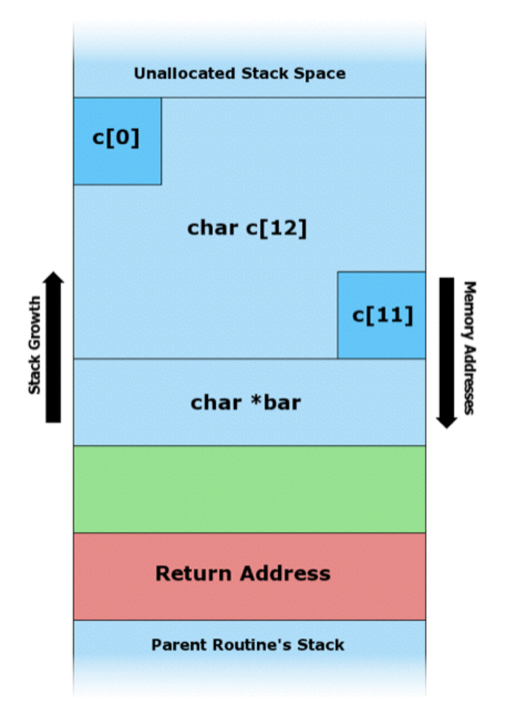{:height="30%" width="30%"}

В самом низу располагается "Parent Routine’s Stack" (стек родительской процедуры) или просто код `main`'а. Выше идет "Return Address" (возвращаемый адрес) или местоположение кода, к которому должна вернуть исполняемая функция после завершения своей работы.

Теперь давайте посмотрим, что находится внутри стека нашей функции. Т.к. стек растет вверх, в первую очередь мы видим `char *bar`, являющийся аргументом `foo`. Далее идет массив `char c[12]` с блоками представляющими первый `c[0]` и последний `c[11]` символы, а также то, что между ними. Если мы начнем запись в c, мы можем переписать чужие значения.

К примеру, с коротким текстом наша программа будет выглядеть так:

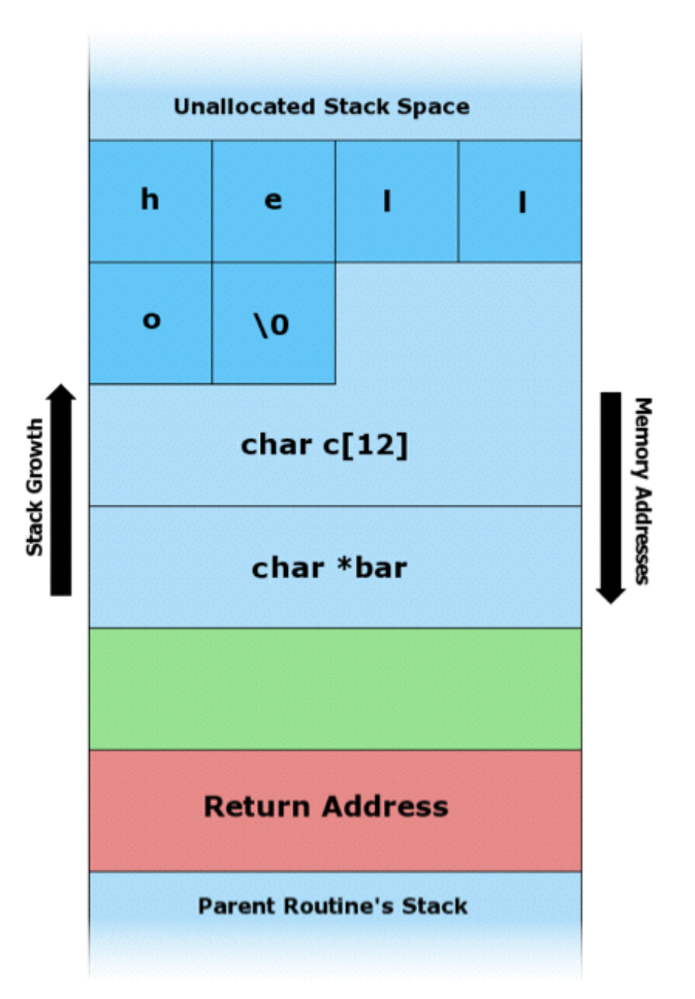{:height="30%" width="30%"}

Но с большей строкой (string) мы можем "задеть" другие значения:

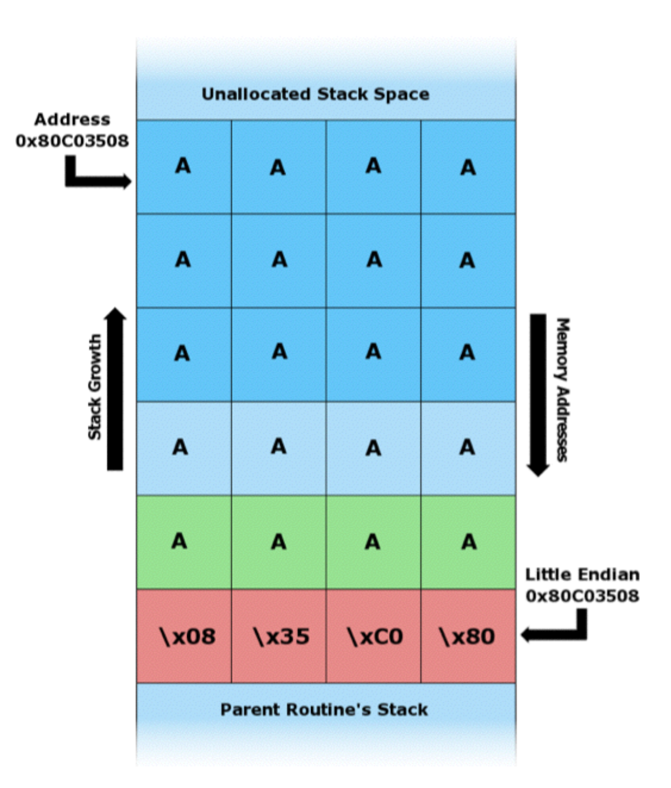{:height="30%" width="30%"}

Возвращаемый адрес переписан на тот, который будет возвращать нас на начало нашей строки (текста, который мы ввели). Поэтому наша программа вернется к коду, который может содержать в себе потенциальную угрозу.

## Изображения

Указателям можно найти применение в манипулировании изображением.

Если мы увеличим изображения, то увидим следующее:

{:height="30%" width="30%"}

Каждый квадратик представляет из себя пиксель. У изображения есть свой определенный размер, а значит и ограниченное количество информации.

Черно-белый смайлик можно представить бинарным кодом:

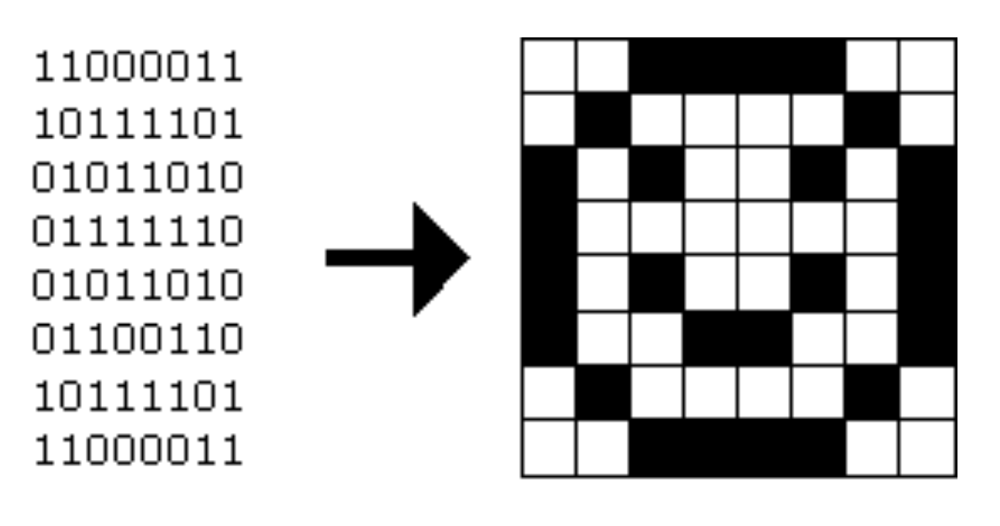{:height="30%" width="30%"}

С `1` представляющей черный цвет и с `0` представляющим белый, мы можем создать "bitmap" изображение.

Формат bitmap похож на другой формат изображения - JPEG, отличие лишь в том, что JPEG использует сжатие, что уменьшает размер изображения на некоторое количество бит, откидывая кое-какую информацию. И все JPEG файлы начинаются с одних и тех же трех байтов: `255`, `216`, `255`, тем самым указывая тип файла.

Помимо бинарной и десятичной систем счисления есть еще шестнадцатеричная. Она использует 16 символов вместо 10, такие как `0-9` и `a`, `b`, `c`, `d`, `e`, `f`.

`255` в двоичной системе будет выглядеть так `1111 1111`, а `216` вот так `1101 1000`. Каждые 4 бита, так как они могут представлять 16 значений, идеально подставляются под шестнадцатеричную систему. `1111` - это `f`, `1101` - это `d` и `1000` - это `8`. Поэтому `255` - тоже самое что и `ff`, а `216` - это `d8`. Так уж заведено, что шестнадцатеричный код нужно записывать вот так `0xff` и `0xd8`.

Зная это, мы можем восстановить JPEG'и (если файлы были удалены, а не перезаписаны) из чистых бинарных данных, тем же способом, что мы использовали для определения string'ов (с начальным и конечным значениями).

Bitmap файлы, с расширением BMP, старее и менее эффективнее в представлении изображения т.к. у них нет сжимания. Но с ними легче работать, потому как у каждого пикселя есть какое-то количество байтов.

Заголовок файла или то, с чего должен начинаться файл BMP, должен выглядеть так:

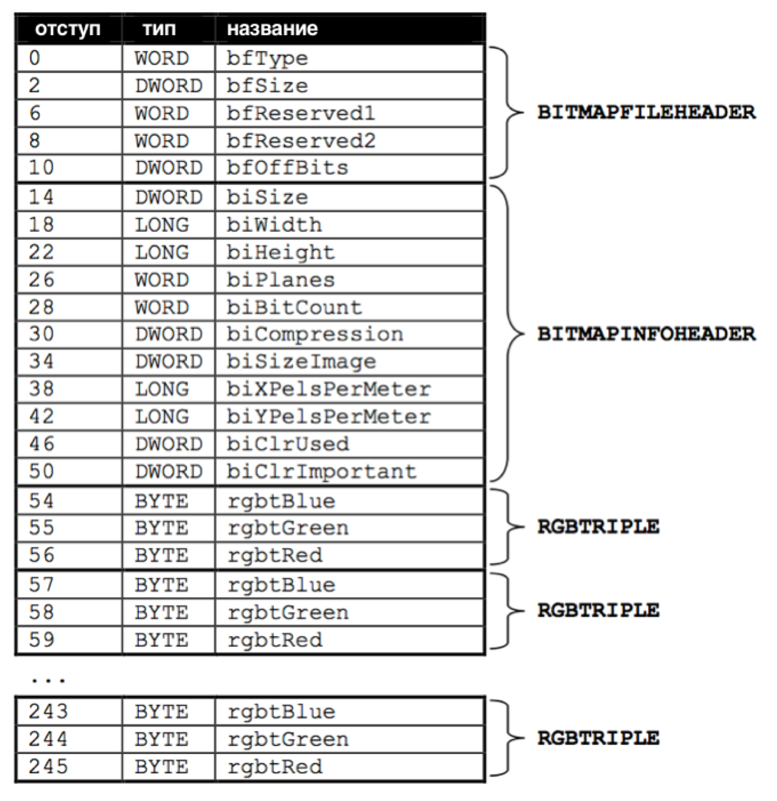{:height="60%" width="60%"}

Файлы представляют из себя простую последовательность байтов и если мы будем представлять каждый байт в виде отступа от начала файла, мы можем задавать, что именно должно быть в файле, для его правильной работы.

Можно догадаться, что обозначают и какие значения имеют некоторые поля, такие как `biWidth` (width - ширина) и `biHeight` (height - высота).

Но самая интересная часть находится в конце диаграммы - это повторяющаяся последовательность `RGBTRIPLE`. Она состоит из 3 байтов, каждая из которых представляет один из трех следующих цветов: синий, зеленый и красный. С этими тремя, при их разной интенсивности, мы можем отображать миллионы различных цветов.

И мы познакомимся с еще одним ключевым словом, чтобы с легкостью представить данную конструкцию, так называемый `struct`. Мы можем создать более сложный тип структуры данных, при этом присвоить ему название:
```c
typedef struct
{
    string name;
    string dorm;
}
student;
```
Чтобы представить студента, мы добавим его описание (два кусочка информации) `string name` и `int dorm`.

И мы можем воспользоваться контейнером следующим образом:
```c
#include <cs50.h>
#include <stdio.h>
#include <string.h>
#include "structs.h"

#define STUDENTS 3

int main(void)
{
    student students[STUDENTS];

    for (int i = 0; i < STUDENTS; i++)
    {
        printf("name: ");
        students[i].name = get_string();

        printf("dorm: ");
        students[i].dorm = get_string();
    }

    for (int i = 0; i < STUDENTS; i++)
    {
        printf("%s is in %s.\n", students[i].name, students[i].dorm);
    }
}
```
Мы можем создать массив структуры `student` под названием `students`, с определенным количеством `STUDENTS` (элементов).

Мы использовали `#define STUDENTS 3`, чтобы дать константе `STUDENTS` значение `3`. Так мы удостоверимся, что наше значение не будет изменено, в отличии от обычной переменной.

Мы можем обратиться к свойствам, находящимся внутри структур (structs), используя синтаксис `students[i].name`, так как `students` - это массив и `students[i]` получит собственную структуру `student`, которую мы можем далее использовать.

Мы можем даже открыть отдельный файл в нашем коде Си и менять его, используя struct'ы:
```c
#include <cs50.h>
#include <stdio.h>
#include <stdlib.h>
#include <string.h>

#include "structs.h"

#define STUDENTS 3

int main(void)
{
    student students[STUDENTS];

    for (int i = 0; i < STUDENTS; i++)
    {
        printf("name: ");
        students[i].name = get_string();

        printf("dorm: ");
        students[i].dorm = get_string();
    }

    FILE *file = fopen("students.csv", "w");

    if (file != NULL)
    {
        for (int i = 0; i < STUDENTS; i++)
        {
            fprintf(file, "%s,%s\n", students[i].name, students[i].dorm);

        }

        fclose(file);
    }
}
```
Здесь мы используем тип данных `FILE`, который является частью языка Си, и библиотечную функцию `fopen`, которая позволяет нам открывать файлы. `"w"` дает возможность производить записи в файле.

После того как мы воспользуемся еще одной библиотечной функцией `fprintf`, которая опять же позволяет работать с `file` (файлом) и изменять его содержимое, мы закрываем файл.

Со всеми этими инструментами мы можем реализовывать все больше и больше интересных проектов!