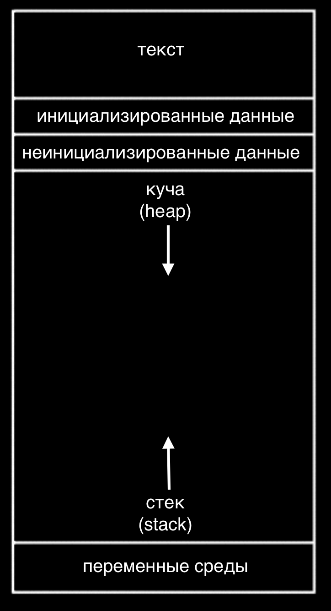
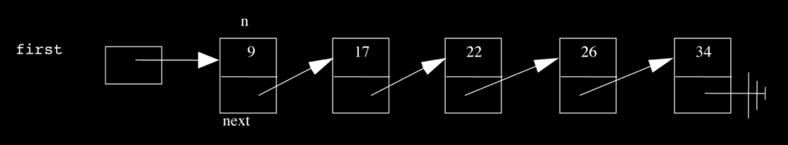
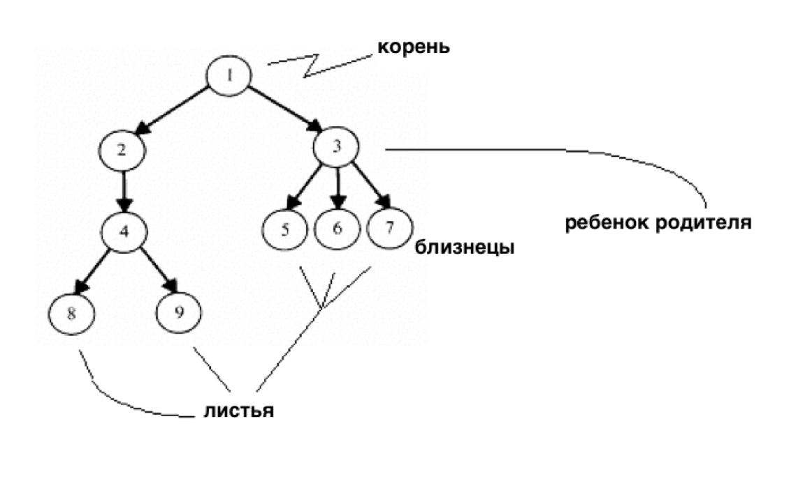
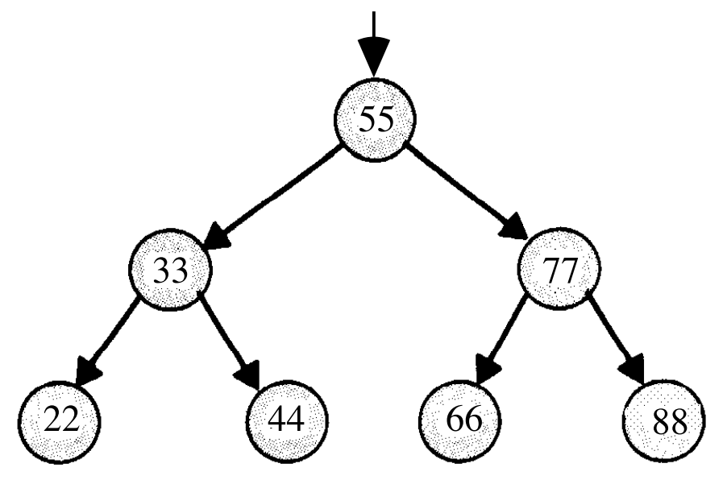
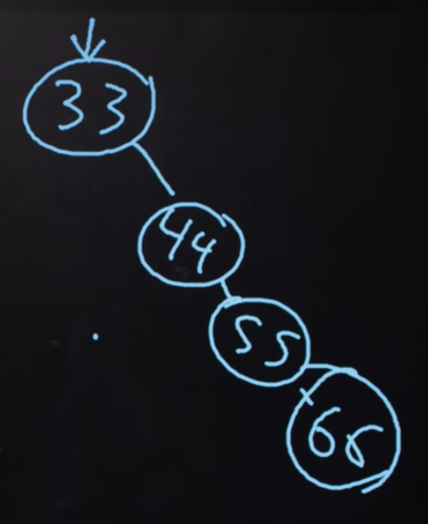
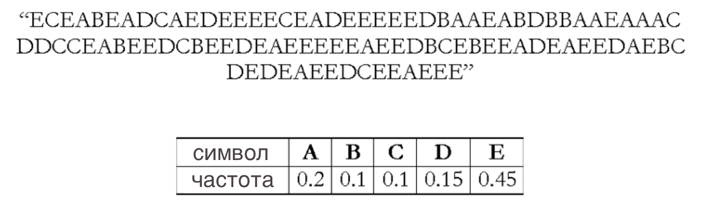
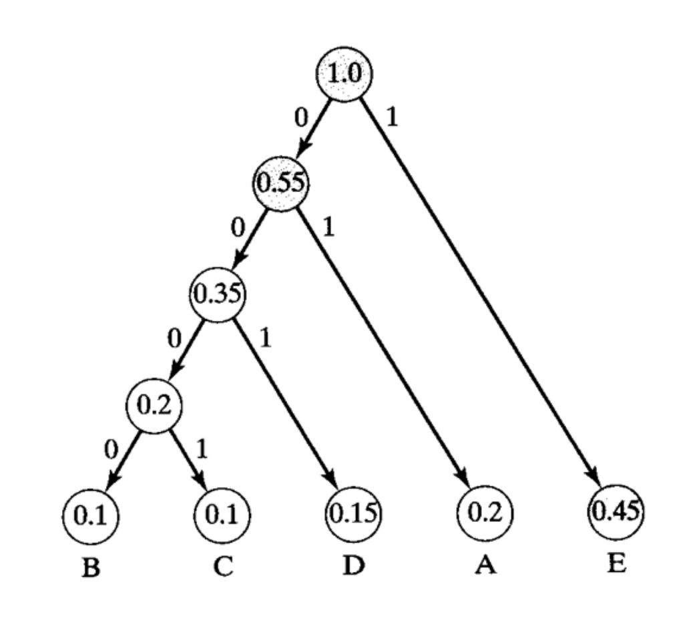
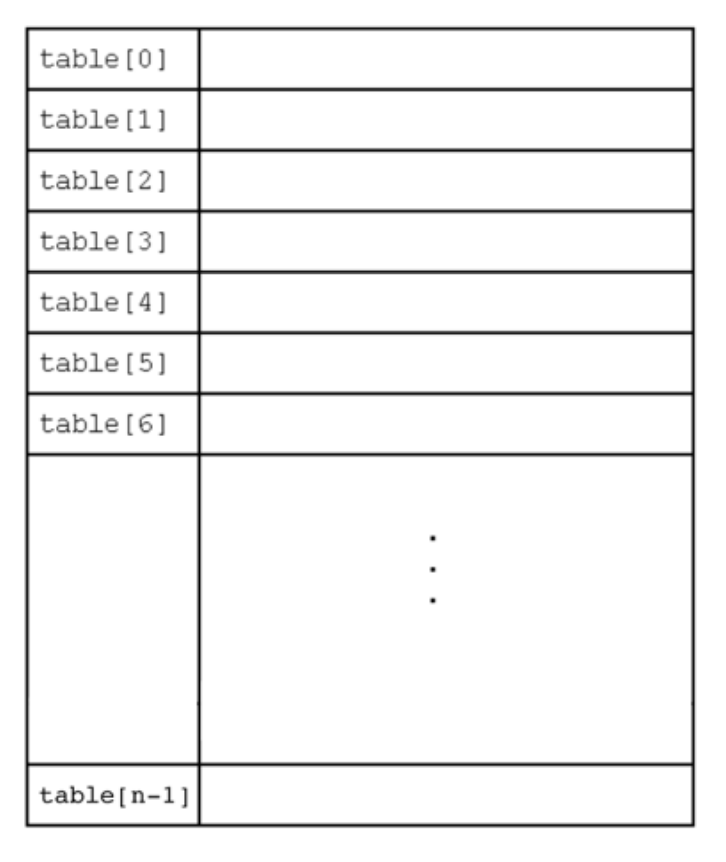
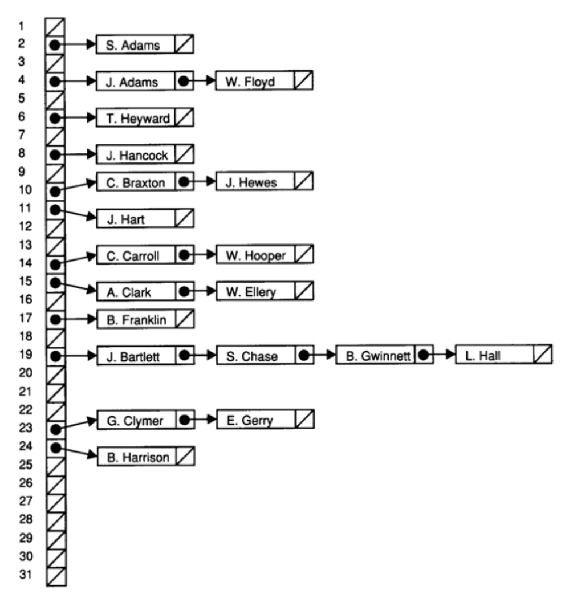
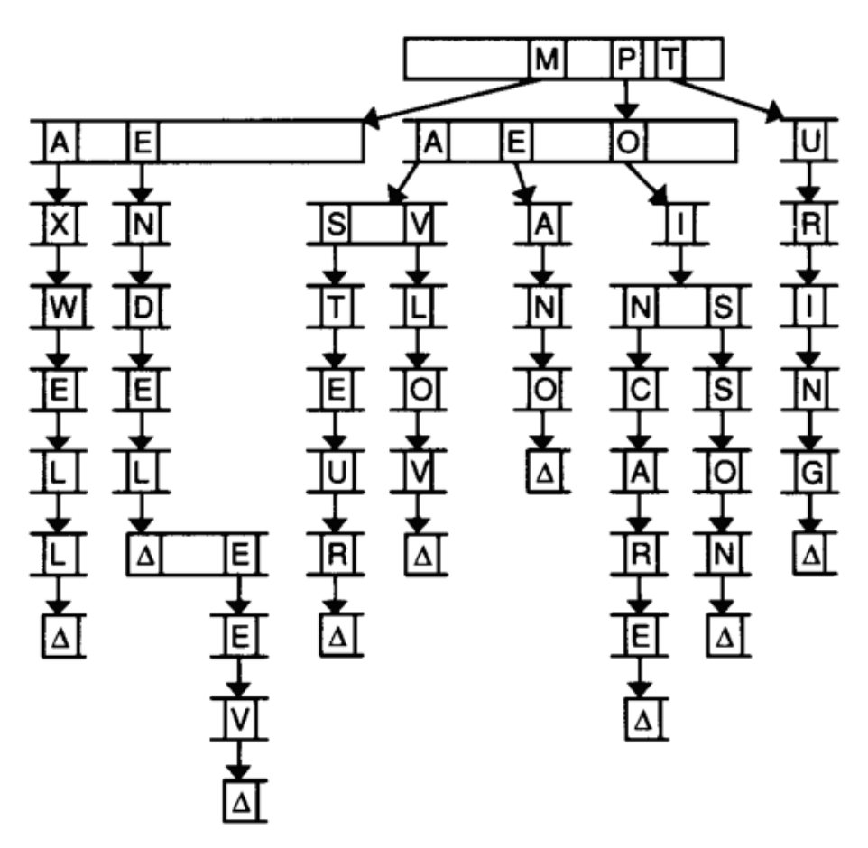

# Лекция 5

## В Прошлый Раз

Мы успели поговорить об указателях - адреса участков памяти, где может храниться информация.

В Си мы можем обращаться к этим участкам и по необходимости выделять большее количество памяти.

Мы рассматривали данную диаграмму, которая показывала как память делится на различные области, каждая из которых имеет свое предназначение:

{:height="30%" width="30%"}

Стек состоит из стопок памяти, отвечающих за функции и их локальные переменные.

Куче (heap) принадлежит динамически выделяемая память, т.е. она выделяется во время работы программы. Применяется в случаях когда мы заранее не знаем сколько памяти нам понадобится.

Области данных хранят объявленные нами переменные, а текстовая область содержит сам код нашей программы (единицы и нули).

Мы также выяснили как можно поменять местами значения переменных, передавая указатели и меняя значения на которые показывают эти указатели:
```c
void swap(int *a, int *b)
{
    int tmp = *a;
    *a = *b;
    *b = tmp;
}
```
`int *a` объявляет указатель, который указывает на переменную типа `int` с названием `a` и позже, используя `*a`, мы переходим к участку, на которое указывает `a` и уже там работаем со значением (таким образом мы разыменовываем указатель).

Мы также разобрали изображения, форматы файлов и создание собственных типов данных.

## Связные Списки

Массивы хранят данные одинакового типа в последовательно расположенном кусочке памяти, тем самым позволяя нам обратиться к любой части массива, просто зная индекс нужной нам части.

Но, к сожалению, у массива есть свои ограничения. Его нельзя увеличить, у нас не получится добавить в его конец дополнительный элемент, так как память, идущая сразу после данного массива, может использоваться другими переменными.

Мы могли бы выделить большее количество памяти, скопировать имеющуюся у нас память в новый участок, далее перенося туда элементы. Но такой процесс, с необходимостью копирования дополнительных элементов и ведущий к росту массива, будет требовать все больше и больше производительных ресурсов компьютеров.

Но, имея возможность динамически выделять память и создавать наши собственные типы данных, мы можем сделать следующее:



Здесь, в структуре данных известной как связный список ("linked list"), у нас 5 отсортированных чисел. Каждый из этих прямоугольников, содержащие число и стрелку, мы будем называть "узлами". В данном случае стрелки всего лишь указывают на следующую структуру. С таким подходом нашим элементам более не требуется быть последовательно расположенными друг за другом в памяти и мы можем без труда создавать новые элементы, выделяя им дополнительную память.

Мы создадим узел (node) с помощью `struct` (структуры) следующим образом:
```c
typedef struct node
{
    int n;
    struct node *next;
}
node;
```
Узел (node) будет содержать в себе переменную `int n` и указатель на следующий узел `struct node *` под названием `next`.

С данной структурой данных мы можем выполнять следующие операции: `delete` (удалить), `insert` (вставить) и `search` (искать).

Вернемся к нашей первой диаграмме. Нам нужен хотя бы один указатель под названием `first` (первый), который будет указывать на первый узел, начало списка. И последний узел будет указывать на `NULL`, таким образом, давая знать, что мы достигли конца списка.

Для поиска элемента в массиве, нам нужно начать работу с первого элемента, далее, используя указатель, проследовать ко второму элементу и т.д. Это потому что каждый узел может находиться в любом участке памяти (т.е. байты нашей выделенной памяти расположены не последовательно), поэтому мы не можем здесь применить стратегию бинарного поиска. И скорость выполнения данного линейного поиска равна *O(n)*, даже если наш список будет отсортированным.

Если бы мы не держали список отсортированным, тогда скорость **вставки** нового узла была бы* O(1)*, так как мы могли бы просто вставить число в начало списка. Пусть `first` указывает на наш новый узел и пусть указатель `next` этого нового узла будет направлен на предыдущий первый узел. Но если мы хотим сохранить список отсортированным, нам сперва придется найти правильное место для **вставки** числа, что опять займет *O(n)*.

**Удаление** узла займет столько же времени - *O(n)*, так как нам сперва придется найти число, которое мы хотим удалить.

Мы продемонстрировали на студентах принцип работы вставки. Нам нужно быть предельно осторожными при вставке элемента в конец списка, потому что нам нужно обновить последний узел так, чтобы он указывал на новый узел до того как мы перейдем по его указателю к `NULL`, тем самым теряя адрес этого последнего узла. Также не помешало бы проявить бдительность при обычном добавлении (вставке) узла в список, так как нам нужно изменить указатель нового узла, дабы он указывал на следующий узел, до того как мы изменим указатель предыдущего узла (так как только оттуда мы прослеживаем местоположение следующего узла).

Удаление элементов требует от нас правильного расположения выполняемых нами операций (правильная последовательность строчек кода), так как мы не хотим потерять часть нашего списка или наш узел до того как мы `free` (освободим) занимаемую им память.

Давайте напишем функцию поиска, которая поможет нам лучше понять синтаксис использования узлов, структур и указателей:
```c
bool search(int n, node *list)
{
    node *ptr = list;

    while (ptr != NULL)
    {
        if (ptr->n == n)
        {
            return true;
        }

        ptr = ptr->next;
    }

    return false;
}
```
Наша функция создается с двумя аргументами: число `n`, которое мы хотим найти и список, который является указателем на первый `node` (узел).

Мы создали временную переменную `node *ptr` и сделали так, чтобы она указывала на список.

Затем, пока в списке есть элемент, мы воспользуемся `ptr→n`, дабы через указатель перейти к структуре узла и получить доступ к хранящейся внутри него, переменной `n`. Если это именно то число, которое мы ищем, тогда функция `return true` (вернет правду) и в противном случае, наш `ptr` будет указывать на следующий элемент списка.

После того, как мы просмотрим все элементы, мы можем `return false` (вернуть ложь), т.к. мы могли бы вернуть `true` (правду), если бы ранее нашли число `n`.

Со связными списками у нас появилась возможность по необходимости увеличивать или уменьшать список. Но взамен мы получаем медленные поиски, вставки и удаления. И в мире программирования часто встречаются такие ситуации, когда вам нужно идти на компромиссы и определять, что для вас важнее: время, пространство или сложность кода.

## Стеки и Очереди

Представьте стопку подносов, где вы легко можете поднять верхний поднос или положить сверху еще один поднос. Такая структура данных, с названием **стек**, поддерживает две операции `push` и `pop`, которые добавляют и удаляют элементы соответственно.

В итоге, последний добавленный (push) элемент будет первым, который мы в последующем удалим (pop). Существуют приложения, где такое свойство бывает крайне полезным, как, к примеру, наш стек в памяти, где вызванная функция помещается на верхнюю часть нашей предыдущей функции.

Мы можем самостоятельно реализовать данное свойство:
```c
typedef struct
{
    int numbers[CAPACITY];
    int size;
}
stack;
```
Теперь у нас есть структура `stack`, в которой мы найдем массив состоящий из `int`ов с названием `numbers` (числа), имеющий размер `CAPACITY` (вместимость), который мы задаем в другой части нашего кода. Также у него есть свойство под названием `size` (размер), так как в нашем стеке количество элементов не всегда будет совпадать с вместимостью данного стека.

И вместо того чтобы хранить весь массив в нашей структуре, мы можем хранить только указатель, который указывает на первый элемент массива:
```c
typedef struct
{
    int *numbers;
    int size;
}
stack;
```
Теперь мы можем с помощью функции `malloc` выделить какую-то часть памяти для хранения наших чисел, а в структуре мы будем хранить только указатель на эту память. Также мы обретаем возможность выбрать насколько большим мы хотим задать каждый стек.

"Очередь" (queue) является противоположностью "стека" (stack). В очереди первый элемент на входе, будет первым элементом на выходе (first in first out - FIFO), точно также как и очереди людей. У нас будут операции `enqueue` (добавить в очередь), которые помещают элементы в конец списка и `dequeue` (извлечь из очереди), которые извлекают начальные элементы списка.

С "очередью" нам нужно немного больше информации:
```c
typedef struct
{
    int front;
    int numbers[CAPACITY];
    int size;
}
queue;
```
Здесь мы используем массив для хранения нашей очереди, но теперь нам также нужно следить за тем, где находится передняя (front) часть данной очереди. Каждый раз, вызывая `dequeue`, нам нужно будет возвращать элемент на место указываемое индексом `front`. Потом мы повышаем `front`, дабы в следующий раз иметь доступ к следующему элементу. Так как мы имеем дело с массивом, мы не можем просто так взять и легко передвинуть его элементы дальше по списку, поэтому мы воспользуемся `front`ом, чтобы следить за тем, где располагается передняя часть массива.

Таким же образом мы можем динамически выделить память:
```c
typedef struct
{
    int front;
    int *numbers;
    int size;
}
queue;
```
Стек и очередь - оба являются абстрактными типами данных, которые мы можем реализовать абсолютно любым способом, но ожидайте, что у них будут такие же свойства и операции.

Мы посмотрели [интересную анимацию](https://youtu.be/kGF2RvIAK0A) о стеках и очередях.

## Деревья

Имея в нашем арсенале такой полезный инструмент как указатели, мы можем начать строить более сложные структуры данных, которые будут превосходить ранее используемые одномерные массивы:

{:height="30%" width="30%"}

У нас может быть один узел, который будет указывать на несколько узлов и, в случае с этой структурой данных, мы получим дерево. Один корневой узел указывает на другие узлы (потомки) как в генеалогическом древе. И узлы не имеющие потомков называют листьями.

Теперь представьте если бы у нас были числа и мы бы хотели иметь возможность эффективно осуществлять поиск какого-то определенного числа, используя двоичный (бинарный) алгоритм поиска. Мы могли бы воспользоваться массивом, но мы также можем воспользоваться так называемым двоичным деревом поиска:

{:height="30%" width="30%"}

Теперь мы можем вставлять и добавлять элементы до тех пор, пока мы придерживаемся того, что потомок, находящийся слева, будет меньше родительского узла, а потомок, находящийся справа, будет больше того же узла.

У любого узла могут быть максимум два потомка и мы легко можем добавлять к ним новые узлы, выделяя для них память и меняя указатели, дабы они были направлены на них (на новые узлы).

Нам также нужно позаботиться о том, чтобы дерево было сбалансированным. К примеру, если бы мы продолжали добавлять все бóльшие и бóльшие элементы в самый правый край, тогда мы бы получили связный список. Поэтому нам нужно тщательнее подходить к вопросу вставки элементов, чтобы быть уверенными, что у нас действительно будет дерево, точно такое же, как приведенное выше на рисунке. В противном случае мы получим:

{:height="30%" width="30%"}

В более продвинутых курсах CS (Computer Science) вы сможете познакомиться с алгоритмами вставки элементов, которые тем самым создают сбалансированное дерево и с алгоритмами перебалансировки дерева.

Но мы начнем с кое-чего более легкого. Для реализации двоичного дерева поиска нам, возможно, придется начать с определения узла:
```c
typedef struct node
{
    int n;
    struct node *left;
    struct node *right;
}
node;
```
Число, хранимое в узле, будет опять `n` и мы также храним указатели на правый и левый потомки.

Теперь мы можем воспользоваться рекурсией, для более элегантного поиска:
```c
bool search(int n, node *tree)
{
    if (tree == NULL)
    {
        return false;
    }
    else if (n < tree->n)
    {
        return search(n, tree->left);
    }
    else if (n > tree->n)
    {
        return search(n, tree->right);
    }
    else
    {
        return true;
    }
}
```
Так как мы знаем, что каждый потомок дерева также является началом меньшего двоичного поискового дерева, мы можем рекурсивно вызывать нашу функцию `search` (поиск) на всё меньшие и меньшие деревья.

Если значение указателя равно `NULL`, тогда мы должны `return false` (вернуть ложь), так как в таком случае у нас нет никакого дерева.

В противном случае, в зависимости от того, как именно `n` сравнивается с числом, находящимся в корне дерева, мы будем искать левое или правое потомственное дерево или `return true` (вернем правду). Так как функция `search` принимает `node *tree`, мы можем передать указатели `tree→left` и `tree-right`, и `search` будет воспринимать их в качестве корня дерева.

И мы также `return` (возвращаем) это значение, которое возвращается к нам благодаря вызову функции `search`.

Мы можем применить деревья для сжатия текста, не теряя при этом данные.

Вспомните, что символы кодируются с помощью ASCII (каждому байту соответствует символ). Но если мы будем пользоваться только несколькими символами и некоторыми чаще других, мы можем использовать меньшее количество бит для часто используемых символов.

Кодировка Хаффмана - является системой, которая использует такую концепцию для сжатия данных.

Код Морзе тоже использует короткие наборы точек и черточек для часто используемых букв. Но не все сообщения могут быть легко понятными. К примеру, `H` равна четырем точкам и `I` двум точкам, а `E` одной точке, поэтому шесть точек в одной строке могут либо обозначать `HI`, либо `EEEEEE`.

Кодировка Хаффмана обходит эти неясности. Предположим мы хотим отправить следующее сообщение:



Сперва мы подсчитываем частоту использования каждого символа, представив их отдельными частями сообщения.

Далее мы зададим наименьшее количество бит для самых распространенных символов и построим дерево, такое как показано ниже:

{:height="30%" width="30%"}

Строить мы начнем с самого низа, беря два наименьших узла и соединяя их, при этом складывая их частоту.

Обратите внимание, что `E` в тексте используется чаще других символов, поэтому ей дается только один бит, `1`. Для представления редко встречающихся букв `B` и `C` потребуется наибольшее количество битов, либо `0000`, либо `0001`.

И для отправки сообщений, нам нужно добавить это преобразование сжатых битов к несжатым символам. Если у нас имеется маленький файл и при этом в нем огромное количество разнообразных символов, то наш файл может стать больше, при попытке добавления данного преобразования. Мы не можем многократно сжимать файлы, тем самым делая их все меньше и меньше!

Мы можем представить листок в дереве Хаффмана следующим образом:
```c
typedef struct node
{
    char symbol;
    float frequency;
    struct node *left;
    struct node *right;
}
node;
```
С такой структурой мы можем хранить данные представленной выше диаграммы.

## Хэш-таблицы и Префиксные Деревья

Еще одна структура данных - Хэш-таблица. С огромным количеством операций, требующих всего *O(1)*, т.е. постоянное число шагов.

Хэш-таблица по виду схожа с массивом:

{:height="30%" width="30%"}

Мы можем хранить любой кусок информации в каждом столбике хэш-таблицы и при этом мы можем получить постоянное время поиска элемента в нашей таблице.

Представьте, что у нас есть ведра и на каждой нарисована буква латинского алфавита. Также у нас есть тетради студентов, мы будем сортировать их по ведрам в зависимости от первой буквы имени студента. Поэтому наша хэш-функция будет работать именно с этими первыми буквами.

Теперь мы можем работать с 1/26 частью наших отсортированных тетрадок, если конечно мы знаем в какую ведерку смотреть. И если мы будем использовать ту же самую хэш-функцию, мы всегда можем повторить процесс сортировки и положить наши тетрадки в те же самые ведерки.

Так как хэш-таблица является массивом, мы можем получить сразу несколько элементов, которые по идее должны оказаться в одном блоке (или ведре). Тут можно воспользоваться линейным зондированием (linear probing), т.е. техникой вставки или передвижения элемента в следующий свободный слот:

{:height="30%" width="30%"}

Если мы добавляем имя `Alex` или `Aaron`, но в блоке `A` уже есть имя `Alice`, тогда мы идем ниже по хэш-таблице к нашему следующему блоку.

Мы также можем хранить в каждом блоке указатель на связанный список, поэтому любое ведро может горизонтально увеличиваться:

{:height="30%" width="30%"}

Такая техника имеет название **хеширование с раздельными цепочками** (separate chaining), где чем больше увеличивается наша таблица, тем меньше становятся наши связные списки.

При худшем сценарии, когда мы будем заносить имена пользователей и у всех имена будут начинаться с одной и той же буквы, скорость работы будет линейной (n). Но все равно данный метод будет намного эффективнее обычного линейного алгоритма, так как здесь рассматривается 1/26 часть занесенных элементов.

И наконец, у нас есть еще одна структура данных под названием **префиксное дерево** или **trie** (произносится как "трай"):

{:height="30%" width="30%"}

Название образовано от слова reTRIEval (получать). Представляет из себя дерево, где в качестве потомков выступают массивы. Каждый массив содержит указатели, которые указывают на другие слои массивов. В данной диаграмме, с изображением массивов, которые способны вместить 26 букв, у первого слоя массива есть указатели `M`, `P` и `T`, направленные на следующие слои массивов. И в этой диаграмме специально пропущены кое-какие части ниже располагающихся массивов (так как сложно представить, какая ширина диаграммы у нас получилась бы тогда), но вы просто считайте, что ширина каждого массива 26 букв.

Чтобы найти элемент, в данном случае слово, мы начнем с первой буквы и посмотрим есть ли у нее потомок, а потом есть ли у этого потомка свой потомок, продолжая до тех пор, пока не дойдем до конца нашего слова и увидим приемлемое окончание нашего передвижения по дереву.

Скорость работы trie равна *O(1)*, так как нам всего лишь нужно искать слово, основываясь на буквах, которые составляют это слово. И для данного процесса поиска безразлично количество содержащихся в trie букв. Операции по добавлению (вставке) и удалению слова будет также занимать постоянное количество времени.

С этими абстрактными типами данных и структурами данных мы можем решать более сложные проблемы, которые будут требовать от нас более качественного и эффективного подхода в написании нашего кода. До следующего раза!