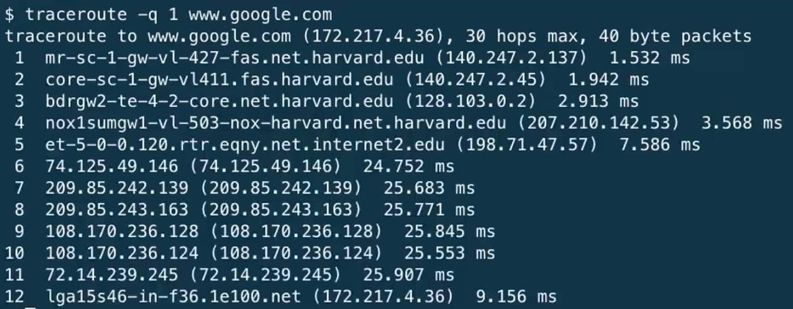
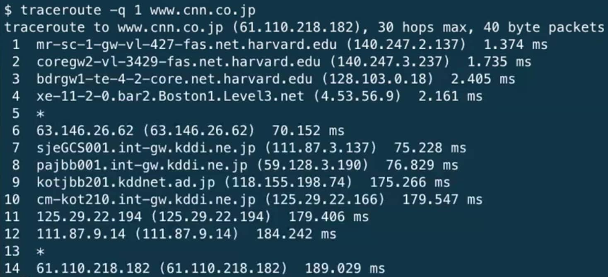
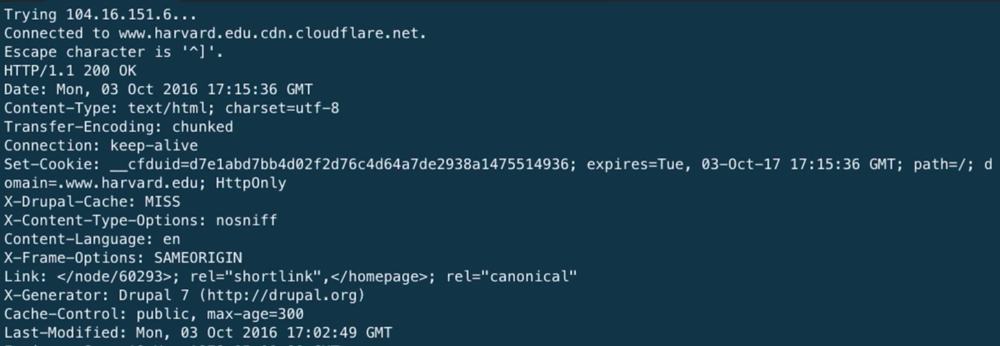
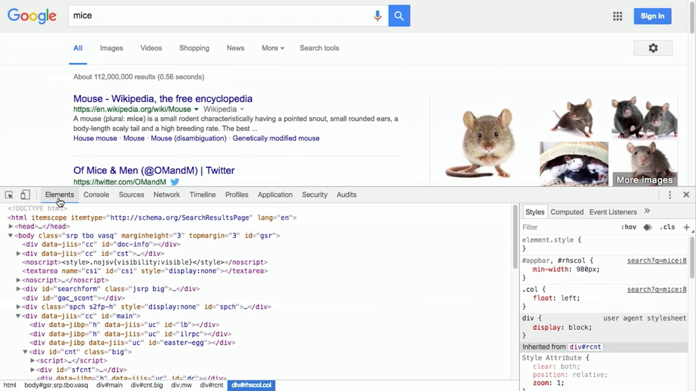
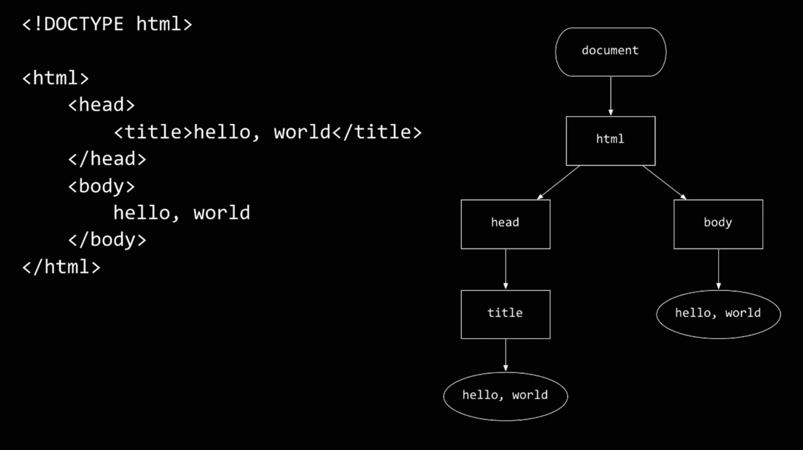
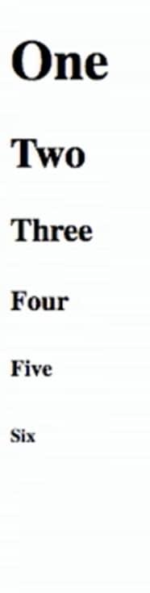

# Лекция 6. HTTP.

## В Прошлый Раз

Мы познакомились с такими структурами данных как:

связный список - узлы соединенные указателями.

стеки и очереди (queues) - списки, поддерживающие свойства первым пришел - первым вышел или последним пришел - первым вышел.

Двоичное дерево поиска, состоящее из двух узлов, соединенных одним родительским узлом

хеш-таблицы - массивы связных списков, позволяющие быстро найти нужные нам элементы

трай-и, позволяют искать элементы путем перебирания символов

## Интернет

Теперь мы покидаем мир Си и погружаемся в мир веба и интернет-технологий.

Как же мы подключаемся к интернету? У нас есть интернет-провайдер (internet service provider или ISP), например "Акадо", чьи проведенные провода в вашем доме образуют сеть и соединяют вас с их сетью еще больших проводов.

Интернет является своего рода приложением, запущенным на всех этих физический соединениях, используемое нами повседневно.

Обычно подключение к интернету идет через беспроводной роутер (коробка, к которой подключают внешний провод). Выбрав беспроводную сеть, раздаваемую нашим роутером, технология, имеющая название DHCP (англ. Dynamic Host Configuration Protocol — протокол динамической настройки узла), назначает уникальный IP-адрес (Internet Protocol) нашему компьютеру, позволяющий идентифицировать его (наше устройство) в сети. И с помощью данного адреса компьютеры способны взаимодействовать между собой, используя интернет.

IPv4 (IP версия 4) - самая распространенная версия IP, имеющая форму `#.#.#.#`.

Точно также, как и у домов в реальном мире есть свои адреса, которые позволяют найти и отличить их от других домов, также и у компьютеров есть свои адреса в мире интернета.

Каждый из `#`-цифр находится в диапазоне от `0` до `255` (диапазон значений), что представляет из себя 8 битное значение. Цифра, соответственно, использует 8 бит, и в целом адрес занимает 32 бита, что дает примерно 4 миллиарда возможных адресов.

Также существуют зарезервированные IP-адреса, известные как частные адреса с диапазонами `10.#.#.#`, `172.16.#.#` - `172.31.#.#` и `192.168.#.#`, которые используются только внутри локальных сетей, не во внешнем мире.

По идее, чтобы попасть на какой-нибудь сайт нужно знать IP-адрес интересующего нас сайта. На помощь приходит технология под названием DNS (англ. Domain Name System — система доменных имён), которая подбирает IP-адресу доменное имя и наоборот. Поэтому если мы наберем в браузере `www.google.com`, название домена в браузере (спасибо DNS) заменится на IP-адрес.

И теперь, когда у нас есть IP-адреса, на которые можно что-то посылать и принимать, мы можем создавать и отправлять пакеты с информацией (туда же входит адрес отправителя и адрес получателя).

Мы отправляем эти пакеты роутерам, компьютерным серверам, находящихся в дата-центрах. Они, в свою очередь, направляют информацию в место назначения, т.е. к определенному IP-адресу. Таким образом, передавая наши пакеты от роутера к роутеру, они достигнут указанной нами точки назначения.

Мы можем открыть среду разработки CS50 IDE и запустить следующую команду:
```
$ nslookup www.google.com
Server:         140.247.233.195
Address:        140.247.233.195#53

Non-authoritative answer:
Name:   www.google.com
Address: 172.217.4.36
```
Первая строка показывает нам DNS-сервер, которого мы попросили достать для нас информацию о доменном имени. В ответ мы получили следующее: `Non-authoritative answer` (неавторизованный ответ), все это из-за того, что наш DNS-сервер не владеет данным доменным имене.

Мы можем представить данные пакеты в виде обычных конвертов, с какой-то информацией внутри них и с адресами на самом конверте, указывающими "Куда" и "Откуда" должны быть направлены конверты.

Запустим еще одну команду `traceroute`:



Здесь показаны роутеры, через которые проходят наши пакеты, направленные одному из сервером `www.google.com`.

Первые два роутера, у которых есть в названии буквы `sc` и `.harvard.edu`, принадлежат Гарварду.

Роутер `bdrgw2` или "border gateway" (пограничный шлюз) соединяет нас с другим роутером, под названием nox1 или "northern crossroads" (северный перекресток) - место соединения огромного количества интернет-провайдеров (много проводов и различных технологий).

Далее идут анонимные (неизвестные) роутеры, с не прикрепленными доменными именами. И наконец, мы дошли до последнего роутера - сервер Гугла (один из них).

Теперь давайте попробуем зайти на сайт, находящийся на огромном расстоянии от нас:



Загрузка Японской версии сайта CNN занимает немало времени.

Если посмотреть на роутеры 8 и 9, то можно увидеть, что их соединение имеет самый большой интервал, поэтому, между ними, возможно, будет находится (буквально) океан.

Мы смотрели видео [подводные кабели](https://www.youtube.com/watch?v=cAosCI51WWk).

Поэтому, если кто-то, предположим Google, получит от нас пакет информации, они, скорее всего, захотят дать вам ответ. Но, если они будут отправлять данные, которые потребуют места больше, чем способен вместить в себя один пакет, на помощь придет технология под названием TCP (Transmission Control Protocol или Протокол Управления Передачей), которая делит информацию на части и позволяет отдельно отправлять пакеты. И эти пакеты помечаются примерно так `1 из 4` или `2 из 4` - таким образом мы выстраиваем их по порядку и способны проследить дошли ли все пакеты.

Существует достаточное количество служб в сети Интернет, кроме обычного веб-серфинга, поэтому, чтобы компьютеру понять, какой программе предназначались пакеты, каждый из них также помечается дополнительным числом или портом.

К примеру, стандартные порты и протоколы включают:

* 21 FTP, протокол передачи файлов, несколько лет назад был предоставлен уникальный идентификатор (номер порта) - 21

* 22 SSH (англ. Secure Shell — «безопасная оболочка»), для выполнения команд на другом компьютере

* 25 SMTP, для отправки email'ов (электронных писем)

* 53 DNS

* 80 HTTP, для посещения веб-сайтов

* 443 HTTPS, для посещения защищенных веб-сайтов

Firewall'ы блокируют входящие пакеты, поэтому через них можно ограничивать доступ к определенным сайтам. Также можно блокировать выходящие пакеты, тем самым не допуская утечки важной информации. И все это реализуется с помощью локального маршрутизатора, который будет просто просматривать все пакеты и не пропускать те, которые будут в себе содержать определенные адреса. Также Firewall способен блокировать весь трафик (передвижение пакетов) на определенном порту.

Есть сервисы, так называемые VPN'ы (англ. Virtual Private Network — виртуальная частная сеть), которыми вы можете воспользоваться, чтобы подключиться к сети вашей компании или университета. Создается зашифрованный туннель, чтобы перемещать весь ваш трафик через виртуальную частную сеть (VPN) в просторы интернета. Но у этого метода есть своя цена, теперь нам понадобится гораздо больше времени, чтобы открыть какой-нибудь сайт или скачать нужную нам информацию.

Также существуют коммутаторы (свитчи) - это простое устройство с богатым количеством портов для подключения устройств через кабель.

Мы смотрели еще одно видео, показывающее [как устроен интернет](https://www.youtube.com/watch?v=TozT8fW9nRc).

## HTTP

HTTP (англ. HyperText Transfer Protocol — «протокол передачи гипертекста») - один из самых распространенных способов форматирования сообщений для установления связи между компьютерами (коммуникации).

К примеру, мы могли бы, в реальном мире, представиться сказав "Привет, меня зовут Стас", вытягивая при этом нашу руку, а другой человек, в свою очередь, скажет свое имя и в ответ пожимает нашу руку.

У HTTP, также как и у рукопожатия, есть свои правила и стандарты того, как нужно начинать и заканчивать "рукопожатие", а точнее связь.

Самый простой запрос в HTTP - это метод под названием `GET`, где мы отправляем сообщение, которое выглядит так:
```
GET / HTTP/1.1
Host: www.harvard.edu
...
```
Символ `/` означает, что нам нужен корень веб-сервера или страница по умолчанию. `HTTP/1.1` указывает на версию используемого HTTP и Host: `www.harvard.edu` указывает на веб-сайт, который мы запрашиваем от сервера.

Надеемся, что сервер отдаст следующий ответ:
```
HTTP/1.1 200 OK
Content-Type: text/html
...
```
И после этих первых строк, ниже будет идти сама страница веб-сайта или информация, которую мы запросили.

Все сайты пишутся на языке HTML. Именно его используют, для отображения какого-либо контента (текст, котики, фотожабы и т.п.).

Часто встречающиеся коды состояния HTTP:

`200 OK`

`301 Moved Permanently` (перемещена навсегда)

`302 Found` (найдена)

`304 Not Modified` (не изменялась)

`401 Unauthorized` (не авторизован)

`403 Forbidden` (запрещена)

`404 Not Found` (не найдена)

`500 Internal Server Error` (внутренняя ошибка сервера)

Можно, находясь в командном окне, притвориться браузером. Запустим команду:
```
$ telnet www.harvard.edu 80
Trying 104.16.151.6...
Connected to www.harvard.edu.cdn.cloudflare.net
Escape character is '^]'.
```
Мы воспользовались 80 портом, так как он предназначен для веб-трафика (HTTP). Похоже, что Гарвард пользуется услугами сервиса CloudFlare, которая является сетью доставки (и дистрибуции) контента (англ. Content Delivery Network или Content Distribution Network, CDN), позволяющая намного быстрее предоставлять веб-сайт тому, кто его запросил (ввел в браузер название сайта и нажал на кнопку "Enter").

Далее пишем:
```
GET / HTTP/1.1
Host: www.harvard.edu
```
И если мы отправим этот запрос, а затем прокрутим вверх (колесиком мыши или стрелками) или перенаправим выходные данные в файл, мы увидим HTTP-ответ:



Здесь у нас `HTTP/1.1 200 OK` и множество других заголовков, указывающие когда закончится срок данной страницы или какой тип контента мы получили.

Мы можем воспользоваться альтернативной командой под названием `curl`, которая будет выводить только заголовки:
```
$ curl -I http://www.harvard.edu/
```
Запустим команду:
```
$ curl -I http://reference.cs50.net/
HTTP/1.1 301 Moved Permanently
Cache-control: no-cache="set-cookie"
Content-Length: 178
Content-Type: text/html
Date: Mon, 03 Oct 2016 17:17:39 GMT
Location: https://reference.cs50.net/
Server: nginx/1.8.1
Set-Cookie: AWSELB=7D03E3C11C9564D4EBA91026CCAAA8EEDCD5DC34657AEDEBBAB0856E24F9ACB5BE65C5B4443B7EF06C9BBEAC5F36BF556A51333C0377A6BC471E810D021D4033A06AC36B27;PATH=/
Connection: keep-alive
```
Здесь есть заголовок `Location:` (позиция или место), перенаправляющий нас на новую ссылку (URL).

Если мы перейдем на данный сайт через наш браузер, нас автоматически перенаправят на другой адрес, начинающийся уже с `https://`.

Благодаря HTTPS между нами и сервером будет зашифрованный трафик, поэтому никто из тех, кто подключен к нашей сети, не сможет украсть наши данные.

Если мы посетим сайт Google и попробуем найти котов ("cats"), то получим огромную ссылку (URL). Но можно ее немного изменить, на что-то более понятное: [http://www.google.com/search?q=cats](http://www.google.com/search?q=cats). Перейдя по этой ссылке, получим точно такой же результат.

Похоже, что наш браузер прикрепляет то, что мы написали в поисковой строке к ссылке (URL) и отправляет всю эту ссылку серверу Google.

Если мы нажмем правой кнопкой по веб-сайту в Chrome, а затем выберем `Просмотреть код`, то увидим форматированный HTML с вложенной структурой и, возможно, шаблонами различных слов:



## HTML

Пример простейшей веб-страницы:
```html
<!DOCTYPE html>
<html>
    <head>
        <title>hello, world</title>
    </head>

    <body>
        hello, world
    </body>
</html>
```
В первой строке мы объявляем, что эта страница написана на языке HTML, а точнее на HTML 5 версии.

И далее видно, что тут присутствует вложенность и симметрия тегов, которые начинаются так `<html>` и заканчиваются вот так `</html>`.

Начальный тег, к примеру `<title>`, указывает на начало определенного элемента, как например название страницы (title of the page), а конечный тег сигнализирует его конец.

Здесь у нас много отступов и пробелов, которыми другие сайты навряд ли пользуются, так как их отсутствие или наличие никак не влияет на страницу, главное чтобы сохранялся порядок и вложенность.

Мы можем представить эту веб-страницу, используя древовидную структуру:



`document` (документ) - это вся страница и она содержит в себе `html` элемент, у которого есть дети `head` (голова) и `body` (тело).

Мы можем представить, что элементы дерева этого веб-сайта, где различные части страницы обновляются без перезагрузки всей страницы, меняются в реальном времени (т.е. на ходу, пока вы пользуетесь сайтом).

Можно открыть CS50 IDE и сохранить файл под названием `hello.html` в нашу рабочую среду вместе со всем этим контентом. Потом мы можем зайти на нашу страницу через браузер и просмотреть ее.

Также можно добавлять изображения:
```html
<!DOCTYPE html>

<html>
    <head>
        <title>image</title>
    </head>

    <body>
        
    </body>
</html>
```
Нам нужно загрузить `cat.jpg` в нашу рабочую среду, и так как никакого другого контента не бывает внутри тега `img`, мы можем просто закрыть начальный тег этим `/>`.

И `alt="Grumpy Cat"` говорит браузеру, что картинка может быть описана с помощью текста, в целях доступности на различных устройствах (которые не способны загружать изображения).

И мы можем создавать ссылки:
```html
<!DOCTYPE html>

<html>
    <head>
        <title>link</title>
    </head>

    <body>
        Search for <a href="https://www.google.com/search?q=cats">cats</a>.
    </body>
</html>
```
Тег `a` (сокращенно от Anchor) с атрибутом `href` или hyper-reference (гиперссылка). Внутрь помещается URL, куда будет направлять ссылка и текст, который мы хотим отображать в качестве ссылки. Заметьте, мы можем напрямую помещать один элемент внутрь другого.

Мы можем комбинировать эти идеи и превратить изображение в ссылку:
```html
<!DOCTYPE html>

<html>
    <head>
        <title>link</title>
    </head>

    <body>
        Search for <a href="https://www.google.com/search?q=cats"></a>.
    </body>
</html>
```
Поведение тегов может быть изменено такими атрибутами как `href` или `src`. И мы можем воспользоваться любым онлайн источником документации HTML, где будут описаны названия тегов и их атрибуты.

Также существуют параграфы:
```html
<!DOCTYPE html>

<html>
    <head>
        <meta name="viewport" content="width=device-width, initial-scale=1"/>
        <title>paragraphs</title>

    </head>

    <body>
        <p>
            Lorem ipsum dolor sit amet, consectetur adipiscing elit. Nullam in tincidunt augue. Duis imperdiet, justo ac iaculis rhoncus, erat elit dignissim mi, eu interdum velit sapien nec risus. Praesent ullamcorper nibh at volutpat aliquam. Nam sed aliquam risus. Nulla rutrum nunc augue, in varius lacus commodo in. Ut tincidunt nisi a convallis consequat. Fusce sed pulvinar nulla.
        </p>

        <p>
            Ut tempus rutrum arcu eget condimentum. Morbi elit ipsum, gravida faucibus sodales quis, varius at mi. Suspendisse id viverra lectus. Etiam dignissim interdum felis quis faucibus. Integer et vestibulum eros, non malesuada felis. Pellentesque porttitor eleifend laoreet. Duis sit amet pellentesque nisi. Aenean ligula mauris, volutpat sed luctus in, consectetur id turpis. Phasellus mattis dui ac metus blandit volutpat. Donec lorem arcu, sollicitudin in risus a, imperdiet condimentum augue. Ut at facilisis mauris. Curabitur sagittis augue in dictum gravida. Integer sed sem sed justo tempus ultrices eu non magna. Phasellus semper eros erat, a posuere nisi auctor et. Praesent dignissim orci aliquam laoreet scelerisque.
        </p>

        <p>
            Mauris eget erat arcu. Maecenas ac ante vel ipsum bibendum varius. Nunc tristique nulla eget tincidunt molestie. Morbi sed mauris eu lectus vehicula iaculis ac id lacus. Etiam sit amet magna massa. In pulvinar sapien ac mi ultrices, quis consequat nisl hendrerit. Aliquam pharetra nec sem non vehicula. In et risus leo. Ut tristique ornare nisl et lacinia.
        </p>
    </body>
</html>
```
У нас несколько параграфов с латинским текстом, каждый из которых выделен отдельными `<p>` тегами.

И в теге `head` у нас есть странная линия, которая начинается с `meta`, говорящая нашему браузеру масштабировать веб-страницу под размер устройства (если мы просматриваем страницу на телефоне, перед нами не появится маленький текст, который мы могли бы получить в противном случае).

Также мы можем использовать заголовки:
```html
<!DOCTYPE html>

<html>
    <head>
        <title>headings</title>
    </head>

    <body>
        <h1>One</h1>
        <h2>Two</h2>
        <h3>Three</h3>
        <h4>Four</h4>
        <h5>Five</h5>
        <h6>Six</h6>
    </body>
</html>
```


Со списками (тегами списка), у нас добавляется еще больше вложенности:
```html
<!DOCTYPE html>

<html>
    <head>
        <title>list</title>
    </head>

    <body>
        <ul>
            <li>foo</li>
            <li>bar</li>
            <li>baz</li>
        </ul>
    </body>
</html>
```
Есть элемент `ul` (unordered list/несортированный список), внутри которого находятся элементы `li` (list item/элементы списка).

Также можно использовать `ol`, если нам нужен ordered list (упорядоченный/отсортированный список).

Все эти примеры можно найти, перейдя по ссылке [http://cdn.cs50.net/2016/fall/lectures/6/src6/](http://cdn.cs50.net/2016/fall/lectures/6/src6/)!

## CSS

Мы можем добавлять стили с помощью другого языка, CSS (англ. Cascading Style Sheets — каскадные таблицы стилей). В то время как HTML используется для разметки веб-страницы или обозначения ее иерархии или контента, CSS применяется для изменения внешнего вида веб-страницы.

Вот пример, где CSS добавляется в HTML:
```html
<!DOCTYPE html>

<html>
    <head>
        <title>css-0</title>
    </head>

    <body>
        <div style="text-align: center;">
            <div style="font-size: 36px; font-weight: bold;">
                John Harvard
            </div>

            <div style="font-size: 24px;">
                Welcome to my home page!
            </div>

            <div style="font-size: 12px;">
                Copyright &#169; John Harvard
            </div>
        </div>
    </body>
</html>
```
Заметьте, у элементов теперь есть атрибут `style`, внутри которых прописано что-то вроде `font-size: 12px;` вместе с другими строками.

`div` - это что-то вроде деления (division), прямоугольная область страницы.

Самый внешний `div`, с `text-align: center;` в качестве стиля, выровнять по центру текст всех своих `div` потомков.

Но мы можем и отделить наш CSS:
```html
<!DOCTYPE html>

<html>
    <head>
        <style>
            body
            {
                text-align: center;
            }

            #top
            {
                font-size: 36px;
                font-weight: bold;
            }

            #middle
            {
                font-size: 24px;
            }

            #bottom
            {
                font-size: 12px;
            }
        </style>

        <title>css-1</title>
    </head>

    <body>
        <div id="top">
            John Harvard
        </div>

        <div id="middle">
            Welcome to my home page!
        </div>

        <div id="bottom">
            Copyright &#169; John Harvard
        </div>
    </body>
</html>
```
Теперь мы дали каждому `div`'у в нашем `body` атрибут `id`, который позволяет определить их в общей структуре документа. В нашем теге `head` мы задаем стили CSS для каждого из них (элементов с атрибутом "id"), используя тег `style`.

`#top`, `#middle` и` #bottom` входят в синтакс, который мы используем для выбора каждого из тех `div`'ов, что с атрибутом "id". И внутри нашего тега `style` мы используем фигурные скобки, чтобы объявлять свойства, которые мы хотим применить к каждому элементу.

Теперь наш контент отделен от нашей эстетики.

Мы можем полностью отделить CSS, поместив его в файл:
```html
<!DOCTYPE html>

<html>
    <head>
        <link href="css2.css" rel="stylesheet"/>
        <title>css-2</title>
    </head>

    <body>
        <div id="top">
            John Harvard
        </div>

        <div id="middle">
            Welcome to my home page!
        </div>

        <div id="bottom">
            Copyright &#169; John Harvard
        </div>
    </body>
</html>
```
Здесь, в теге `head`, мы добавили тег `link`, которые схож с `include` языка программирования Си. Теперь соответствующий файл `css2.css` будет применен к нашей странице:
```css
body
{
    text-align: center;
}

#top
{
    font-size: 36px;
    font-weight: bold;
}

#middle
{
    font-size: 24px;
}

#bottom
{
    font-size: 12px;
}
```
И заметьте строку HTML, где есть символ `©` - символ авторского права. Мы можем поискать в интернете что-то вроде "HTML entities" (спецсимволы HTML), чтобы понять как добавлять такого рода символы в нашу веб-страницу.

Хоть эти три версии и показывают одну и ту же веб-страницу, когда мы открываем ее в браузере, дизайн последнего намного лучше остальных. К примеру, тот же `css2.css` может использоваться сразу несколькими HTML страницами и нам всего лишь нужно было бы менять стиль только в одном определенном месте нашего документа.

На самом деле существует множество библиотек CSS, которые хранят в себе огромное количество, написанных другими, стилей. Мы можем применить их на наши собственные веб-страницы, без необходимости того, чтобы начинать все с чистого листа.

## POST

Мы познакомились с методом HTTP под названием `GET` и, оказывается, есть еще один метод `POST`, который позволяет браузеру отправлять данные серверу, внутри самого запроса, а не в URL (т.е. не в ссылке).

Запрос `POST` может выглядеть так:
```
POST /login.php HTTP/1.1
Host: www.facebook.com
...

email=username@example.com&pass=12345
```
Отправляются оба `email` (электронная почта) и `pass` (пароль). Эти знания помогут нам при создании наших собственных веб-страниц.

Давайте создадим страницу под названием поиск:
```html
<!DOCTYPE html>

<html>
    <head>
        <title>CS50 Поиск</title>
    </head>

    <body>
        <h1>CS50 Поиск</h1>
        <form action="https://www.google.com/search" method="get">
            <input name="q" type="text"/>
            <br/>
            <input type="submit" value="CS50 Поиск"/>
        </form>
    </body>
</html>
```
У нас есть заголовок `h1` и еще один элемент `form` (формы).

Мы воспользуемся методом `get`, так как мы знаем, что Google использует именно этот метод для поиска информации.

Мы добавим `input` (элемент ввода), имеющий название `q` и кнопку `submit` (отправить).

Теперь, если мы откроем эту страницу и введем `cats` (кошки), наш браузер поймет, что ему нужно создать ссылку (URL), которая будет выглядеть так [https://www.google.com/search?q=cats](https://www.google.com/search?q=cats), далее переводя нас туда из нашей формы.

Но мы не создавали бэк-энда (back-end), т.е. веб-сервера, который был бы способен считывать принимаемые URL'ы (ссылки) и производить подходящие ответы, отправляя их обратно клиенту. Скоро мы познакомимся с еще одним языком под названием Python (Питон), который поможет нам написать наш собственный веб-сервер.