# Лекция 6. Машинное обучение.

## Введение в машинное обучение

Эта лекция свяжет первую часть этого курса, где мы изучали низкоуровневые языки программирования, и вторую часть, где будут изучаться высокоуровневые языки.

Python, например, может быть использован для написания web-сервера, принимающего запросы, обращающегося к базе данных и возвращающего данные пользователю.

Сегодня мы будем использовать Python для анализа данных в контексте машинного обучения.

Как показано на следующей картинке, есть несколько (неточных) представлений о том, чем занимаются в машинном обучении:

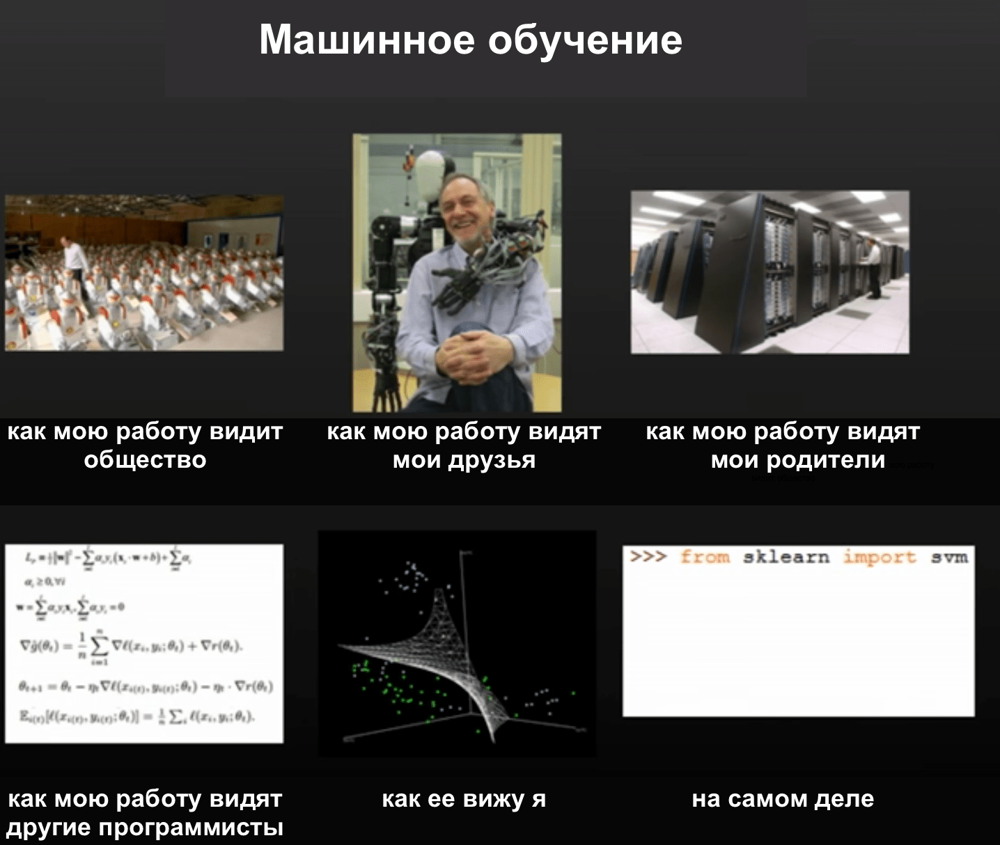

Достаточно правдивым, однако, является то, что в машинном обучении в основном используется язык программирования Python.

Прочитав эту строчку (последнее изображение), можно понять, что `sklearn` - есть модуль или библиотека, из которой мы получаем кое-какие функции называемые `svm`, хотя мы и не знаем, для чего они предназначены.

Машинное обучение часто ассоциируется у людей с искусственным интеллектом (ИИ), и особенно, с роботами из фантастических фильмов.

В повседневной же жизни, машинное обучение применяется для написания поисковых систем, распознавания изображений, голоса и обработки естественного языка.

Машинное обучение всего лишь описывает алгоритмы для решения этих задач.

Вспомним, что алгоритм получает набор входных данных, а затем производит какие-то выходные данные. В случае распознавания изображений, мы хотим предоставить в качестве входных данных набор изображений и получить на выходе текст, описывающий эти изображения.

В случае обработки естественного языка, мы можем попытаться обработать целый роман и получить его тематику.

В прошлом, мы проделывали что-то подобное в проблеме Whodunit, когда шумная картинка была отфильтрована, чтобы найти скрытую информацию.

Разница здесь в том, что ранее нам было известно о добавленном шуме, а в нынешнем случае никакой информации об изображении нет.

Чтобы справиться с этой задачей, мы применим нечто, что называется training data (обучаемые данные) - процесс предоставления обученного набора изображений, помогающих распознавать новые изображения.

## Распознавание изображений

Наглядно это можно увидеть на примере следующих данных для обучения, направленных на создание алгоритма, который может распознавать рукописные цифры:

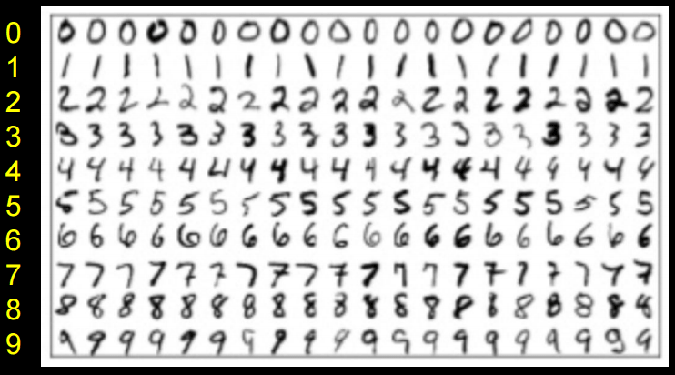

Представим линию, на которой отмечены точки с цифрами:
```
<--•--•-•----------------•-•-•-->
   0  0 0                6 6 6
```
И если нам дают дополнительную точку, мы можем угадать, что это 6:
```
<--•--•-•--------------•-•-•-•-->
   0  0 0              ? 6 6 6
```
Этот метод называется: **классификатор ближайших соседей**.

Тот же принцип в двух измерениях:

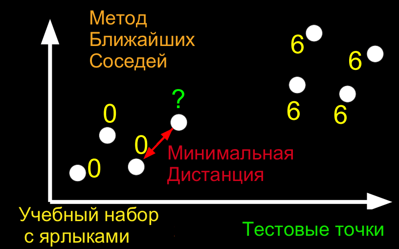

Теперь вопрос состоит в том, как мы можем отображать изображения цифр в пространстве, так как оттуда мы можем найти ближайших соседей контрольных точек к нашим точкам данных обучения.

Flatland - это рассказ о двумерном существе, Квадрате, который посещает Lineland и пытается убедить точки, живущие в нем в том, что есть два измерения, а затем посещает Spaceland, чтобы обнаружить существование третьего измерения. Мы смотрели [трейлер](https://vimeo.com/8675372) фильма по этой истории.

Мы живем в 3-х мерном пространстве, но мы можем подобным образом мыслить о точках в более высоких измерениях.

Возьмем изображение цифры. Мы можем присвоить каждому пикселю, с определенным значением серого, число, каждое из которых имеет свое измерение:

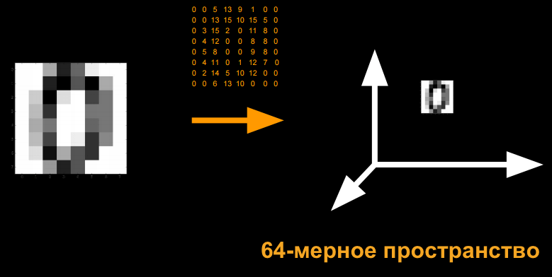

Благодаря "алгоритму ближайшего соседа", мы сможем отобразить все наши данные обучения в виде точек, и, предоставив проверочную (как ранее в примере) точку, мы сможем найти ближайшую точку обучения.

## Ближайшие соседи Python

Чтобы попасть в интерпретатор, мы можем просто написать в терминале `python`.

Оказавшись в нем, нам стали доступны новые команды:
```
>>> x = 3
>>> y = 5
>>> x + y
8
>>> x = 'a'
>>> y = ' b'
>>> x + y
'a b'
```
В Python не нужно определять типы переменных. Также отпадает необходимость в уточнении типа кавычек (нет разницы будете вы использовать одинарные или двойные).

Нет нужды в компиляторе, так как интерпретатор в реальном времени считывает код, далее компилирует его и запускает скомпилированный файл.

Простой цикл `for`:
```
>>> for i in [3, 5, 7]:
...   print(i)
...
3
5
7
```
Идет прямое перебирание элементов массива. Мы больше не нуждаемся в фигурных скобках, но вместо них нужно будет использовать отступы, чтобы указывать уровни нашего кода.

В остальной части лекции мы будем использовать что-то, называемое iPython notebook, которое позволяет нам писать строки кода и видеть результат их выполнения, по одному кусочку кода за раз:

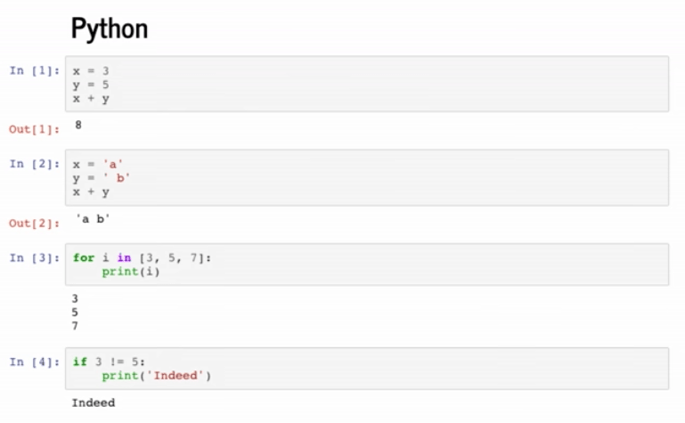

Процесс обучения нашего алгоритма, описанный ранее, называется supervised learning (обучение с учителем). В supervised learning мы обозначаем данные обучения (некоторые входные значения) ожидаемыми выходными значениями.

Начнем с загрузки модулей или библиотек:
```python
import numpy as np
import matplotlib.pyplot as plt
# Настройте matplotlib для встраивания отображения в выходные ячейки данного notebook'а
%matplotlib notebook
```
Популярность Python дает нам доступ к огромному числу готовых библиотек.

Начнем с создания кое-каких данных обучения:
```python
In [2]:
X_train = np.array([[1,1], [2,2.5], [3,1.2], [5.5,6.3], [6,9], [7,6]]) # Определите numpy-массив двумерных точек
Y_train = ['red', 'red', 'red', 'blue', 'blue', 'blue'] # Определите список (т.е. массив) строк
```
`X_train` - это точки, а `Y_train` - это ярлык (обозначение) каждой точки.

`X_train` - это тоже самое, что и двумерный массив, поэтому мы можем, точно таким же образом, как и в случае с двумерным массивом, получить доступ к элементам, находящимся внутри других элементов:
```python
In [3]:
print(X_train[5,0]) # Получить 0 координату 5ой точки в массиве
print(X_train[5,1]) # Получить 1 координату 5ой точки в массиве
7.0
6.0
```
В Python, как и в Си, индексация начинается с 0.

У синтаксиса Python есть еще одна особенность, называемая slicing (срезать), которая позволяет вытаскивать из массива сразу несколько элементов:
```python
In [4]:
print(X_train[:, 0]) # Извлечь 1-ую координату (с индексом 0) всех элементов (:) массива X_train
[ 1.   2.   3.   5.5  6.   7. ]
In [5]:
print(X_train[:, 1]) # Извлечь 2-ую координату (с индексом 1) всех элементов (:) массива X_train
[ 1.   2.5  1.2  6.3  9.   6. ]
```
Теперь мы можем отобразить все эти точки вместе с их цветами в качестве ярлыков:
```python
plt.figure() # Определите новый образ
plt.scatter(X_train[:,0], X_train[:,1], s = 170, color = Y_train[:]) # Отобразите точки, используя синтаксис нарезки Python
plt.show() # Покажите рисунок
```
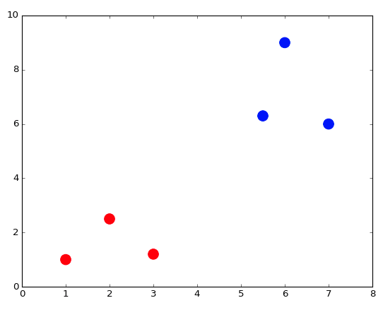

Мы можем посмотреть в документацию, для уточнения входных параметров функции (метода) `plt.scatter`.

Давайте создадим и отобразим тестовую точку:
```python
X_test = np.array([3,4])
plt.figure() # Определите новый образ
plt.scatter(X_train[:,0], X_train[:,1], s = 170, color = Y_train[:])
plt.scatter(X_test[0], X_test[1], s = 170, color = 'green')
plt.show() # Покажите рисунок
```
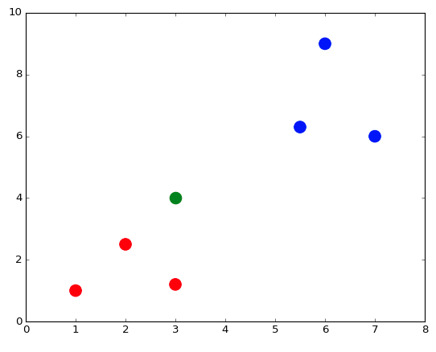

Тестовая точка `green` (зеленая), так как мы пока не знаем к какому цвету она относится из данных обучения.

Для запуска Nearest Neighbor Classifier нужно для начала определить функцию, с помощью которой будет высчитываться расстояние:
```python
def dist(x, y):
    return np.sqrt(np.sum((x - y)**2)) # np.sqrt и np.sum являются numpy-функциями, предназначенные для работы с numpy-массивами
```
Мы знаем, что наши точки находятся в двух измерениях, поэтому мы вычисляем расстояние, вычитая значения каждой координаты двух точек x и y, возводим их в квадрат, вычислить их сумму и применяем квадратный корень:

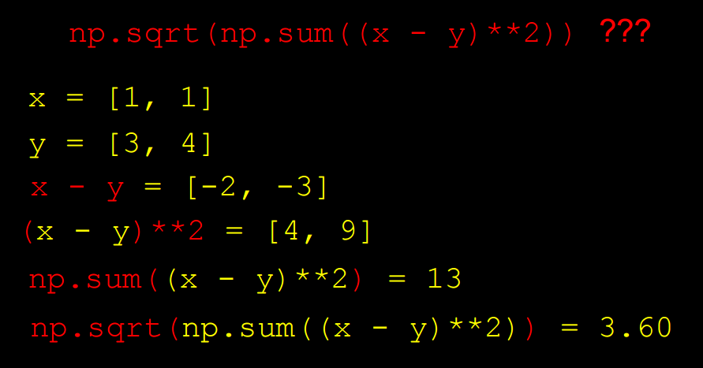

Вычислим расстояние от каждой точки обучения до тестовой точки:
```python
num = len(X_train) # Вычислите количество точек в X_train
distance = np.zeros(num) # Инициализируйте numpy-массив нулей
for i in range(num):
    distance[i] = dist(X_train[i], X_test) # Вычислите расстояние от X_train[i] до X_test
print(distance)
[ 3.60555128  1.80277564  2.8         3.39705755  5.83095189  4.47213595]
```
Мы получим массив с расстояниями (distances).

Мы также можем воспользоваться векторизацией "vectorization", чтобы применить формулу вычисления расстояния прямо на массивах:
```python
distance = np.sqrt(np.sum((X_train - X_test)**2, axis = 1)) # Векторизация
print(distance)
[ 3.60555128  1.80277564  2.8         3.39705755  5.83095189  4.47213595]
```
Теперь мы можем найти точку с минимальной дистанцией и определить подходящий для нее ярлык:
```python
In [12]:
min_index = np.argmin(distance) # Получите индекс с наименьшим расстоянием (distance)
print(Y_train[min_index])
red
```
## Распознавание изображений с Python

Изученные принципы мы применим для распознавания цифр.

Для начала мы импортируем `sklearn` - модуль Python для машинного обучения. Данный модуль предоставляет несколько стандартных наборов данных, к примеру набор цифр.
```python
In [13]:
from sklearn import datasets
digits = datasets.load_digits()
```
Набор данных `digits` содержит в себе 1797 изображений, представляющих из себя рукописные цифры. Каждое изображение имеет числовую метку (ярлык), указывающее какое число изображено на картинке. `digits.images` - массив изображений, а `digits.target` - массив меток (ярлыков).

Каждый элемент массива `digits.images` находится на своем собственном 8x8 пиксельном массиве, где каждый пиксель является целым числом (integer) со значением от 0 до 16. Давайте посмотрим как выглядит первое изображение (под индексом 0):
```python
In [14]:
print(digits.images[0])
[[  0.   0.   5.  13.   9.   1.   0.   0.]
 [  0.   0.  13.  15.  10.  15.   5.   0.]
 [  0.   3.  15.   2.   0.  11.   8.   0.]
 [  0.   4.  12.   0.   0.   8.   8.   0.]
 [  0.   5.   8.   0.   0.   9.   8.   0.]
 [  0.   4.  11.   0.   1.  12.   7.   0.]
 [  0.   2.  14.   5.  10.  12.   0.   0.]
 [  0.   0.   6.  13.  10.   0.   0.   0.]]
```
Сможете разглядеть изображение нуля? Упростим себе задачу, присвоим каждому числу интенсивность черного. Так мы сможем лучше отрисовать наш массив:
```python
plt.figure()
plt.imshow(digits.images[0], cmap = plt.cm.gray_r, interpolation = 'nearest')
plt.show()
```
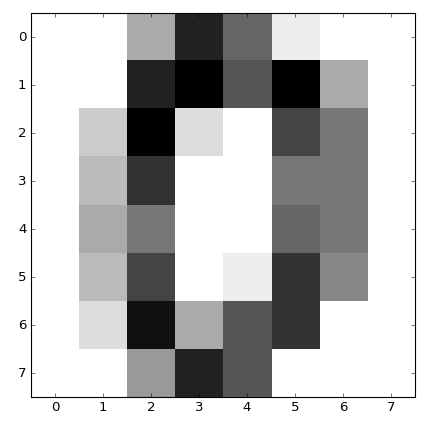

Каждый элемент массива `digits.target` представляет из себя числовую метку или цифру, которой соответствует определенное изображение:
```python
In [16]:
print(digits.target[0])
0
```
Создадим данные обучения из первых 10 цифр:
```python
X_train = digits.data[0:10]
Y_train = digits.target[0:10]
```
Выберем тестовую точку:
```python
X_test = digits.data[345]
```
Применим тот же алгоритм, который мы использовали ранее, чтобы найти ближайшего соседа этой тестовой точки, среди всех точек данных обучения (training data):
```python
num = len(X_train) # Вычислите количество точек в X_train
distance = np.zeros(num) # Инициализируйте массив нулей
for i in range(num):
    distance[i] = dist(X_train[i], X_test) # Вычислите расстояние от X_train[i] до X_test
min_index = np.argmin(distance) # Получите индекс с наименьшим расстоянием (distance)
print(Y_train[min_index])
3
```
Меткой этого изображения действительно является `3`:
```python
print(digits.target[min_index])
3
```
Можно немного дописать код, чтобы получить возможность проверки большего числа точек:
```python
num = len(X_train) # Вычислите количество точек в X_train (данных обучения)
no_errors = 0 # Следите за количеством ошибок
distance = np.zeros(num) # Создайте, заполненный нулями, массив с размером X_trains
for j in range(1697, 1797):
    X_test = digits.data[j] # Проверьте значения в диапазоне [1697, 1797)
    for i in range(num):
        distance[i] = dist(X_train[i], X_test) # Вычислите расстояние от X_train[i] до X_test
    min_index = np.argmin(distance) # Получите индекс с наименьшим расстоянием (distance)
    if Y_train[min_index] != digits.target[j]: # Увеличение счетчика ошибок на одну единицу, если метка не совпадает с меткой ближайшего соседа
        no_errors += 1
print(no_errors)
37
```
37 ошибок из 100 попыток распознавания изображения! Неплохо для такого простого алгоритма. Но мы можем добиться лучшего результата, если увеличим набор учебных данных.

Если мы немного изменим последние шаги и сделаем так, что вместо 10 будет использоваться 1000 изображений цифр в качестве обучающихся данных, мы получим только 3 ошибки перебрав 100 тестовых изображения.

## Больше о распознавании изображения

Мы можем применить тот же алгоритм на наборе данных из тысяч изображений, каждое из которых имеет определенную объектную метку: самолет, птица, кошка, собака и т.д. Но, оказывается, при использовании алгоритма определения ближайшего соседа, мы получаем только 30% корректность определения объекта.

К примеру, цифра 0 всегда будет отображаться в 2D (двух измерениях), в черном и белом. Изображения объектов представлены определенными цветами, но они так же могут иметь разные ракурсы или углы обзора.

К проблемам, возникающим при распознавании изображения, относятся:

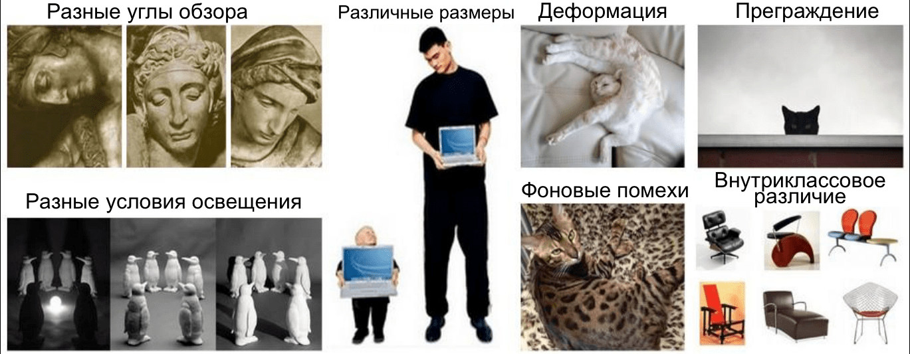

Алгоритмы распознавания изображения могут быть улучшены путем группировки пикселей изображения в отдельно рассматриваемые **черты**. Такой процесс имеет название **deep learning** (глубинное или глубокое обучение):

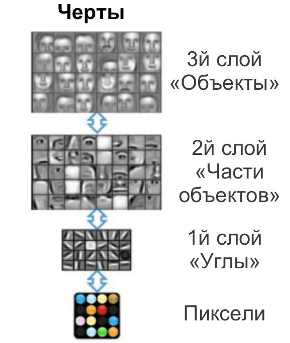

На реализацию этих алгоритмов требуется огромное количество производительных ресурсов. И библиотеки, наподобие [TensorFlow](https://www.tensorflow.org/), помогают строить программы, использующие машинное обучение для решения определенных проблем.

[Deep Dream Generator](http://deepdreamgenerator.com/) позволяет находить шаблоны (черты) входных изображениях, а также позволяет соединять их (таким образом мы можем получить фотографию смешанную с рисовательным стилем).

С глубинным обучением мы можем достигнуть 95% точности распознования изображения. Но, в некоторых случаях, этого может быть недостаточно (самоуправляемые машины).

Не так давно автомобиль под маркой Tesla не смог распознать белый грузовик с прицепом на ярко освещенном фоне неба, что привело к ужасной аварии.

## Текстовый кластеринг

Мы также можем создать алгоритм, который принимает синопсисы (сжатое изложение или описание) фильмов и группирует их.

Драмы будут сгруппированы в одну группу, а анимационные фильмы Диснея в другую.

Теперь у наших данных нету ярлыков, поэтому мы воспользуемся unsupervised learning (обучением без "учителя").

Данный набор непомеченных точек будет сгруппирован в `k` группы, следующим образом:

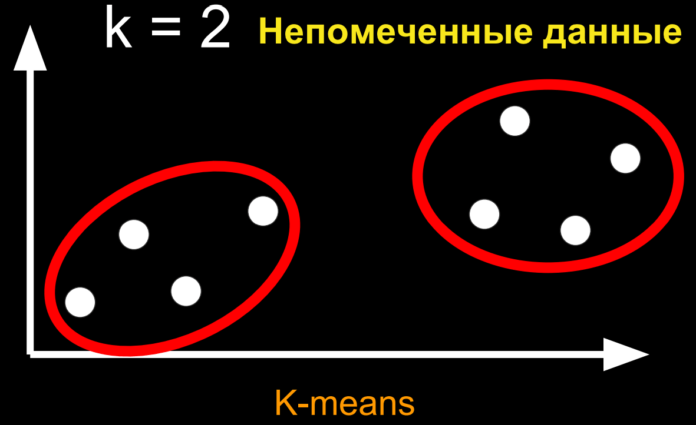

Данный алгоритм имеет название `k-means` (метод k-средних). Особо углубляться в детали того, как устроен этот алгоритм мы не будем.

Но, на нашем разбираемом уровне, чтобы применить данный алгоритм к описанию кино, нам нужно превратить текст в кое-какую точку в пространстве.

Наш подход - "мешок со словами", где у нас есть кое-какие строки и мы помечаем частоту появления каждого слова:

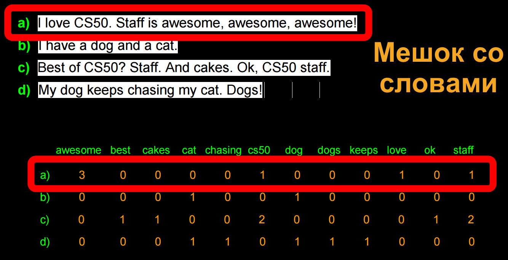

Мы можем улучшить данный алгоритм высчитывая частичную частоту использования слова в каждой строке, таким образом сокращая разницу между длинными и короткими строками:

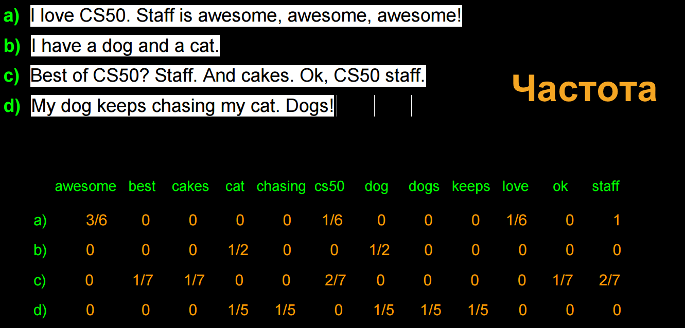

Далее мы можем отобразить каждую строку в пространстве с n-измерениями и запустить наш алгоритм `k-means` для их группировки.

Продемонстрируем данную работу, создав кое-какие точки, рисуя их теми же строками кода, что мы писали ранее:
```python
import numpy as np
import matplotlib.pyplot as plt
# Настройте matplotlib для встраивания отображения в выходные ячейки данного notebook'а
%matplotlib notebook
In [26]:
X = np.array([[1,1], [2,2.5], [3,1.2], [5.5,6.3], [6,9], [7,6], [8,8]]) # Определите numpy-массив двумерных точек
plt.figure()
plt.scatter(X[:,0], X[:,1], s = 170, color = 'black') # Точки отображения с нарезным синтаксисом X[:,0] и X[:,1]
plt.show()
```
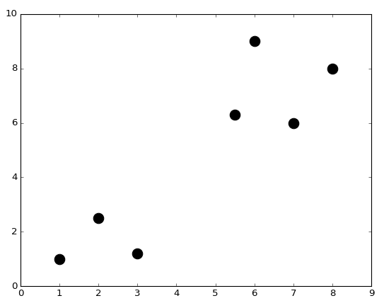

Мы можем импортировать алгоритм `k-means` из модуля `sklearn`, запустить его и отобразить группы вместе с их центрами:
```python
from sklearn.cluster import KMeans
k = 2 # Определените количество кластеров, на которые мы хотим разделить наши данные
kmeans = KMeans(n_clusters = k) # Запустите алгоритм kmeans
kmeans.fit(X);
centroids = kmeans.cluster_centers_ # Получените центральные координаты каждого кластера
labels = kmeans.labels_ # Присвойте метки каждому кусочку информации
colors = ['r.', 'g.'] # Определите два цвета для нашего отображения
plt.figure()
for i in range(len(X)):
    plt.plot(X[i,0], X[i,1], colors[labels[i]], markersize = 30)
plt.scatter(centroids[:,0],centroids[:,1], marker = "x", s = 300, linewidths = 5) # Центроиды отображения
plt.show()
```
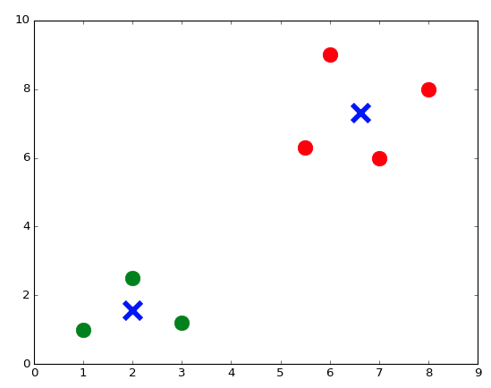

Можем даже уточнить 3 или 7 групп:


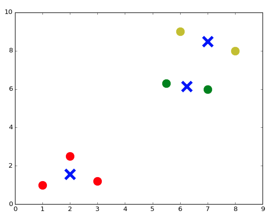

Теперь можем попробовать сгруппировать тект:
```python
corpus = ['I love CS50. Staff is awesome, awesome, awesome!',
          'I have a dog and a cat.',
          'Best of CS50? Staff. And cakes. Ok, CS50 staff.',
          'My dog keeps chasing my cat. Dogs!'] # Так мы представляем список строк (strings) в Python
```
Мы импортируем еще один компонент из библиотеки `sklearn` и воспользуемся им, чтобы создать словарь и подсчитывать отдельные слова в каждом предложении:
```python
# Создайте матрицу "мешок со словами"
from sklearn.feature_extraction.text import CountVectorizer
count_vect = CountVectorizer(stop_words = 'english')
Z = count_vect.fit_transform(corpus)
# Функция fit_transform() принимает в качестве входных данных список строк (strings) и выполняет два действия:
# в первую очередь она "встраивает модель", т.е. создает словарь, а во-вторых она преобразует информацию в матрицу.
```
Мы можем взглянуть на словарь:
```python
vocab = count_vect.get_feature_names()
print(vocab)
['awesome', 'best', 'cakes', 'cat', 'chasing', 'cs50', 'dog', 'dogs', 'keeps', 'love', 'ok', 'staff']
```
И мы можем взглянуть на матрицу Z - "мешок со словами":
```python
Z.todense() # Сгенерировать загруженную матрицу из Z, которая хранится в виде разбросанного матричного типа данных
Out[35]:
matrix([[3, 0, 0, 0, 0, 1, 0, 0, 0, 1, 0, 1],
        [0, 0, 0, 1, 0, 0, 1, 0, 0, 0, 0, 0],
        [0, 1, 1, 0, 0, 2, 0, 0, 0, 0, 1, 2],
        [0, 0, 0, 1, 1, 0, 1, 1, 1, 0, 0, 0]], dtype=int64)
```
Нормализованные значения в матрице дают неполную информацию о словах (так как самые общие слова дают мало информации о тематике текста), поэтому формула `tfidf` (Term Frequency times Inverse Document Frequency) даст лучшие результаты:
```python
# Создайте матрицу tf–idf
from sklearn.feature_extraction.text import TfidfVectorizer
vectorizer = TfidfVectorizer(stop_words = 'english')
X = vectorizer.fit_transform(corpus)
X.todense()
Out[37]:
matrix([[ 0.89469821,  0.        ,  0.        ,  0.        ,  0.        ,
          0.23513012,  0.        ,  0.        ,  0.        ,  0.29823274,
          0.        ,  0.23513012],
        [ 0.        ,  0.        ,  0.        ,  0.70710678,  0.        ,
          0.        ,  0.70710678,  0.        ,  0.        ,  0.        ,
          0.        ,  0.        ],
        [ 0.        ,  0.35415727,  0.35415727,  0.        ,  0.        ,
          0.55844332,  0.        ,  0.        ,  0.        ,  0.        ,
          0.35415727,  0.55844332],
        [ 0.        ,  0.        ,  0.        ,  0.38274272,  0.48546061,
          0.        ,  0.38274272,  0.48546061,  0.48546061,  0.        ,
          0.        ,  0.        ]])
```
Теперь можно запустить наш алгоритм `k-means` и мы увидим самые часто используемые слова каждого кластера:
```python
k = 2 # Определите количество кластеров, в которые мы поместим поделенные данные
# Определите правильное понятие расстояния, для обработки документов
from sklearn.metrics.pairwise import cosine_similarity
dist = 1 - cosine_similarity(X)
# Запустите алгоритм KMeans
model = KMeans(n_clusters = k)
model.fit(X);

print("Top terms per cluster:\n")
order_centroids = model.cluster_centers_.argsort()[:, ::-1]
terms = vectorizer.get_feature_names()
for i in range(k):
    print ("Cluster %i:" % i, end='')
    for ind in order_centroids[i, :3]:
        print (' %s,' % terms[ind], end='')
    print ("")
Top terms per cluster:

Cluster 0: awesome, staff, cs50,
Cluster 1: dog, cat, keeps,
```
Мы можем импортировать несколько описаний фильмов с сайта IMDB (западный аналог "Кинопоиска") в Python и выполнить тот же самый процесс:
```python
# Импортируйте набор данных в frame данных Panda (Панды)
import pandas as pd
from io import StringIO
import requests

act = requests.get('https://docs.google.com/spreadsheets/d/1udJ4nd9EKlX_awB90JCbKaStuYh6aVjh1X6j8iBUXIU/export?format=csv')
dataact = act.content.decode('utf-8') # Для конвертирования в строку (string) для StringIO
frame = pd.read_csv(StringIO(dataact))
```
Данные, находящиеся внутри `frame`, представляют из себя множество текстов (входных текстов):
```python
print(frame)
                     Title                                           Synopsis
0       Mad Max: Fury Road  Max Rockatansky (Tom Hardy) explains in a voic...
1               The Matrix  The screen is filled with green, cascading cod...
2        The King's Speech  The film opens with Prince Albert, Duke of Yor...
3   No Country for Old Men  The film opens with a shot of desolate, wide-o...
4         A Beautiful Mind  John Nash (Russell Crowe) arrives at Princeton...
5                Inception  A young man, exhausted and delirious, washes u...
6                   Frozen  The Walt Disney Pictures logo and the movie ti...
7            The Lion King  The Lion King takes place in the Pride Lands o...
8                  Aladdin  The film starts with a street peddler, guiding...
9               Cinderella  The film opens in a tiny kingdom, and shows us...
10            Finding Nemo  Two clownfish, Marlin (Albert Brooks) and his ...
11               Toy Story  A boy called Andy Davis (voice: John Morris) u...
12              Robin Hood  Told with animals for it's cast, the story tel...
```
Выстроим строки для каждого описания (синопсиса) фильма, матрицу `tfidf` (как мы это делали ранее), и, наконец, отобразим метки и самые часто используемые слова каждого кластера:
```python
# Пройдитесь через каждый синопсис и добавьте его содержимое к списку 'corpus', в котором хранятся строки (strings)
corpus = []
for i in range(0, frame["Synopsis"].size):
    corpus.append(frame["Synopsis"][i])
# Создайте матрицу tf–idf
from sklearn.feature_extraction.text import TfidfVectorizer
vectorizer = TfidfVectorizer(stop_words = 'english', min_df = 0.2)
# min_df = 0.2 - означает, что слово должно встречаться как минимум в 20% документов
X = vectorizer.fit_transform(corpus)

k = 2 # Определите количество кластеров, в которые мы поместим поделенные данные
# Определите правильное понятие расстояния, для обработки документов
from sklearn.metrics.pairwise import cosine_similarity
dist = 1 - cosine_similarity(X)
# Запустите алгоритм kmeans
model = KMeans(n_clusters = k)
model.fit(X);

no_words = 4 # Количество слов, выводимых в соответствии с кластером
order_centroids = model.cluster_centers_.argsort()[:, ::-1] # Отсортируйте центры кластеров по близости к центроиду
terms = vectorizer.get_feature_names()
labels = model.labels_ # Получение меток, присвоенных к каждому из данных

print("Top terms per cluster:\n")
for i in range(k):
    print("Cluster %d movies:" % i, end='')
    for title in frame["Title"][labels == i]:
        print(' %s,' % title, end='')
    print() # Добавление пробела
    print("Cluster %d words:" % i, end='')
    for ind in order_centroids[i, :no_words]:
        print (' %s' % terms[ind], end=','),

    print()
    print()
Top terms per cluster:

Cluster 0 movies: Mad Max: Fury Road, The Matrix, No Country for Old Men, A Beautiful Mind, Inception, Frozen, Finding Nemo, Toy Story,
Cluster 0 words: room, tank, says, joe,

Cluster 1 movies: The King's Speech, The Lion King, Aladdin, Cinderella, Robin Hood,
Cluster 1 words: king, prince, john, palace,
```
Стоит заметить, что The King’s Speech (Король говорит!) не должен был оказаться среди анимационных фильмов (мультфильмов), но учитывая, что нам даются только текстовые описания, алгоритм определил этот фильм, основываясь на главных ключевых словах, в кластер анимационных фильмов.

Совсем недавно, глубокий алгоритм обучения, разработанный командой из Google, победил чемпиона мира в Go, и он сделал это, придумав новые ходы - не те, что были доступны в тренировочных данных.

Сегодня мы рассмотрели малую долю возможных применений для машинного обучения.

Также, мы рассмотрели как Python и его библиотеки можно использовать для решения сложных задач.

До следующего раза!

