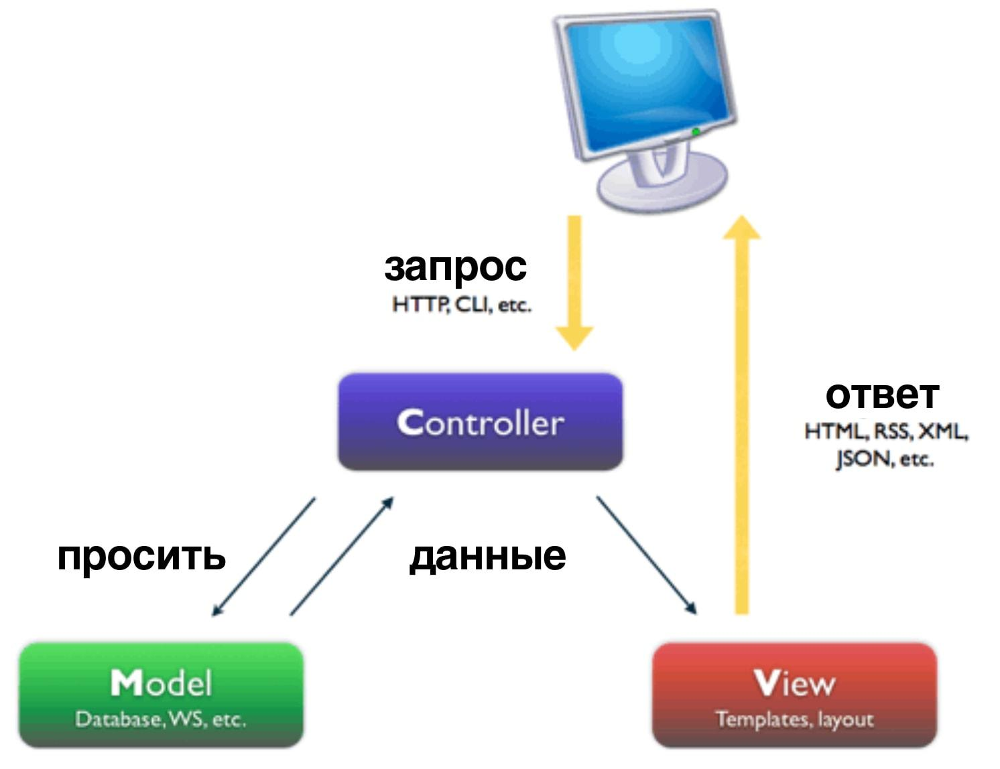
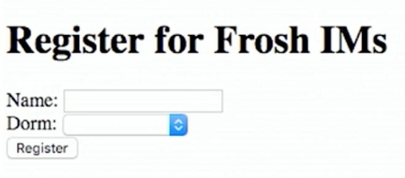
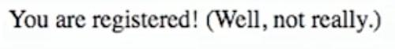
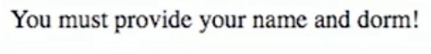
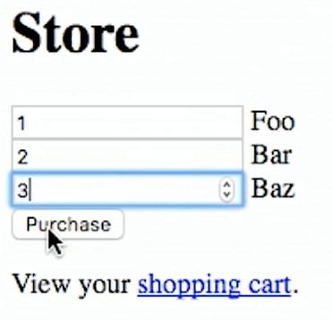
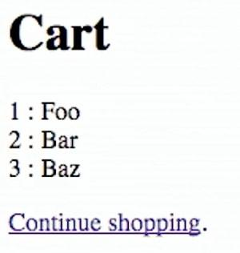

# Лекция 6. Python.

## Введение в Python

Си не всегда является лучшим выбором для решения проблем вычислительного мира, так как нам самим приходится имплементировать многочисленные структуры данных, не говоря о самостоятельной регулировке памяти.

Более высокоуровневые языки программирования оснащены дополнительными фишками и абстракциями, помогающие программистам в их нелегком деле.

Точно так же, как и процесс перехода со Scratch на Си продемонстрировал нам схожесть концепций компьютерных языков, процесс перехода с Си на Python будет следовать этому же сценарию.

Первая программа написанная на Си, "hello, world" (Привет, мир!), может быть очень легко представлена на языке Python:
```python
print("hello, world")
```
Мы можем добавить функцию `main`, хотя данный шаг не так обязателен в Python, как это было в Си:
```python
def main():
    print("hello, world")

if __name__ == "__main__":
    main()
```
Обратите внимание, что в Python мы определяем функцию строкой `def main():`, оставляя позади привычку добавления фигурных скобок, но взамен приучая себя к отступам, отвечающие за иерархию кода.

Функцию `printf` еще легче можно записывать в Python, просто `print`. Нам не нужно в конце прибавлять управляющий символ `\n`, так как язык добавляет его за нас.

Бесконечный цикл в Python выглядит так:
```python
while True:
    print("hello, world")
```
Булеан `True` должен начинаться с заглавной буквы.

Цикл с определенным количеством повторов:
```python
for i in range(50):
    print("hello, world")
```
Переменная `i`, на каждой итерации, будет последовательно хранить в себе текущий элемент перебираемого массива и все это будет проделываться без вашей имплементации. Функция `range(50)` автоматически создает список (массив) чисел заданного диапазона (от `0` до `49` по умолчанию, если мы дадим ей в качестве параметра число `50`).

В Python также существуют типы переменных, но, в отличии от Си, он не является строго типизированным языком. Наоборот, это слабо типизированный язык. Другими словами, нам не нужно каждый раз уточнять тип нашей переменной.

Мы просто пишем:
```python
i = 0
```
Булеан выражения схожи с теми, что мы разбирали в Си: `i < 50`, `x < y`.

Условия тоже не отличаются:
```python
if x < y:
    print("x меньше y")
elif x > y:
    print("x больше y")
else:
    print("x равен y")
```
Обратите внимание, что мы больше не ставим скобки вокруг наших выражений и вместо того, чтобы использовать фигурные скобки, мы перешли к отступам, показывая ими принадлежность кода к определенному блоку (конструкциям if, while, def и т.п.).

И `elif` является ключевым словом Python, означающим `else if`.

Массивами в Python называют списками. Вам больше не придется контролировать память и следить за ее утечками, язык сам это делает за вас.

Синтаксис списков совпадает с синтаксисом массивов Си. Если в Си мы использовали `argv[0]`, чтобы получить аргумент командной строки, то в Python мы будем пользоваться `sys.argv[0]`.

Также отметим, что Си компилируется из исходного кода в машинный код, а язык Python является интерпретируемым. Это значит, что мы можем запустить нашу программу всего одной командой, которая займется всем необходимым, чтобы достигнуть поставленной нами цели (запуска программы).

К примеру, мы запустим написанную нами программу командой `python hello.py`. Она запустит программу под названием `python`, которой далее будет передан аргумент `hello.py`, содержащий исходный код нашей программы.

`python` также является интерпретатором, т.е. программой способной компилировать исходный код в так называемый байткод (представлен ниже), далее считывая и запуская его:
```
2       0   LOAD_GLOBAL         0   (print)
        3   LOAD_CONST          1   ('hello,    world')
        6   CALL_FUNCTION       1   (1  positional, 0   keyword pair)
        9   POP_TOP
        10  LOAD_CONST          0   (None)
        13  RETURN_VALUE
```
Поэтому Python - это одновременно язык и программа, компилирующая и интерпретирующая свой же язык (в то время как Си является языком, а `clang` - отдельным компилятором).

## Первые программы

Мы снова упростим вам изучение нового языка, добавив функции библиотеки (модуля) CS50:

* `cs50.get_char`

* `cs50.get_float`

* `cs50.get_int`

* `cs50.get_string`

* …​

Эти функции являются частью модуля `cs50`, поэтому, вызывая функцию, нам нужно указать к какому модулю она принадлежит.

В Python мы повстречаем знакомые нам типы данных:

* `bool`

* `float`

* `int`

* `str` (string или строка, в которую встроены специальные функции, позволяющие легко манипулировать ею)

* `complex` (сложные или воображаемые числа)

* `list` (как массивы)

* `tuple` (группы значений, например координаты x и y)

* `range`

* `set` (коллекция объектов с определенными свойствами)

* `dict` (словарь, схож с хеш-таблицей)

* …​

Давайте сохраним файл `hello.py`, поместив туда следующее:
```python
print("hello, world")
```
Далее мы можем запустить `python hello.py`:
```python
$ python hello.py
hello, world
```
Превратим это:
```c
#include <cs50.h>
#include <stdio.h>

int main(void)
{
    string name = get_string();
    printf("hello, %s\n", name);
}
```

в это:
```python
import cs50
s = cs50.get_string()
print("hello, {}".format(s))
```
`import` - синтаксис добавления библиотеки.

Потом мы объявляем переменную `s`, без уточнения ее типа, и вызываем метод `cs50.get_string()`, далее сохраняя возвращаемый результат в `s`.

Затем включаем `s` в отображаемые нами на экране данные. Строки (strings) или еще точнее объекты, имеют встроенные функции. Мы вызываем эти функции с помощью синтаксиса `"hello, {}".format(s)`, и, предоставляя правильные аргументы, мы можем подставлять переменные так, как сами этого пожелаем.

Существует две основные версии Python, версия 2 и 3, у которых присутствует достаточное количество различий, делающие невозможным программам написанным на одной версии языка быть работоспособными на другой.

Мы будем пользоваться Python 3, хотя в интернете и присутствует огромное количество документаций или онлайн уроков, в которых все еще задействован Python 2.

У Python также есть функция `input`, которая позволяет выполнять тот же функционал, что и библиотека CS50:
```python
s = input("name: ")
print("hello, {}".format(s))
```
В качестве параметра этой функции, мы можем указать текстовый запрос, понятный нашему пользователю. Далее, после ввода пользователем определенный данных, функция вернет нам эти данные (поместит в переменную **s**).

Точно также мы можем получить число:
```python
import cs50

i = cs50.get_int()
print("hello, {}".format(i))
```
Можно вывести на экран числа с плавающими запятыми, уточнив разрядность таким образом, что мы сможем увидеть неточность Python, такую же как и в Си:
```python
print("{:.55f}".format(1 / 10))
```
Значение, которое мы планируем вывести, выглядит так `1 / 10` и форматирование уточняется с помощью `:55f` (внутри фигурных скобках строки).

Запустим и увидим:
```
`0.1000000000000000055511151231257827021181583404541015625`
```
В Си, если мы поделим один `int` на другой `int`, то получим еще один `int`. Но Python, в отличии от Си, способен автоматически определять и возвращать значения с плавающей точкой (float).

Мы можем написать знакомую нам программу, в которой используются различные операторы:
```python
import cs50

# запросить у пользователя X
print("x это ", end="")
x = cs50.get_int()

# запросить у пользователя Y
print("y это ", end="")
y = cs50.get_int()

# вычисления
print("{} плюс {} будет {}".format(x, y, x + y))
print("{} минус {} будет {}".format(x, y, x - y))
print("{} умножить на {} даст {}".format(x, y, x * y))
print("{} поделить на {} даст {}".format(x, y, x / y))
print("{} поделить на {} (и опустить) даст {}".format(x, y, x // y))
print("остаток от деления {} на {} будет равен {}".format(x, y, x % y))
```
В Python присутствует специальный оператор `//`, который делит два integer'a и возвращает усеченный integer (удалив всё, что идет после запятой).

И комментарии в Python, вместо того чтобы начинаться с `//`, будут начинаться с `#`.

Мы передаем `end=""` в качестве дополнительного параметра функции `print`, чтобы избежать автоматического добавления новой строки в конце текста.

Напишем программу для конвертации температур:
```python
import cs50

f = cs50.get_float()
c = 5.0 / 9.0 * (f - 32.0)
print("{:.1f}".format(c))
```
Получаем `float f`, применяем подходящую формулу и сохраняем результат в `c`, а также уточняем вывод одного дробного разряда `:1f`.

## Логические программы

Работа с логикой:
```python
import cs50

c = cs50.get_char()

if c == "Y" or c == "y":
    print("yes")
elif c == "N" or c == "n":
    print("no")
else:
    print("ошибка")
```
Мы получаем `char` и сравниваем его с `Y`, `y`, `N`, или `n`, чтобы определить, что было сказано: yes или no.

В Python мы просто пишем `or` или `and`, вместо `||` и `&&`.

В Си мы сравниваем `char`'ы, используя одинарные кавычки, но в Python один символ - тоже является string'ом. Хорошей новостью является то, что мы можем сравнивать строки (strings) обычным оператором `==,` и он будет сравнивать их так, как мы могли бы этого ожидать (возвращая `True`, при равности обеих строк). Более того в Python, как одинарные кавычки `'`, так и двойные `"`, могут быть использованы для обозначения строк, главное чтобы и в начале, и в конце строки, они имели одинаковый вид.

В Си мы также создавали программу, которая позволяла получать положительный integer:
```c
#include <cs50.h>
#include <stdio.h>

int get_positive_int();

int main(void)
{
    int i = get_positive_int();
    printf("%i - это положительный integer\n", i);
}

int get_positive_int(void)
{
    int n;
    do
    {
        printf("n это ");
        n = get_int();
    }
    while (n < 1);
    return n;
}
```
Нам нужно было сперва объявить функцию, затем переменную `n`, а потом и цикл `do while`.

Теперь мы можем написать:
```python
import cs50

def main():
    i = get_positive_int()
    print("{} - это положительный integer".format(i))

def get_positive_int():
    while True:
        print("n это ", end="")
        n = cs50.get_int()
        if n > 0:
            break
    return n

if __name__ == "__main__":
    main()
```
Нам не нужно объявлять функцию `get_positive_int` до того как мы ее вызовем. Главное чтобы ее не пришлось запускать до того, как мы доберемся до участка с ее описанием. В данном случае, мы вызываем `get_positive_int` в нашей функции `main`, но сам `main` будет запущен только в самой последней строке нашего кода, поэтому все, что находится в нашей программе, будет при запуске объявлено и готово к работе.

И нам не нужно уточнять, что `get_positive_int` не принимает никаких аргументов, мы просто пишем `()` вместо `(void)`.

У Python также нет цикла `do while`, вместо него используется конструкция `while True`. И наш цикл завершает свою работу словом `break`, при условии `if n > 0`.

Функция вернет переменную `n`, но обратите внимание на то, что нам не пришлось объявлять ее за пределами цикла, как мы это делали в Си, чтобы переменная была доступна в другой части кода. `n` будет создана в первом запуске нашего цикла и далее будет идти только изменение ее значения.

И наконец, нам нужно вызвать функцию `main` двумя последними строками.

Мы могли бы повторно имплементировать программу `cough` (кашель), чтобы трижды произнести "cough":
```python
print("cough")
print("cough")
print("cough")
```
С циклом:
```python
for i in range(3):
    print("cough")
```
С помощью функции:
```python
def main():
    for i in range(3):
        cough()

def cough():
    print("cough")

if __name__ == "__main__":
    main()
```
Мы можем добавить аргумент нашей функции `cough`:
```python
def main():
    cough(3)

def cough(n):
    for i in range(n):
        print("cough")

if __name__ == "__main__":
    main()
```
Здесь `cough` принимает кое-какой аргумент `n`, чей тип будет автоматически установлен самим языком, в данном случае `int`.

Мы можем дать функции сразу несколько аргументов:
```python
def main():
    cough(3)
    sneeze(3)

def cough(n):
    say("cough", n)

def sneeze(n):
    say("achoo", n)

def say(word, n):
    for i in range(n):
        print(word)

if __name__ == "__main__":
    main()
```
Так как мы отображаем на экране только переменную `word`, которая передается нашей функции `say`, мы можем просто написать `print(word)`.

## Более сложные программы

На 2 лекции мы имплементировали свою собственную программу `strlen`:
```c
#include <cs50.h>
#include <stdio.h>

int main(void)
{
    string s = get_string();
    int n = 0;
    while (s[n] != '\0')
    {
        n++;
    }
    printf("%i\n", n);
}
```
В Python эти детали реализации будут часто утаиваться, поэтому нам нужно будет постоянно пользоваться документацией и больше полагаться на встроенные функции (заранее написанные для нас):
```python
import cs50

s = cs50.get_string()
print(len(s))
```
Давайте попробуем преобразовать символы в ASCII:
```python
for i in range(65, 65 + 26):
    print("{} is {}".format(chr(i), i))
```
Мы можем уточнить начальное число и конечное в функции `range` (включая начальное число, но не конечное).

Потом, мы сперва выводим на экран `chr(i)`, а далее `i`, используя функцию Python `chr()`, которая превращает integer в `char`.

Мы также можем пользоваться аргументами командной строки:
```python
import sys

if len(sys.argv) == 2:
    print("hello, {}".format(sys.argv[1]))
else:
    print("hello, world")
```
Мы можем проверить количество аргументов, используя функцию `len(sys.argv)`, и получить доступ ко второму аргументу (вспомните, что первым аргументом будет имя программы) с помощью `sys.argv[1]`. Здесь `sys` является встроенным модулем Python, у которого есть аргументы командной строки.

Мы можем вывести все полученные нами аргументы:
```python
import sys

for i in range(len(sys.argv)):
    print(sys.argv[i])
```
И мы можем вывести каждый символ каждого аргумента:
```python
import sys

for s in sys.argv:
    for c in s:
        print(c)
    print()
```
В конструкции `for s in sys.argv` мы получаем доступ к элементу `sys.argv` и называем его `s`. Типом каждого элемента будет string.

Потом, с помощью `for c in s`, мы получаем доступ к каждому элементу строки `s`, который мы будем называть `c`, так как каждый элемент является символом.

Мы также можем завершить программу, выходя из нее (`exit`) с каким-то значением (числом). Как это было с `возвращаемым` выходным кодом в Си:
```python
import cs50
import sys

if len(sys.argv) != 2:
    print("введите аргумент командной строки")
    exit(1)

print("hello, {}".format(sys.argv[1]))

exit(0)
```
В Python для выхода из программы мы отдельно вызываем функцию `exit` вместе с кое-каким значением, так как у нас не всегда может присутствовать функция `main`, из которой мы могли бы что-то `возвращать`.

Также вспомните, что в командной строке мы можем написать `echo $?`, чтобы увидеть возвращаемое значение последней запущенной программы.

Мы можем сравнить две строки:
```python
import cs50
import sys

print("s: ", end="")
s = cs50.get_string()

print("t: ", end="")
t = cs50.get_string()

if s != None and t != None:
    if s == t:
        print("одинаковые")
    else:
        print("разные")
```
Так как нам не придется больше работать с указателями (как это было в Си), вместо `null` мы воспользуемся особым значением `None` (возвращаемое функцией `get_string`), указывающее на то, что ничего не было возвращено.

В Си `s` и `t` являются двумя разными адресами, а в Python сравнение содержимого `s` и `t` будет автоматическим.

Копирование строки:
```python
import cs50
import sys

print("s: ", end="")
s = cs50.get_string()

if s == None:
    exit(1)

t = s.capitalize()

print("s: {}".format(s))
print("t: {}".format(t))

exit(0)
```
Теперь мы можем запустить программу и увидеть, что в `t` хранится текст переменной `s`, но в `t` первая буква будет заглавной, в то время как содержимое `s` останется нетронутым.

Вспомните, что `s` - это объект Python'а, поэтому у него есть встроенные функции, которые мы можем вызвать из этого объекта, с помощью синтаксиса `.`. Мы можем воспользоваться функцией (а точнее методом) `s.capitalize()`, которая автоматически преобразует первую букву в заглавную.

Более того, строки в Python являются неизменными (immutable), т.е. их нельзя изменить после их создания. Поэтому `s.capitalize()` возвращает копию переменной `s` (с первой заглавной буквой), которую далее нам нужно где-то сохранить (хотя, технически, мы могли бы сохранить результат внутри того же `s` с `s = s.capitalize()`, но тогда это была бы "новая" строка).

Мы можем поменять местами переменные, без разыменования указателей. Попробуем передать эти переменные:
```python
def main():
    x = 1
    y = 2

    print("x is {}".format(x))
    print("y is {}".format(y))
    print("Swapping...")
    swap(x, y)
    print("Swapped.")
    print("x is {}".format(x))
    print("y is {}".format(y))

def swap(a, b):
    tmp = a
    a = b
    b = tmp

if __name__ == "__main__":
    main()
```
Значения переменных не меняются местами, так как они опять, как и ранее, передаются копиями.

Но мы никак не можем задействовать указатели в Python'е, поэтому только следующим образом можно поменять местами значения:
```python
x = 1
y = 2

print("x это {}".format(x))
print("y это {}".format(y))
print("Swapping...")
x, y = y, x
print("Swapped.")
print("x это {}".format(x))
print("y это {}".format(y))
```
В Python мы можем поменять местами значения переменных всего одной строкой. Левая и правая сторона: `x, y` и `y, x` являются кортежами (tuples) - структурами данных, состоящие из нескольких значений. Мы устанавливаем элементы внутри `x, y` на внутренние элементы `y, x`, что, в свою очередь, меняет местами значения.

Также функция может возвращать несколько значений, поэтому нам возможно придется сохранять их как-то так `a, b, c, d = foo()`

Давайте создадим структуры на Python:
```python
import cs50
from student import Student

students = []

for i in range(3):
    print("name: ", end="")
    name = cs50.get_string()

    print("dorm: ", end="")
    dorm = cs50.get_string()

    students.append(Student(name, dorm))

for student in students:
    print("{} is in {}.".format(student.name, student.dorm))
```
Сперва мы объявляем файл `student`, который мы позже создадим. Далее импортируем из него класс `Student`.

Потом мы можем создать пустой список под названием `students`, в котором будут хранится студенты. У нас есть возможность добавлять и удалять его элементы.

Потом мы получаем значения `name` (имени) и `dorm` (общежития). Создаем объект `Student`, передавая эти строки (strings, а точнее name и dorm) в качестве аргументов. Весь этот результат добавляем к концу списка `students`, через метод `append` (у списков тоже есть свои встроенные функции, в данном случае мы рассмотрели одну из них - `append`).

Наконец, мы выводим свойства каждого `student`'а, с помощью синтаксиса `.`.

Чтобы создать модуль `student`, нам нужно сделать следующее:
```python
class Student:
    def __init__(self, name, dorm):
        self.name = name
        self.dorm = dorm
```
Мы объявляем `class` (класс) объектов под названием `Student`, у которого будет только один метод или встроенная функция `init`, которую мы не будем вызывать напрямую, но она будет автоматически вызвана при создании объекта на основе класса `Student`, как это было выше в коде с `Student(name, dorm)`.

Эта функция получает сам объект в качестве аргумента и другие аргументы, передаваемые при создании объекта, в данном случае `name` и `dorm`. Затем мы сохраняем аргументы в только что созданный объект.

Есть еще одна удобная особенность языка:
```python
import cs50
import csv
from student import Student

students = []
for i in range(3):
    print("name: ", end="")
    name = cs50.get_string()

    print("dorm: ", end="")
    dorm = cs50.get_string()

    students.append(Student(name, dorm))

file = open("students.csv", "w")
writer = csv.writer(file)
for student in students:
    writer.writerow((student.name, student.dorm))

file.close()
```
Теперь, вместо того чтобы выводить students (студентов) на экран, мы можем записать их в файл `students.csv`, открывая его, далее используя встроенный модуль `csv`, который позволяет создавать файлы с разделенными запятыми значениями.

В выражении `csv.writer(file)` происходит передача, в качестве аргумента, открытого нами ранее файла, дабы получить объект `writer` (записыватель), который будет принимать tuples (кортежи), записывая их в файл с помощью метода `writerow`.

Если бы мы запустили данную программу без `import csv`, интерпретатор выполнял бы функцию `input`, собирая такие вводимые данные как: `name` и `dorm`, далее создавая `students`. Но как только интерпретатор дойдет до `csv` и заметит отсутствие его объявления, будет зафиксировано исключение (т.е. программа остановится по причине ошибки).

Мы можем повторно имплементировать, используя язык Python, все примеры 1 - 5 недель и даже всю программу `speller`.

Посмотрим на файл `dictionary.py`:
```python
class Dictionary:
    def __init__(self):
        self.words = set()

    def check(self, word):
        return word.lower() in self.words

    def load(self, dictionary):
        file = open(dictionary, "r")
        for line in file:
            self.words.add(line.rstrip("\n"))
        file.close()
        return True

    def size(self):
        return len(self.words)

    def unload(self):
        return True
```
Здесь, при каждой инициализации словаря, мы создаем свойство `words` и задаем ему пустой `set` (набор). В Python, set'ы абстрагируются (поэтому мы не имеем представление о их имплементации в памяти или являются ли они хеш-таблицами ), несмотря на это мы можем с легкостью управлять ими.

Мы можем добавлять элементы в `self.words` с помощью s`elf.words.add()`. Проверять есть ли в нем слово (word), используя `word in self.words()`. И получать размер, при помощи `len(self.words)`.

И так как Python управляет всей этой памятью за нас, нам не придется задумываться над тем, как выгружать или освобождать ее.

Как мы могли наблюдать выше, такой высокоуровневый язык как Python, в котором имплементировано огромное количество низкоуровневого функционала (что могло бы занимать сотни строк в Си) позволяет нам писать более сложные программы, без необходимости ломать голову над всеми этими мелкими деталями имплементации.

##Веб-сервер

В 6 лекции мы успели поговорить о том, как связываются сервера и браузеры. Мы всего лишь открывали файлы HTML, созданные нами в рабочей среде (workspaces), без обращения к серверу, который способен генерировать динамический ответ.

Нашей задачей будет имплементировать веб-сервер на Python'е. Он сможет принимать HTTP-запрос и предоставлять кое-какой ответ со сгенерированным HTML-контентом.

Но сперва нам нужно познакомиться с кое-какой моделью:



Эта популярная схема или шаблон проектирования веб-приложения имеет название MVC или Model-View-Controller («Модель-Представление-Контроллер», «Модель-Вид-Контроллер») .

В "контроллере" (C) находится логика, которой мы определяем поведение кода, при получении определенных запросов. Например определение залогинился ли пользователь или нет.

В "представлении" (V) находится внешний вид нашего сайта, с HTML шаблонами и CSS стилями.

В "модели" (M) находятся данные, которыми "контроллер" заполняет "представления".

Мы будем акцентировать внимание на V и C.

Python поставляется со встроенными возможностями веб-сервера, запуская на вашем компьютере программу, способную слушать запросы исходящие из интернета к вашему компьютеру и отвечать на них. Мы создадим свой собственный класс `HTTPServer_RequestHandler`, который унаследует (заберет себе методы) от класса `BaseHTTPRequestHandler` (данный класс встроен в Python):
```python
from http.server import BaseHTTPRequestHandler, HTTPServer

# HTTPRequestHandler класс

class HTTPServer_RequestHandler(BaseHTTPRequestHandler):

    # GET
    def do_GET(self):
        # отправить код состояния
        self.send_response(200)

        # отправить заголовки
        self.send_header('Content-type','text/html')
        self.end_headers()

        # определение отправляемого клиенту сообщения
        if self.path == "/":
            message = "Hello, world!"
        else:
            name = self.path[1:]
            message = "Hello, {}!".format(name)

        # записать сообщение
        self.wfile.write(bytes(message, "utf8"))
        return

...
```
Мы напишем для сервера свою собственную функцию `do_GET`, которая будет вызвана при получении `GET` запроса. Наш сервер всегда будет возвращать код `200`, заголовок и сообщение.

О всех этих особенностях и функциях Python мы узнаем с помощью онлайн документации.

Далее нам нужно запустить сервер:
```python
...

def run():
  print('запускаю сервер...')

  # настройка сервера
  port = 8080
  server_address = ('127.0.0.1', port)
  httpd = HTTPServer(server_address, HTTPServer_RequestHandler)

  # запуск сервера
  print('запускаю сервер на порте {}...'.format(port))
  httpd.serve_forever()

run()
```
Мы уточняем порт, с которого мы хотим получать сообщения. Адрес сервера `127.0.0.1` всегда будет указывать на наш компьютер. Создайте `HTTPServer`, который встроен в сам Python. Мы ему передаем свой собственный `HTTPServer_RequestHandler` (серверный обработчик запросов). И, наконец, мы запустим его (сервер), используя функцию `serve_forever` (вечно служить).

Программу запустили и похоже, что ничего не происходит. Но если мы откроем браузер и посетим `http://127.0.0.1:8080` (в CS50 IDE адрес будет отличаться), то увидим:
```
hello, world
```
Но это просто текст и чтобы написать код, который генерировал бы полностью новую HTML-страницу, нам бы понадобилось больше времени и, возможно, пара чашек кофе.

Мы можем воспользоваться фреймворком - коллекцией кода, содержащий еще большее количество функциональностей, которыми мы можем воспользоваться для построения наших проектов.

Одним из таких фреймворков, облегчающих задачу программистам, является Flask. Приложение, построенное с помощью данного фреймворка, будет выглядеть как-то так:
```python
from flask import Flask, redirect, render_template, request, session, url_for

app = Flask(__name__)

@app.route("/")

def index():
    return render_template("index.html")

@app.route("/register", methods=["POST"])
def register():
    if request.form["name"] == "" or "captain" not in request.form or "comfort" not in request.form or request.form["dorm"] == "":
        return render_template("failure.html")
    return render_template("success.html")
```
Мы сперва `import` (добавляем) огромное количество функциональности `from flask` (из flask'a), и создаем `app` (приложение).

Далее у нас идет строка `@app.route("/")`, которая говорит, что следующая функция должна вызываться при запросе данного адреса у веб-сервера. В данном случае, функция вернет `render_template("index.html")` или просто то, что в себе несет файл `index.html`.

Потом, если мы увидим `@app.route("/register", methods=["POST"])`, т.е. то, как отправляется запрос POST нашему `/register`, мы вызовем ниже идущую функцию `register`. Данная функция, если у нас в `form`'е будут отсутствовать определенные элементы, вернет шаблон `failure.html`. В противном случае, она вернет `success.html`.

Таким образом мы запустим это приложение, перейдя в папку с `application.py` файлом и выполнив `$ flask run --host=0.0.0.0 --port=8080`. Указывая `--host=0.0.0.0` мы уточняем, что приложение будет принимать запросы с любого адреса.

Теперь, если мы наберем в браузере `http://127.0.0.1:8080`, то получим имплементированную нами форму (из файла) `index.html`:



И если мы заполним данную форму, мы увидим сообщение либо с ошибкой, либо с поздравлением. Все зависит от заполненности формы:





На самом деле, даже если мы полностью заполним форму, никакой регистрации не произойдет, так как у этого приложения не существует базы данных или места, где хранились бы введенные пользователем данные.

Но, как бы там не было, давайте взглянем на `failure.html` (неудача):
```



Registration Failed



You must provide your name, comfort, and dorm!

```
Здесь не так много логики, но, похоже, что мы дополняем файл под названием `layout.html`, в котором, скорее всего, находится всего лишь обычная структура страницы. Затем, с помощью `` и ``, мы указываем, что должно быть внутри `title` и внутри `body`.

У `success.html` есть что-то подобное:
```



Registration Successful



You are registered!  (Well, not really.)

```
И у `layout.html`:
```
<!DOCTYPE html>

<html>
    <head>
        <meta content="initial-scale=1, width=device-width" name="viewport"/>
        <title></title>
    </head>

    <body>
        
        
    </body>
</html>
```
Мы видим в данном файле одни и те же магические слова `` и ``, которые работают не благодаря HTML или Python, а благодаря фреймворку Flask (функция `render_template`), строящий веб-страницы с помощью данных шаблонов.

Форма в `index.html`:
```



Frosh IMs



<div style="text-align:center">
    <h1>Register for Frosh IMs</h1>
    <form action="{{ url_for('register') }}" method="post">
        Name: <input name="name" type="text"/>
        <br/>
        <input name="captain" type="checkbox"/> Captain?
        <br/>
        <input name="comfort" type="radio" value="less"/> Less Comfortable
        <input name="comfort" type="radio" value="more"/> More Comfortable
        <br/>
        Dorm:
        <select name="dorm">
            <option value=""></option>
            <option value="Apley Court">Apley Court</option>
            <option value="Canaday">Canaday</option>
            <option value="Grays">Grays</option>
            <option value="Greenough">Greenough</option>
            <option value="Hollis">Hollis</option>
            <option value="Holworthy">Holworthy</option>
            <option value="Hurlbut">Hurlbut</option>
            <option value="Lionel">Lionel</option>
            <option value="Matthews">Matthews</option>
            <option value="Mower">Mower</option>
            <option value="Pennypacker">Pennypacker</option>
            <option value="Stoughton">Stoughton</option>
            <option value="Straus">Straus</option>
            <option value="Thayer">Thayer</option>
            <option value="Weld">Weld</option>
            <option value="Wigglesworth">Wigglesworth</option>
        </select>
        <br/>
        <input type="submit" value="Register"/>
    </form>
</div>

```
Здесь в `` гораздо больше HTML кода. У формы также есть `{{ url_for('register') }}` для ее атрибута `action`, вызывающая функцию маршрутизации `register` (регистрирования) в нашем приложении, тем самым избегая хардкодинга.

Возвращаясь к нашему приложению, в часть где приводится маршрут `register` (регистрация),
```python
@app.route("/register", methods=["POST"])

def register():
    if request.form["name"] == "" or "captain" not in request.form or "comfort" not in request.form or request.form["dorm"] == "":
        return render_template("failure.html")
    return render_template("success.html")
```
мы опять видим логику "контроллера", которая проверяет заполненность формы, а затем возвращает соответствующее "представление".

Мы можем продемонстрировать еще одно простое приложение, которое позволяет нам выбирать сколь угодное количество `foo`, `bar` и `baz`:



Приложение динамически генерирует страницу, которая даст нам знать сколько всего продуктов мы добавили в корзину:



И если мы закроем, а затем откроем окно браузера, мы увидим то же самое, добавленное нами, количество продуктов.

Простой код HTML формы, а также шаблона корзины:
```



Cart




<h1>Cart</h1>


    {{ item["quantity"] }} : {{ item["name"] }}
    <br/>



```
Обратите внимание, что мы можем вывести на экран каждый `item` (продукт) нашей переменной `cart` (корзины), используя цикл `for`. Мы имеем доступ к полям каждого объекта `item` (продукта), а именно к `quantity` (количеству) и к `name` (имени).

Дабы разобраться, что из себя представляет `cart` (корзина), нам нужно взглянуть в `application.py`:
```python
from flask import Flask, redirect, render_template, request, session, url_for

app = Flask(__name__)

app.secret_key = "shhh"

@app.route("/", methods=["GET", "POST"])
def store():
    if request.method == "POST":
        for item in ["foo", "bar", "baz"]:
            if item not in session:
                session[item] = int(request.form[item])
            else:
                session[item] += int(request.form[item])
        return redirect(url_for("cart"))
    return render_template("store.html")

@app.route("/cart")
def cart():
    cart = []
    for item in ["foo", "bar", "baz"]:
        cart.append({"name":item.capitalize(), "quantity":session[item]})
    return render_template("cart.html", cart=cart)
```
`shhh` - это всего лишь какое-то секретное значение, используемое нами для защиты нашей сессии (времени жизни определенного процесса) или корзины (конечно, дабы избежать случайного его угадывания злоумышленником, оно должно было быть намного длиннее и сложнее!)

В методе `store`, мы сперва проверяем будет ли запрос вида `POST`. Если это так, т.е. пользователь отправил форму, тогда мы добавим количество, указанное в форме для каждого `item` (продукта), в нашу `session` (сессию), если, конечно, продукт не будет являться уже занесенным в данный объект, в противном же случае мы увеличим его количество. И `session` представляет из себя объект, получаемый нами из фреймворка, который выступает в качестве продуктовой корзины, где мы можем сохранять информацию для каждого пользователя подключенного к нашему веб-серверу.

Метод `cart` (корзина) создает пустой список и хранит словарь каждого продукта, вместе с его названием и количеством, используя сессию для получения этого значения. Затем мы передаем результат (в качестве аргумента) функции `render_template`, чтобы сформировать страницу `cart.html`, которую мы видели выше.

Ого, мы многое успели разобрать! Однако, мы нащупали только поверхность того, на что способен язык программирования Python и многие другие, существующие на данный момент, фреймворки.