# Лекция 9. SQL.

## На прошлой неделе

На прошлой неделе мы снова вернулись к нашему любимому Scratch, дабы освежить память и вспомнить простейшие концепции программирования. Так мы облегчили себе переход с Си на Python.

Познакомились с новым способом написания простенькой программы:
```python
def main():
    print("hello, world")

if __name__ == "__main__":
    main()
```
далее переходя к написанию более сложных программ.

Также разобрали шаблон проектирования MVC, используемый для создания архитектуры веб-приложения.

Сегодня мы будем углубляться в сторону M нашей MVC конструкции, а именно в Model, для сохранения и получения данных.

Мы продолжим использовать Flask - популярный фреймворк Python'а, для построения веб-приложений. С него будут начинаться все наши далее разбираемые примеры. Также веб-приложения могут быть написаны с использованием любого другого фреймворка, не говоря о встроенных функциях самого Python.

Простота написания приложения с использованием Flask'a, может вызвать шок у неподготовленного среднестатистического программиста:
```python
from flask import Flask, render_template

app = Flask(__name__)

@app.route("/")
def index():
    return render_template("index.html")
```
Вы все еще тут? Мы решили сразу не загружать вас и начать с программы, которая просто возвращает шаблон `index.html`, при попытке пользователя посетить `/` - главную страницу сервера.

## Frosh IMs

Давайте взглянем на папку [`froshims0`](http://cdn.cs50.net/2016/fall/lectures/9/src9/froshims0/), содержащую в себе директорию `templates` с различными файлами, имеющие расширение `.html`, а также файл `application.py`:
```python
from flask import Flask, render_template, request

app = Flask(__name__)

@app.route("/")
def index():
    return render_template("index.html")

@app.route("/register", methods=["POST"])
def register():
    if request.form["name"] == "" or request.form["dorm"] == "":
        return render_template("failure.html")
    return render_template("success.html")
```
Мы добавили функцию `register`, которая будет выдавать различные результаты, в зависимости от вводимых пользователем данных.

В данном примере мы будем проверять, имеет ли в себе HTTP-запрос, отправленный методом POST, веб-форму (form) с полями `name` и `dorm` (общежитие). В случае, если хотя бы одно поле окажется пустым, пользователю будет возвращаться шаблон `failure.html`, `success.html` - в противном случае.

Содержимое `failure.html`:
```





failure





You must provide your name and dorm!



```

И что-то похожее в `success.html`:
```





success





You are registered! (Well, not really.)



```

А в `index.html` находится сама форма:
```





Frosh IMs





<h1>Register for Frosh IMs</h1>

<form action="{{ url_for('register') }}" method="post">

    Name: <input name="name" type="text"/>

    <br/>

    Dorm:

    <select name="dorm">

        <option value=""></option>

        <option value="Apley Court">Apley Court</option>

        <option value="Canaday">Canaday</option>

        <option value="Grays">Grays</option>

        <option value="Greenough">Greenough</option>

        <option value="Hollis">Hollis</option>

        <option value="Holworthy">Holworthy</option>

        <option value="Hurlbut">Hurlbut</option>

        <option value="Lionel">Lionel</option>

        <option value="Matthews">Matthews</option>

        <option value="Mower">Mower</option>

        <option value="Pennypacker">Pennypacker</option>

        <option value="Stoughton">Stoughton</option>

        <option value="Straus">Straus</option>

        <option value="Thayer">Thayer</option>

        <option value="Weld">Weld</option>

        <option value="Wigglesworth">Wigglesworth</option>

    </select>

    <br/>

    <input type="submit" value="Register"/>

</form>



```
Обратите внимание, что эта форма тоже использует общий шаблон `layout.html`, задавая свой собственный `title` `block` (блок заголовка) и `body` `block` (блок тела).

Затем эти блоки подставляются в `layout.html` и мы получаем финальную страницу:
```

<!DOCTYPE html>

<html>

    <head>

        <meta content="initial-scale=1, width=device-width" name="viewport"/>

        <title></title>

    </head>

    <body>

        

    </body>

</html>

```
Так как все страницы в нашем приложении разделяют одинаковые кусочки HTML-кода, мы можем указывать эти общие кусочки здесь (`layout.html`) и изменять определенные участки под разные веб-страницы.

Чтобы наконец начать сохранять информацию, давайте посмотрим на файл `application.py`, находящийся в папке `froshims1`:
```python
from flask import Flask, render_template, request

import csv

app = Flask(__name__)

@app.route("/")
def index():
    return render_template("index.html")

@app.route("/register", methods=["POST"])
def register():
    if request.form["name"] == "" or request.form["dorm"] == "":
        return render_template("failure.html")
    file = open("registrants.csv", "a")
    writer = csv.writer(file)
    writer.writerow((request.form["name"], request.form["dorm"]))
    file.close()
    return render_template("success.html")
```
Заметьте, что на последних строках функции `register()`, мы записываем информацию, полученную нами из запроса, в файл под названием `registrants.csv` - разделенный запятыми файловый формат (csv, comma-separated values).

Для этого мы открываем (open) файл и указываем в качестве второго аргумента букву `a`, которая позволяет добавлять или присоединять (append) данные к концу файла. Если бы мы использовали для записи в наш файл аргумент `w` (writing), то переписали бы предыдущий файл новым.

Затем мы используем, встроенный в Python, модуль `csv` для записи файла, вызывая метод `writerow` (запись строки) - занимается непосредственно самой записью `name` и `dorm`.

Мы можем открывать файлы `csv` в программе Excel или Google Sheets, но считывание или изменение этих данных требует затраты огромного количества времени и сил, и, с увеличением данных, этот метод будет становиться все менее эффективным.

## SQL

Чтобы решить проблему управления данными, человечество создало SQL (англ. structured query language — «язык структурированных запросов»).

Это язык программирования, позволяющий проводить самые простые операции над данными. Существует много программ, поддерживающих данный язык, например MySQL и PostgreSQL.

Обычно эти программы работают как сервер, слушая запросы и ответы, но намного легче работать с программой SQLite, которая позволяет использовать язык запросов SQL.

Табличные программы подобные Excel или Google Sheets позволяют хранить данные в строках и столбцах. Мы обычно используем самую верхнюю строку для таких заголовков как "name" (имя) и "dorm" (общага), и каждая строка будет содержать свою запись:

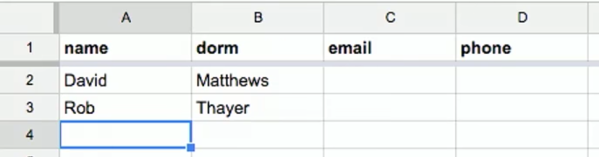

В данном примере, нам даются структурированные данные с определенными ключами - это метаданные, которые описывают каждый столбик и приводимые значения.

Мы можем воспринимать их как список строк, каждая из которых будет представлять из себя словарь. У каждой строки есть столбик с клеткой, поэтому мы можем создавать пары типа ключ/значение на каждую клетку, где ключ является заголовком для данного столбика и где значение - это то, что хранится внутри клеток.

Но мы можем спроецировать более эффективную и легкую в интеграции с другими программами систему хранения данных.

Нам понадобятся обычные операции:

* `CREATE …​`

* `INSERT …​`

* `SELECT …​`

* `UPDATE …​`

* `DELETE …​`

* …​

SQL используется для реляционных баз данных или баз данных, чьи данные имеют между собой связь, при этом находясь в разных таблицах.

Находясь внутри среды разработки CS50 IDE, мы запустим программу под названием `phpliteadmin`, чтобы создать базу данных SQLite. После всего этого, мы сможем управлять ею (базой) с помощью веб-интерфейса (т.е. наша база будет представляться в виде веб-сайта):

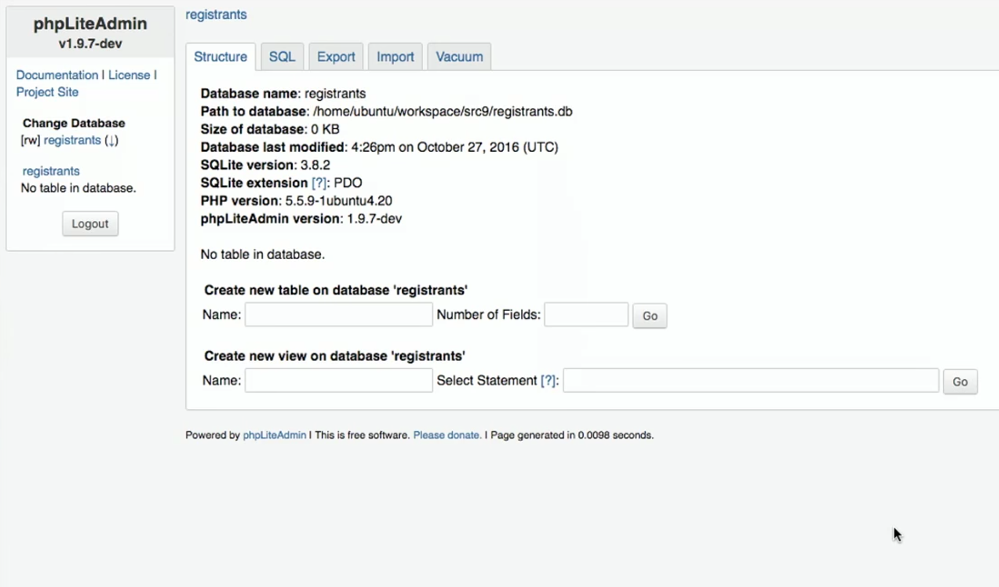

Сам инструмент написан на языке программирования под названием PHP, но мы можем использовать его без того, чтобы вдаваться в подробности его имплементации (да здравствует абстракция!).

У нас есть база данных `registrants` (зарегистрировавшихся пользователей) и кое-какой багаж функционала для работы с ней. Раздел `Structure` показывает информацию о нашей базе данных, раздел `SQL` позволяет нам осуществлять SQL-запросы, а также мы можем `Export` (Экспортировать) или `Import` (Импортировать) данные.

Но сперва мы создадим новую таблицу (которую мы можем воспринимать как новый лист табличного файла) под названием `registrants`, с двумя внутренними полями.

Мы назовем эти поля `name` и `dorm`. Теперь, в целях оптимизации, мы можем выбирать тип хранимых данных каждого поля:

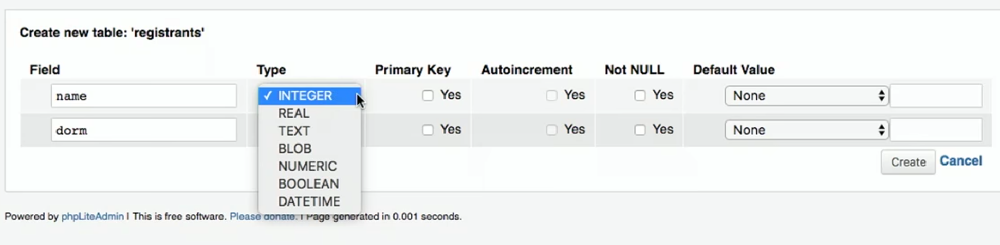

Нам предоставляется выбор из следующих типов данных: `INTEGER`, `REAL` (число с запятой), `TEXT` (string), `BLOB` (бинарные данные), `NUMERIC` (числа, которые могут быть либо integer'ами, либо float'ами), `BOOLEAN`, `DATETIME` (для хранения даты и времени в определенном формате).

Укажем тип данных `TEXT` для обоих полей. И далее у нас есть еще несколько дополнительных опций для каждого поля.

`Primary Key` (первичный ключ) указывает на то, является ли данное поле ключом, по которому уникально определяются все строки данной таблицы. Конечно, есть шанс, что два человека могут иметь одинаковые имена и общежития, но теперь нам не нужно за это беспокоиться.

`Autoincrement` (Автоувеличение) позволяет нам получить поле с integer значением, которое способно самостоятельно увеличиваться при каждом добавлении новой строки в нашу таблицу (как например с "номером ID"), поэтому мы здесь тоже не будем ставить галочку.

`Not NULL` - это означает, что поле не может быть пустым или null, так как нам нужно, чтобы оба поля были заполнены в каждой строке. Здесь мы поставим галочки для обоих полей.

Наконец, мы можем уточнить `Default Value` (по умолчанию заданное значение), если ранее не было предоставлено никаких значений. Но эту функцию мы также пропустим.

После того как мы нажмем на кнопку `CREATE` (создать), перед нами появится это:


Здесь приводится текст, представляющий из себя SQL-запрос, используемый для создания таблицы с выбранными нами параметрами. phpLiteAdmin сгенерировал все это за нас, чтобы нам не приходилось помнить весь синтаксис или прибегать к документации.

Теперь, если кликнем на таблицу `registrants`, мы увидим еще большее количество табов (вкладок):

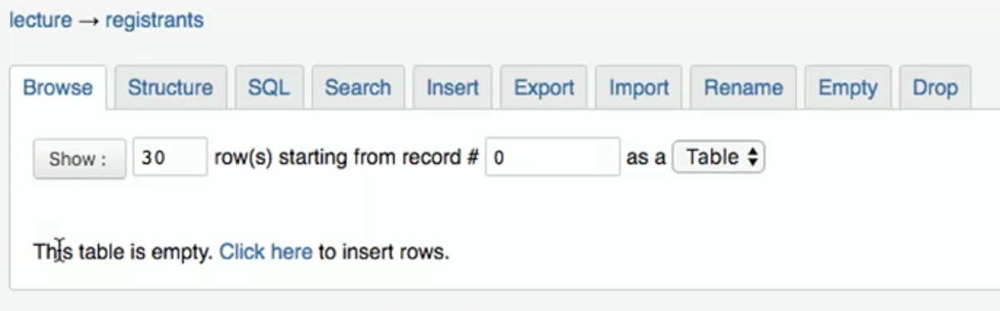

`Browse` позволяет нам просматривать данные, но там пока ничего нет.

`Structure` демонстрирует нам то, как выглядят поля, а также их типы и свойства, одновременно позволяя нам их изменять.

`Insert` позволяет нам добавлять данные и, если мы заполним форму, видеть запрос:

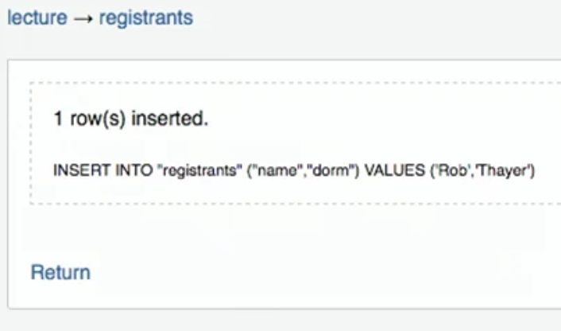

Тогда мы будем иметь возможность видеть наши свеже добавленные данные. Но мы можем написать свой собственный SQL-запрос, с помощью (как вы уже догадались) `SQL` вкладки:

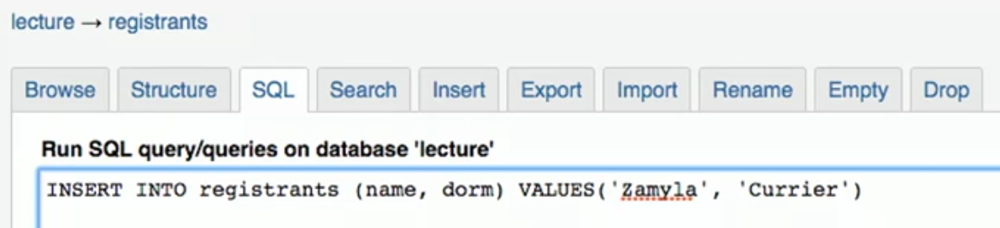

Так мы можем вручную добавлять новые строки в нашу таблицу.

Мы видели работу инструмента с командой `CREATE`, позволяющей создавать таблицу и командой `INSERT`, предназначенной для добавления данных. to add data, but let’s try other operations ourselves:
```sql
SELECT * FROM registrants
```
В данном случае `*` означает "все", поэтому запустив этот запрос мы получим:

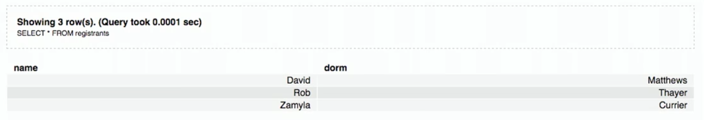

Мы назовем это результативным набором из 3 строк.

Мы также можем изменять существующие данные:
```sql
UPDATE registrants SET dorm = 'Grays' WHERE name = 'Zamyla'
```
Хоть это и новый синтаксис, мы примерно можем понять что он исполняет.

Удаление данных:
```sql
DELETE FROM registrants WHERE name = 'Rob'
```
Чтобы освежить память, взгляните на эти запросы:
```sql
CREATE TABLE 'registrants' ('id' INTEGER PRIMARY KEY, 'name' TEXT, 'dorm' TEXT)
```
```sql
INSERT INTO 'registrants' (name, dorm) VALUES('David', 'Matthews')
```
```sql
SELECT * FROM 'registrants'
```
```sql
UPDATE 'registrants' SET name = 'David Malan' where id = 1
```
```sql
DELETE FROM 'registrants' WHERE id = 1
```
Ранее наша таблица базы данных хранила только поля `name` и `dorm`, но могло случиться так, что у нас в таблице оказались бы два человека с одинаковыми именами и/или одинаковыми общежитиями, поэтому запросы `UPDATE` и `DELETE`, возможно, не смогут выбрать правильные строки.

Точно так же, как и у людей есть уникальные удостоверения личности, к примеру паспорт, мы можем назначить ID строкам нашей таблицы.

Теперь добавим поле `id`, являющееся `INTEGER`'ом и не забудем указать, что оно будет `Primary Key` (первичным ключом), а значит уникальным. Также нам понадобится функция `Autoincrement`, которая будет присуждать каждой строке число, в зависимости от порядка ее (строка) добавления, начиная с `1`, `2`, `3` и так далее.

Если мы запустим `INSERT INTO registrants (name, dorm) VALUES('David', 'Matthews')`, не указывая поле `id`, база данных автоматически присвоит ей значение

Мы можем уточнить, которую строку мы хотели бы удалить. Пример: `DELETE FROM registrants WHERE id = 2`.

И если мы добавим еще одну строку в нашу таблицу, то ей присвоится `id` со значением `4`. В итоге каждое такое значение будет всегда оставаться уникальным для базы данных (в случае если другие таблицы будут ссылаться на `id` `2`).

У SQL также есть функции, позволяющие изменять типы данных `date` (дата), `time` (время) и `datetime` (дата и время). Так мы можем выбрать записи, которые будут соответствовать определенным датам.

Есть еще некоторые свойства, которые можно назначать столбикам нашей таблицы:

`PRIMARY KEY` (первичный ключ), такой столбик будет служить для уникального обозначения строк. И, кроме того, будет использоваться для хранения информации в определенной структуре данных, оптимизированной для выбора и обновления по данному значению (как например бинарное дерево).

`UNIQUE` означает, что поле будет уникальным для каждой строки. Это позволит базе данных оптимизировать запросы на данном поле.

`INDEX` означает, что мы хотим, чтобы база данных хранила поле в каком-нибудь индексе, дабы в будущем, при частом использовании поиска, мы могли бы увеличить скорость этого самого поиска.

`NOT NULL` говорит о необходимости того, чтобы поле имело какое-нибудь значение, т.е. оно не может быть пустым.

`FOREIGN KEY` (внешний ключ) - мы еще вернемся к этому свойству, но если коротко, оно означает обращение к строке чужой таблицы.

Еще SQL позволяет нам `JOIN` (соединять) таблицы.

Если у нас есть таблица под названием `users` (пользователи), то в ней могут присутствовать такие примитивные данные как: имя (name), адрес (address), телефон (phone) и электронная почта (email):

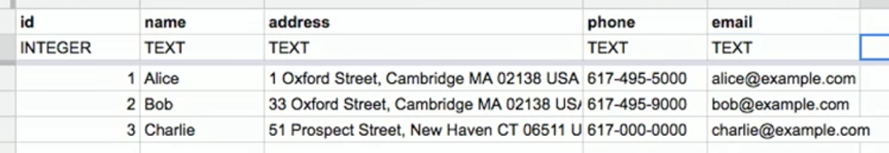

Типом каждого поля будет `TEXT`, за исключением поля `id`, который будет хранить значения типа `INTEGER` (так как это более логичный подход).

Нам, возможно, придется часто проводить поиск в столбике `name` или `address`, поэтому нам лучше их проиндексировать, но не делайте их уникальными.

Так как мы, возможно, будем использовать `email` в качестве логина для авторизации пользователя на нашем сайте, лучше всего сделать столбик `email`'а уникальным, чтобы с `email`'ом ассоциировалась только одна запись таблицы базы данных.

Но мы видим некоторую громоздкость в том, как хранятся адреса. У нас есть два пользователя, проживающих в Кембридже (Cambridge). Нам не обязательно хранить весь адрес, указывая город и штат. Вместо этого, мы можем просто указывать `zipcode` (почтовые индексы):

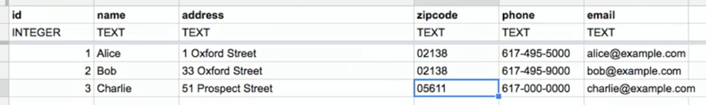

И, чтобы позже можно было просмотреть название города, нам нужно будет в отдельном таблице сохранить, для каждого почтового индекса, полную информацию о городе. И, на этот раз, нам не нужно будет записывать эту информацию о городе более одного раза:

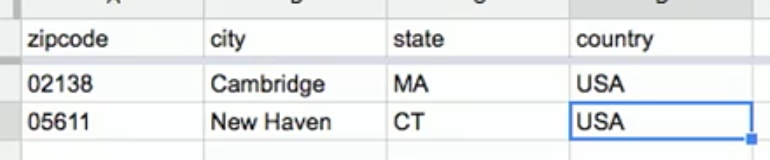

Если мы присвоим каждой строке таблицы `zipcodes` какое-нибудь `id`, тогда для каждого пользователя будет достаточным то, что мы будем просто хранить integer вместо полного почтового индекса:

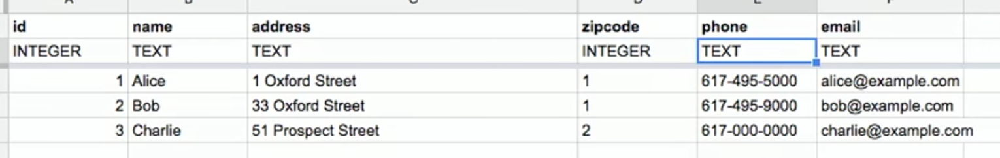

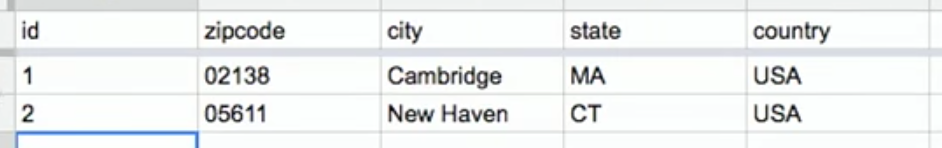

Мы, конечно, усложнили нашу систему, но теперь, при получении большего количества строк, нам не придется каждый раз сохранять снова и снова одно и то же название города и штата. Мы **нормализовали** нашу базу данных, выведя общие данные за пределы нашей таблицы, вместо этого мы теперь просто ссылаемся на них.

Мы преобразуем эти наброски в базу данных, путем создания таблицы `users` и `zipcodes`, при этом указывая приведенные нами ранее поля и типы данных:

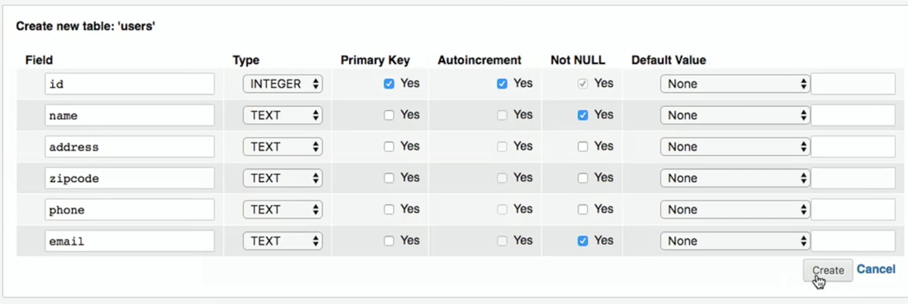

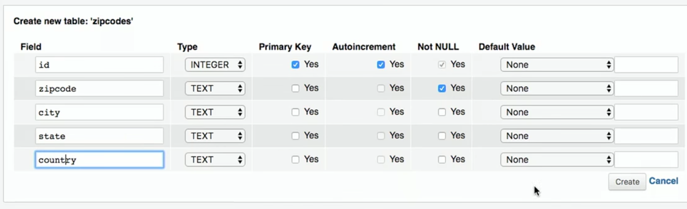

Но типом столбика `zipcode`, в таблице `user`s, не должен быть `TEXT`. Мы изменим его на `INTEGER`, т.е. присудим точно такой же тип как и у столбика `id`, находящегося в таблице `zipcodes`.

Теперь мы можем вручную добавить наши данные:

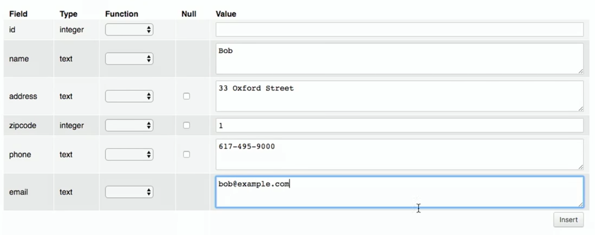

Если мы хотим получить информацию о пользователях, мы можем воспользоваться `SELECT` (выбором), дабы выделить интересующих нас пользователей (users). Далее мы увидим, что их `zipcode` будет равен `1`, как раз ее мы и выберем (`SELECT`) в таблице `zipcodes`, таким образом получая информацию о данной таблице. SQL способен проделать это за нас, используя ключевое слово `JOIN` (соединять):
```sql
SELECT * FROM users JOIN zipcodes ON users.zipcode = zipcodes.id
```
Соединим поля таблиц: поле `zipcode` таблицы `users` и поле `id` таблицы `zipcodes`.

Получим:


На этот раз мы вывели все данные пользователей, при этом сохраняя их эффективное хранение.

Мы можем `CREATE` (создать) индекс для таких полей как, например, `email`. Поэтому, если мы попытаемся повторно `INSERT` (добавить) запись с одинаковым `email`'ом, база данных вернет ошибку и не позволит нам добавить эту запись.

Мы, конечно, можем добавить в наш Питоновский код функционал, который позволял бы `SELECT` (проводить выборку) по электронной почте и только затем `INSERT` (вставлять) новую запись, но, к счастью, база данных все это проделывает за нас.

Другие полезные фишки (функции) SQL:

* `BEGIN TRANSACTION`

* `COMMIT`

* `ROLLBACK`

Если мы вернемся к нашей IDE (среде разработки), то увидим файл `lecture.db`, в котором хранятся ранее созданные и используемые нами данные.

Чтобы открыть этот файл, мы можем воспользоваться терминальной программой: `$ sqlite3 lecture.db`.

Теперь мы сможем исполнять запросы, записывая их после `sqlite>`:

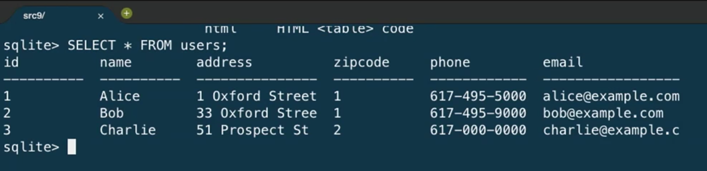

Существует определенный стандарт присваивания имён `FOREIGN KEY`s (внешним ключам) или полям, являющимся `PRIMARY KEY`s (первичными ключами) в какой-нибудь другой таблице. В нашем примере поле `zipcode` (индекс), принадлежащее таблице `users` (пользователи), на самом деле представляло собой поле `id` таблицы `zipcodes`. Поэтому мы должны установить название поля таблицы `users` как `zipcode_id`, чтобы дать знать, что оно действительно является полем `id`.

## Frosh IMs

Разберем приложение [`froshims2`](http://cdn.cs50.net/2016/fall/lectures/9/src9/froshims2/), т.е. откроем файл `application.py` и взглянем на код:
```python
from cs50 import SQL

from flask import Flask, render_template, redirect, request, url_for

app = Flask(__name__)

db = SQL("sqlite:///froshims2.db")

@app.route("/")
def index():
    return render_template("index.html")

@app.route("/register", methods=["POST"])
def register():
    if request.form["name"] == "" or request.form["dorm"] == "":
        return render_template("failure.html")
    db.execute("INSERT INTO registrants (name, dorm) VALUES(:name, :dorm)", name=request.form["name"], dorm=request.form["dorm"])
    return render_template("success.html")
```
Начнем с того, что импортируем (import) модуль `SQL` из нашей библиотеки `cs50`. С помощью данного модуля мы сможем без проблем выполнять SQL-запросы, находясь в нашем Питоновском коде.

`db = SQL("sqlite:///froshims2.db")` - эта строка указывает какую именно базу данных мы хотим задействовать в нашем приложении.

В файле `register` мы оставим прежний код, но теперь, если нам нужно будет сохранить какие-либо данные, эту операцию наше приложение будет осуществлять с помощью команды `db.execute("INSERT INTO registrants (name, dorm) VALUES(:name, :dorm)", name=request.form["name"], dorm=request.form["dorm"])`. Первым аргументом команды `db.execute` является SQL-запрос. `:name` и `:dorm` - выступают в качестве заполнителей, так как мы намереваемся заменить их значениями переменных. Этим аргументам будут переданы значения (VALUES), полученные из `request.form`. Далее функция `cs50` `execute` составит из этих значений окончательный, готовый к применению, SQL-запрос.

Нам еще раз нужно создать файл с помощью программы `phpliteadmin`, под названием `froshims2.db`. В нем мы создадим нужную нам таблицу.

Далее можем перейти к нашей форме, которая находится в `index.html` и если мы ее заполним, а затем нажмем кнопку `Submit` (Отправить), то увидим новые данные в нашей базе данных.

Теперь мы можем программным способом (через код нашей программы) создавать и выбирать данные. Создадим маршрут `registrants` (зарегистрированные пользователи/регистраторы), перейдя по которому, мы сможем увидеть всех зарегистрированных пользователей:
```python
@app.route("/registrants")

def registrants():
    rows = db.execute("SELECT * FROM registrants")
    return render_template("registrants.html", registrants=rows)
```
Ранее, когда мы выполняли команду `db.execute` `INSERT`, мы не проверяли возвращаемое значение. Но в данном случае, когда мы используем команду `SELECT` (ВСТАВКИ), мы хотим сохранить возвращаемое значение, так как это будет нашим итоговым комплектом, т.е. списком словарей (list of dictionaries).

И наш шаблон (template) документа `registrants.html` будет выглядеть как-то так:
```





    registrants





<ul>

    

        <li>{{ registrant.name }} from {{ registrant.dorm }}</li>

    

</ul>



```
Для каждого `registrant` (регистранта) в нашем списке `registrants` (регистрантов), переданного шаблону из модуля `application.py`, мы получим значения каждого ключа словаря `registrant`.

Здесь у нас есть новый странный синтаксис `{{` и `}}`, посредством которого в наш сгенерированный HTML вставляется переменная.

И мы можем добавить еще один маршрут, который позволит удалить строку:
```python
@app.route("/unregister", methods=["GET", "POST"])

def unregister():
    if request.method == "GET":
        rows = db.execute("SELECT * FROM registrants")
        return render_template("unregister.html", registrants=rows)
    elif request.method == "POST":
        if request.form["id"]:
            db.execute("DELETE FROM registrants WHERE id = :id", id=request.form["id"])
        return redirect(url_for("registrants"))
```
Если мы перейдем на страницу `unregister` (отмены регистрации), мы, скорее всего, захотим увидеть страницу, где нам будет предоставляться форма с различными параметрами, благодаря которой, мы сможем удалять определенных пользователей. Значит, если мы отправим из данной формы метод `POST`, нам нужно чтобы исполнился запрос `DELETE` (УДАЛЕНИЕ), и чтобы пользователь был перенаправлен на маршрут `registrants` (регистранты).

И `unregister.html` будет содержать следующую форму:
```





    registrants





<form action="{{ url_for('unregister') }}" method="post">

<ul>

    

        <li><input name="id" type="radio" value="{{ registrant.id }}"/> {{ registrant.name }} from {{ registrant.dorm }}</li>

    

</ul>

<input type="submit" value="Unregister"/>

</form>



```
Мы создадим input-элементы HTML с типом `radio`, а это значит, что мы можем выбрать только один элемент формы. И присвоим атрибуту `action`, принадлежащий тегу `form`, значение `url_for('unregister')`, таким образом сообщение будет `POST` (ОПУБЛИКОВАНО) в надлежащем месте (т.е. передано правильному маршруту).

И `value` (значением) каждого `input`'а будет `registrant.id`, поэтому, когда мы отправим форму, `id` будет передан нашему методу (функции) `unregister`.

Теперь у нас есть форма, которая не только создает интерактивный пользовательский интерфейс, но еще и сервер, который может принимать введенные пользователем значения и на их основе осуществлять определенные операции.

У нас есть HTML, язык разметки для написания веб-страниц, который отправляется через HTTP, протокол для установки связи посредством интернета, и сервер написанный на Питоне, языке программирования, с задействованным фреймворком Flask, который помогает нам запустить простой веб-сервер. И мы немного познакомились с SQL, помогавший нам манипулировать данными.

## Модели

Мы можем абстрагироваться от уровня использования SQL-запросов к моделям. Это такая фишка, которую мы можем получим благодаря фреймворку Flask.

В [`froshims3`](http://cdn.cs50.net/2016/fall/lectures/9/src9/froshims3/) мы изменили то, как мы взаимодействуем с базой данных. В `application.py`:
```python
from flask import Flask, render_template, redirect, request, url_for
from flask_sqlalchemy import SQLAlchemy

app = Flask(__name__)

# Flask-SQLAlchemy
app.config["SQLALCHEMY_TRACK_MODIFICATIONS"] = False
app.config["SQLALCHEMY_DATABASE_URI"] = "sqlite:///froshims3.db"
app.config["SQLALCHEMY_ECHO"] = True
db = SQLAlchemy(app)
```
Мы воспользовались другой библиотекой под названием SQLAlchemy, для которой мы уточняем файл базы данных и можем далее обращаться как `db`.

Далее мы можем определить объектно-реляционное отображение (object-relational mapping / ORM), которое описывает наши данные в качестве объектов (или представляет данные в качестве объектов):
```python
class Registrant(db.Model):

    __tablename__ = "registrants"
    id = db.Column(db.Integer, primary_key=True)
    name = db.Column(db.Text)
    dorm = db.Column(db.Text)

    def __init__(self, name, dorm):
        self.name = name
        self.dorm = dorm
```
Мы создаем `class` (класс) под названием `Registrant`, который дополняет базовую `Model` (модель) - ее мы получаем из `db` (объект базы данных созданный библиотекой SQLAlchemy).

Далее мы уточняем свойства данного класса, такие как table (таблица) и columns (столбики). Т.е. мы уточняем свойства наших данных и мы хотели бы сохранить их в Python'e, без написания самих запросов SQL.

И каждый объект данного класса будет представлять из себя строку в таблице, со своими собственными свойствами: `name` (имя) и `dorm` (общежитие).

Позже, в маршруте `register`, мы увидим пользу данного подхода:
```python
@app.route("/register", methods=["POST"])

def register():
    if request.form["name"] == "" or request.form["dorm"] == "":
        return render_template("failure.html")
    registrant = Registrant(request.form["name"], request.form["dorm"])
    db.session.add(registrant)
    db.session.commit()
    return render_template("success.html")
```
Теперь, вместо того чтобы записывать нашу собственную команду `INSERT`, мы можем создать объект `Registrant` (зарегистрированный пользователь), путем предоставления в качестве параметров дополнительных значений, с которыми мы хотим инициализировать данный объект и добавить его к нашей базе данных `db`, используя команду `db.session.add`. И уже следующая строка `db.session.commit()` сохраняет нового `registrant` (регистранта) в базе данных.

Маршруты `registrants` и `unregister` тоже могут пользоваться данным новым методом, для взаимодействия с базой данных:
```python
@app.route("/registrants")

def registrants():
    rows = Registrant.query.all()
    return render_template("registrants.html", registrants=rows)

@app.route("/unregister", methods=["GET", "POST"])
def unregister():
    if request.method == "GET":
        rows = Registrant.query.all()
        return render_template("unregister.html", registrants=rows)
    elif request.method == "POST":
        if request.form["id"]:
            Registrant.query.filter(Registrant.id == request.form["id"]).delete()
            db.session.commit()
        return redirect(url_for("registrants"))
```
Как только наше приложение станет сложным и более загруженным, мы найдем полезным возможность библиотеки записывать за нас SQL-запросы, что несомненно поможет нам сэкономить драгоценное время.

## SQL-инъекции

Прописывать свой собственный SQL-запрос тоже может привести к определенным проблемам.

SQL-инъекция является одной из таких проблем. К примеру, когда мы авторизовываемся на сайте, мы заполняем поля формы: username (никнейм) и password (пароль), и серверная сторона сайта (back-end) может попробовать достать строку из базы данных с подходящим никнеймом и паролем.

Но если на сервере используется SQL, тогда то, что мы прописываем в форме может быть напрямую включено в запрос. К примеру, представьте, что мы передали `me@examplemailprovider.com` в качестве никнейма и `' OR '1' = '1` в качестве пароля:

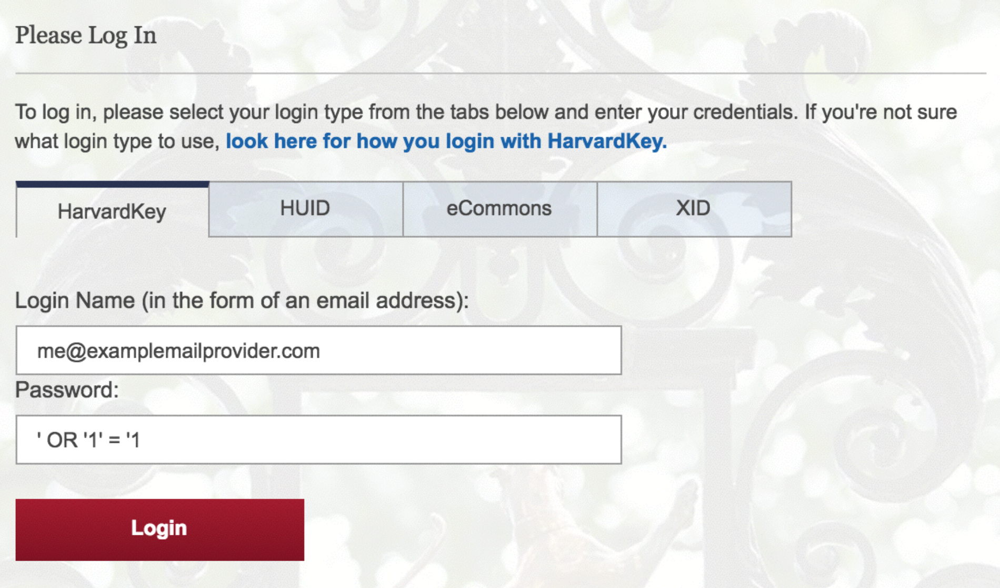

У SQL есть специальное ключевое слово `OR` и похоже на то, что значение данного пароля изменит поведение SQL-запроса, если его одинарные кавычки будут напрямую добавлены в запрос.

Предположим, что код на серверной стороне прописан следующим образом:
```python
username = request.form["username"]
password = request.form["password"]
db.execute("SELECT * FROM users WHERE username = '{}' AND password = '{}'".format(username, password))
```
Тогда, если `password` будет таким образом подменен, то наш запрос, на самом деле, будет выглядеть так:
```sql
SELECT * FROM users WHERE username = 'me@examplemailprovider.com' AND password = '' OR '1' = '1'
```
И этот запрос выберит строку, где `username = 'me@examplemailprovider.com'` даже если `password` не будет совпадать, так как `1` всегда будет равна `1`.

Но если мы воспользуемся библиотекой CS50 или в общем какой-либо другой библиотекой, они будут предусматривать такие случаи и избегать их надлежащим образом:
```python
username = request.form["username"]
password = request.form["password"]
db.execute("SELECT * FROM users
WHERE username = :username AND password = :password", username=username, password=password)
```
станет:
```python
username = request.form["username"]
password = request.form["password"]
db.execute("SELECT * FROM users
WHERE username = 'me@examplemailprovider.com' AND password = '\' OR \'1\' = \'1'")
```
теперь одинарные кавычки были минованы и они более не меняют string или поведение запроса.

И библиотека CS50 всего лишь передает запрос библиотеке SQLAlchemy, в которой и имплементировано избегание данной инъекции.

Мы даже можем добавить точку с запятой в передаваемое нами значение, если мы знаем, что сервер уязвим к такого рода атакам, и запустим запрос по типу этого `DROP DATABASE`.

Далее мы начнем использовать JavaScript, дабы сделать наш сайт более интерактивным!

