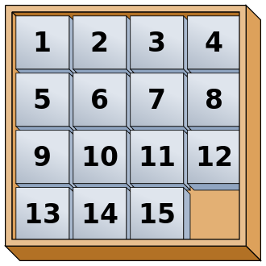
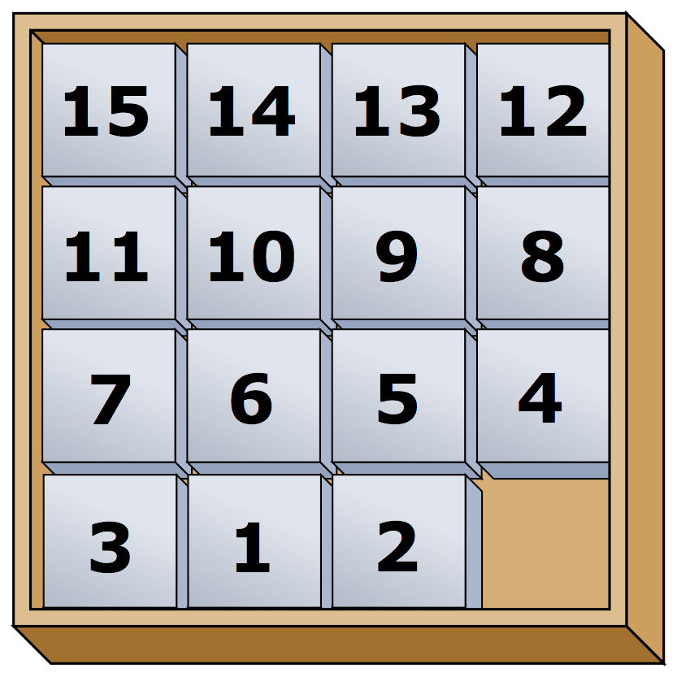

# Game of Fifteen (Пятнашки)

## Коротко

Создайте игру "Пятнашки" - такую, как показано ниже.
```
$ ./fifteen 3
WELCOME TO GAME OF FIFTEEN

8  7  6

5  4  3

2  1  _

Tile to move:
```

## Описание

Пятнашки - это популярная головоломка, представляющая из себя двухмерную доску (квадрат) с пронумерованными передвигаемыми плитками. Задача в этой головоломке заключается в том, чтобы расставить плитки на доске по возрастанию, слева направо, сверху вниз с пустой плиткой в правом нижнем углу доски, как показано ниже.



Передвижение любой плитки, которая граничит с пустым пространством доски, в это пространство называется "move" (движение). Хотя вышеприведенная конфигурация и означает то, что в игре уже одержана победа, вы можете заметить, что плитка под номером 12 или плитка под номером 15 могут быть передвинуты на место пустого пространства. Плитки нельзя двигать по диагонали или вынимать из доски.

Хотя возможны различные конфигурации, мы можем предположить, что игра будет начинаться с обратно-отсортированных плиток доски: от большего к меньшему, слева направо, сверху вниз; с пустым пространством в нижнем правом углу доски. **Если доска содержит нечетное количество плиток (т.е. высота и ширина доски одинаковы), позиции плиток под номерами 1 и 2 должны быть поменяны местами, как показано ниже.** Головоломку можно решить из этой конфигурации.



## Развертывание

### Скачивание
```
$ wget https://github.com/cs50/problems/archive/fifteen.zip
$ unzip fifteen.zip
$ rm fifteen.zip
$ mv problems-fifteen fifteen
$ cd fifteen
$ ls
Makefile    fifteen.c   questions.txt
```
## Понимание

Посмотрите на `fifteen.c`. Внутри этого файла есть движок игры "Пятнашки". Следующая задача - закончить реализацию этой игры.

Но сперва скомпилируйте данный движок. (Помните как?) И, хотя программа еще сырая и не завершенная, вы можете запустить игру. (Догадаетесь как?) Скорее всего вы захотите запустить данную программу в более крупном окне терминала - для этого нажмите на зеленый плюс (+), который находится сверху, над вашим кодом, и выберите **New Terminal**. Можно просто перевести окно терминала в полноэкранный режим, нажав на иконку **Maximize** в его правом верхнем углу.

Как бы там не было, похоже, что игра хотя бы частично функционирует. Конечно, ей еще далеко до полноценной игры, поэтому здесь понадобитесь вы!

## Проверка на Понимание

Просмотрите весь код и все комментарии, открыв файл `fifteen.c`, и ответьте на вопросы, приведенные снизу в `questions.txt` - текстовый файл (почти пустой), который мы включили для вас в развертываемую папку `fifteen`. Не надо переживать, если вам не до конца понятно, как работает `fprintf` или `fflush`; мы их добавили только для автоматизации кое-каких проверок.

0. Кроме 4 × 4 (доска игры "Пятнашки"), какие еще размеры доски позволяет использовать наш движок?

1. Какой структурой данных представлена игровая доска?

2. Какая вызывается функция для приветствия игрока в начале игры?

3. Какие функции вам скорее всего придется реализовать?

## Описание

Создайте игру "Пятнашки" в соответствии с комментариями, данными в `fifteen.c`.

1. Реализуйте `init` (инициализация).

2. Реализуйте `draw` (рисование).

3. Реализуйте `move` (движение).

4. Реализуйте `won` (победа).

## Подсказки

Помните - все делать "детскими шагами". Не пытайте написать весь код игры за раз. Лучше реализовывайте по одной функции и проверяйте, работает она или нет, а уже потом продвигайтесь дальше. Дизайн игры можете придумать любой (т.е., сколько пробелов вы захотите оставить между числами, когда будете выводить доску на экран). Предположительно, доска при выводе на экран, должна выглядеть так, как указано ниже, но вы можете реализовать ее так, как пожелаете.
```
15 14 13 12

11 10  9  8

 7  6  5  4

 3  1  2  _
```
Помните, что плитки с номерами 1 и 2 должны быть смещенными (точно также, как в примере 4 × 4, приведенном выше), если плиток нечетное количество (как в примере 4 × 4 выше). Если у доски четное количество плиток, плитки 1 и 2 не должны быть смещенными. В примере ниже это хорошо продемонстрировано (доска 3 × 3):
```
8  7  6

5  4  3

2  1  _
```
Вы можете создать свои собственные функции и даже менять прототипы функций, которые мы написали для вас. Но вам нельзя менять логику самого `main`'а, чтобы мы могли автоматизировать проверку вашего кода, когда вы вышлите его нам. В частности `main` должен вернуть только `0`, если и только когда пользователь действительно одержит победу в игре; значения не равные нулю должны возвращаться в случаях возникновения ошибок, как указано в нашем развертываемом коде.

## Проверка

Для проверки вашей реализации игры `пятнашки` вы конечно можете просто поиграться с ней. (Знайте, что вы можете заставить вашу программу завершить работу, нажав на клавиатуре <kbd>ctrl</kbd> + <kbd>c</kbd>). Удостоверьтесь, что вы (и мы) не вылетим из вашей программы, предоставив непонятное число плитке. И знайте, что точно также, как вы автоматизировали ввод данных в `find`, вы можете автоматизировать выполнение этой игры. На самом деле, в папке `~cs50/pset3` есть файлы `3x3.txt` и `4x4.txt` с выигрышными последовательностями движений для досок 3 × 3 и 4 × 4 соответственно. Чтобы проверить вашу программу, предположим, первыми предоставляемыми данными, выполните следующее.
```
./fifteen 3 < ~cs50/pset3/3x3.txt
```
Имейте в виду, `check50` предполагает, что пустое место на вашей доске представлено в `board` (доске) как цифра `0`; Если вы выбрали какое-либо другое значение, лучше всего изменить его на `0` ради `check50`. Еще на заметку - `check50` предполагает, что вы индексируетесь в `board` (доске) таким образом `board[строка][столбик]`, а не таким `board[столбик][строка]`.
```
check50 cs50/2017/x/fifteen
```
Вас потребуют ввести логин (**GitHub username**) и пароль (**GitHub password**) от вашей учетной записи на Github'е, которую вы можете завести, пройдя по данной ссылке [https://github.com/join](https://github.com/join).

Зайдите на сайт [cs50.me](https://cs50.me/), используя всё ту же учетную запись GitHub'а и нажмите на зеленую кнопку **authorize submit50** (Это действие производится только один раз).