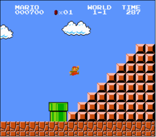

# Mario (Марио)

## Коротко

Создайте программу, которая будет строить половину пирамиды по заданной пользователем высоте (Height).
```
$ ./mario
Height: 5
    ##
   ###
  ####
 #####
######

$ ./mario
Height: 3
  ##
 ###
####
```
## Объяснение

В конце первого уровня популярной в свое время игры от Nintendo - Super Mario Brothers Марио должен был высоко прыгнуть с полупирамиды, чтобы допрыгнуть до флага и заработать максимальное количество очков. Ниже скриншот



## Описание

Напишите в файле `mario.c`, который находится в папке `~/workspace/pset1/`, программу, рисующую ту же самую полупирамиду используя решетки (`#`) вместо блоков.

Чтобы нарисовать полупирамиду, сперва попросите пользователя ввести неотрицательное целое число (integer), которое будет не выше `23`. (Высота пирамиды, которая приведена выше, равна `8` блокам.)

Если пользователь не сможет предоставить число, которое будет неотрицательным и не выше `23`, тогда его нужно попросить повторно ввести высоту.

Потом создайте (используя `printf` и еще один или несколько циклов) полупирамиду.

Позаботьтесь, чтобы самая нижняя левая часть вашей полупирамиды состыковывалась с левым краем окна терминала.

## Использование

Ваша программа должна проделывать тоже самое, что показано в примере ниже.
```
$ ./mario
Height: 4
   ##
  ###
 ####
#####
```
```
$ ./mario
Height: 0
```
```
$ ./mario
Height: -5
Height: 4
   ##
  ###
 ####
#####
```
```
$ ./mario
Height: -5
Height: five
Retry: 40
Height: 24
Height: 4
   ##
  ###
 ####
#####
```

## Проверка
```
check50 cs50/2018/x/mario/less
```

## Стиль
```
style50 mario.c
```

## Закачать
```
submit50 cs50/2018/x/mario/less
```

Вас потребуют ввести логин (**GitHub username**) и пароль (**GitHub password**) от вашей учетной записи на Github'е, которую вы можете завести, пройдя по данной ссылке [https://github.com/join](https://github.com/join).

Зайдите на сайт [cs50.me](https://cs50.me/), используя всё ту же учетную запись GitHub'а и нажмите на зеленую кнопку **authorize submit50** (Это действие производится только один раз).

## Подсказки

Постарайтесь связать следующие моменты (а) высота, которую хочет дать пирамиде пользователь, (б) строка, которая на данный момент выводится на экран, и (с) сколько пробелов и сколько решеток на этой строке. Как только вы определите формулу, вы сможете перевести все это в Си!
