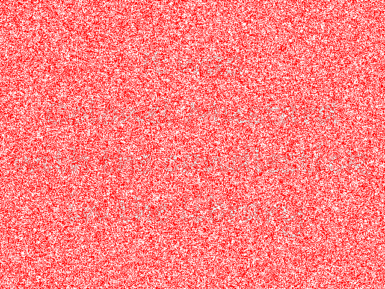
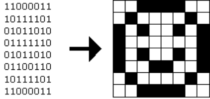
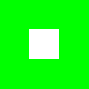
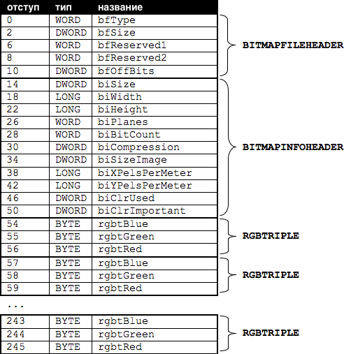

# Whodunit (Кто это сделал?)

## Коротко

Ответьте на некоторые вопросы и затем реализуйте программу, которая сможет вытащить спрятанное сообщение из BMP изображения, как указано ниже.
```
$ ./whodunit clue.bmp verdict.bmp
```
## Развертывание

### Скачивание
```
$ wget https://github.com/cs50/problems/archive/whodunit.zip
$ unzip whodunit.zip
$ rm whodunit.zip
$ mv problems-whodunit whodunit
$ cd whodunit
$ ls
bmp.h  clue.bmp  copy.c  large.bmp  small.bmp  smiley.bmp
```
## Объяснение

Добро пожаловать в особняк Tudor. Вы гость, трагически погибшего, мистера Джона Бодди, ставшего жертвой чьей-то грязной игры. Для того, чтобы одержать победу, вы должны определить whodunit (кто совершил преступление?).

К сожалению для вас (хотя к еще большему сожалению для мистера Бодди), единственной уликой является 24-битный BMP файл под названием `clue.bmp` (улика/зацепка), изображенный ниже, который господин Бодди оставил на своем компьютере, в свои последние минуты жизни. В файле есть скрытое среди красного "шума" изображение whodunit (того, кто совершил преступление.).



Вы давно выбросили этот кусок красного пластика, который помог бы решить эту загадку, значит вы должны подойти к этой проблеме глазами компьютерного специалиста.

Но, для начала, некоторая информация.

Наверное, самый простой способ представить изображение будет сетка пикселей (то есть точки), каждая из которых может быть разного цвета. Поэтому, чтобы представить черно-белые изображения, нам нужно использовать на каждом пикселе 1 бит, где 0 - черный цвет и 1 - белый цвет, как показано ниже.



Поэтому изображение - это просто сетка битов (то есть карта битов/bitmap или отображение битов). Для более красочных (имеющих больше цветов) изображений вам просто нужно большее количество битов на пиксель. Формат файла (например GIF), который поддерживает "8-битный цвет" использует 8 бит в каждом пикселе. Формат файла (например BMP, JPG, PNG), который поддерживает "24-битный цвет" использует 24 бита в каждом пикселе. (BMP фактически поддерживает 1-, 4-, 8-, 16-, 24- и 32-битный цвет.)

Мистер Бодди использует 24-битную структуру BMP, обозначая 8 битами количество красного цвета, другими 8 битами количество зеленого цвета и оставшимися 8 битами количество синего цвета в пикселе. Если вы когда-нибудь слышали об аббревиатуре RGB, поздравляем, вы сейчас работаете именно с ними: красный (RED), зеленый (GREEN), синий (BLUE).

Если значения R, G и B какого-то пикселя на BMP изображении, будут равны 0xff, 0x00 и 0x00 (шестнадцатеричная система счисления), то этот пиксель будет чисто красным, так как 0xff (иначе известное как 255 в десятичной системе) означает "много красного", в то время как 0x00 и 0x00 означают "никакого зеленого" и "никакого синего". Учитывая то, насколько красное BMP изображение оставил нам мистер Бодди, мы можем спокойно заявить, что в нем определенно много пикселей именно с такими значениями RGB. Естественно в нем присутствуют пиксели и с другими значениями.

Между прочим в HTML и CSS (языки с помощью которых создаются веб-сайты) модели цветов устроены точно таким же образом. Здесь больше информации по этому поводу [wikipedia](https://ru.wikipedia.org/wiki/Цвета_HTML).

Теперь перейдем к проблеме более техническим способом. Вспомните, что файл представляет из себя всего лишь последовательность битов, расположенных между собой определенным образом. Поэтому 24-битный BMP-файл - это тоже просто последовательность битов, где (почти) каждые 24 бита представляют цвет какого-то пикселя. Но в BMP файле также есть какие-то "метаданные" - информация, к примеру высота и ширина изображения. Эти метаданные хранятся в начале файла в виде двух структур данных, которые в народе называют "заголовками" (не путать с заголовками языка Си). Первым из этих заголовков является `BITMAPFILEHEADER` (заголовок файла), его длина 14 байтов (напомним, что 1 байт равен 8 битам). Второй называется `BITMAPINFOHEADER` (заголовок данных), его длина 40 байтов. Далее после этих заголовков следует уже сам bitmap (изображение): массив байтов, трое из которых образуют цвет пикселя. (В 1, 4 и 16-битном BMP-файлах, но не в 24 или 32, есть еще один заголовок, сразу после `BITMAPINFOHEADER` (заголовка данных), и он называется `RGBQUAD` - массив, определяющий "значения интенсивности" каждого цвета палитры устройства). BMP хранит эти три значения в обратном порядке (т.е. BGR), 8 битов для представления синего, далее 8 битов для зеленого и 8 битов для красного (некоторые BMP также хранят все биты в обратном порядке, т.е. верхняя строка битов изображения начинается с самого конца BMP файла. Не волнуйтесь, в данном наборе проблем биты расположены в обычно порядке). Если бы мы превратили 1-битный смайлик в 24-битный, заменяя черный красным, 24-битное BMP-изображение сохранило бы эти биты так, что `0000ff` указывал бы на красный цвет и `ffffff` на белый. Мы выделили красным цветом все примеры чисел `0000ff`.
```
ffffff  ffffff  0000ff  0000ff  0000ff  0000ff  ffffff  ffffff
ffffff  0000ff  ffffff  ffffff  ffffff  ffffff  0000ff  ffffff
0000ff  ffffff  0000ff  ffffff  ffffff  0000ff  ffffff  0000ff
0000ff  ffffff  ffffff  ffffff  ffffff  ffffff  ffffff  0000ff
0000ff  ffffff  0000ff  ffffff  ffffff  0000ff  ffffff  0000ff
0000ff  ffffff  ffffff  0000ff  0000ff  ffffff  ffffff  0000ff
ffffff  0000ff  ffffff  ffffff  ffffff  ffffff  0000ff  ffffff
ffffff  ffffff  0000ff  0000ff  0000ff  0000ff  ffffff  ffffff
```
Таким образом, если присмотреться, вы можете увидеть красный смайлик, образованный битами, которые расположены слева направо, сверху вниз.

Вспомните, что шестнадцатеричная цифра представляется 4 битами. Соответственно `ffffff` в шестнадцатеричной системе означает `111111111111111111111111` в бинарной.

*Хорошо, теперь остановитесь! Не продолжайте дальше, пока вы точно не будете уверены, что понимаете почему **`0000ff`** представляет красный пиксель в 24-битном BMP файле.*

Хорошо, оставим теорию и перейдем к практике. Внутри файлового браузера (панель слева) среды разработки CS50 (CS50 IDE), дважды щелкните по **smiley.bmp**, таким образом откроется изображение маленького смайлика, 8x8 пикселей. Увеличьте размер изображения с помощью выпадающего меню, которое можно найти в новом окне открытого изображения. Измените увеличение с **100%** на **800%**, дабы можно было разглядеть смайлик, который будет выглядеть также, как показано ниже (если изображение будет размытым, убедитесь, что у **Smooth**, располагающегося сверху окна, не поставлена галочка). Таким образом вы можете разглядеть каждый пиксель изображения (как большие квадратики).


Теперь давайте заглянем "под капот" и посмотрим на байты, которые образуют изображение `smiley.bmp`. В этом нам поможет `xxd` - "hex editor" (шестнадцатеричный редактор) командной строки. Выполните в терминальном окне следующее:
```
xxd -c 24 -g 3 -s 54 smiley.bmp
```
Ниже приведен результат того, что вы должны увидеть (Наверное, будет лучше если вы увеличите размер терминального окна). Как это было ранее, мы выделили красным цветом все значения `0000ff`.
```
0000036: ffffff ffffff 0000ff 0000ff 0000ff 0000ff ffffff ffffff  ........................
000004e: ffffff 0000ff ffffff ffffff ffffff ffffff 0000ff ffffff  ........................
0000066: 0000ff ffffff 0000ff ffffff ffffff 0000ff ffffff 0000ff  ........................
000007e: 0000ff ffffff ffffff ffffff ffffff ffffff ffffff 0000ff  ........................
0000096: 0000ff ffffff 0000ff ffffff ffffff 0000ff ffffff 0000ff  ........................
00000ae: 0000ff ffffff ffffff 0000ff 0000ff ffffff ffffff 0000ff  ........................
00000c6: ffffff 0000ff ffffff ffffff ffffff ffffff 0000ff ffffff  ........................
00000de: ffffff ffffff 0000ff 0000ff 0000ff 0000ff ffffff ffffff  ........................
```
В самом левом столбике находятся адреса (шестнадцатеричные), которые указывают на отступ от первого байта файла. Обратите внимание, что `00000036` в шестнадцатеричной системе равен `54` в десятичной. Поэтому вы начинаете работу с `54` байта изображения `smiley.bmp`. Вспомните, что первые 14 + 40 = 54 байта BMP заполнены метаданными. Если вы действительно хотите увидеть эти метаданные, выводя их вместе с битовыми пикселями (bitmap), выполните следующее.
```
xxd -c 24 -g 3 smiley.bmp
```
Если бы `smiley.bmp` действительно содержал в себе символы ASCII, вы бы увидели их в самом правом столбике `xxd`, вместо всех этих точек.

Поэтому `smiley.bmp` 8 пикселей в ширину и 8 пикселей в высоту, и имеет 24-битную структуру (каждый пиксель которого представлен 24 ÷ 8 = байтами). Каждая строка (или "растровая строка") занимает (8 пикселей) × (3 байта на каждый пиксель) = 24 байта, а это количество кратно 4. Оказывается, если количество байтов в растровой строке не кратны 4, BMP файлы хранятся немного по-другому. В `small.bmp`, к примеру, представлено еще одно 24-битное BMP-изображение, зеленый квадрат с шириной и высотой в 3 пикселя. Если вы откроете его (дважды нажмете по нему), вы увидите, что он выглядит так, как показано ниже, хотя и намного меньше (Опять же, увеличьте картинку, для более удобной работы).



Таким образом каждая строка в zsmall.bmpz занимает (3 пикселя) × (3 байта на пиксель) = 9 байтов, что не кратно 4. Поэтому строки заполняют нулями, которые позволяют увеличить их длину, дабы они (строки) были кратны 4. Другими словами, в каждую строку 24-битного BMP-изображения, необходимо добавить от 0 до 3 байтов отступов (Понятно почему?). В случае zsmall.bmpz, необходимо 3 байта нулей, т.к. (3 пикселя) × (3 байта на пиксель) + (3 байта отступов) = 12 байтов, что действительно кратно 4.

Чтобы "увидеть" этот отступ выполните следующую команду:
```
xxd -c 12 -g 3 -s 54 small.bmp
```
Обратите внимание, мы применили другое значение для `-c`, отличное от того, что мы использовали для `smiley.bmp`. Поэтому `xxd`, на этот раз, выводит только 4 столбика (3 для зеленого квадрата и 1 для отступа). Вы должны увидеть следующие выходные данные (мы выделили зеленым все числа `00ff00`).
```
0000036: 00ff00 00ff00 00ff00 000000  ............
0000042: 00ff00 ffffff 00ff00 000000  ............
000004e: 00ff00 00ff00 00ff00 000000  ............
```
Для разнообразия, давайте используем `xxd` на `large.bmp`, который идентичен `small.bmp`, но имеет соотношения 12 пикселей на 12 пикселей, т.е. разрешение изображения в четыре раза больше. Попробуйте выполнить команду, приведенную ниже (вам, скорее всего, придется расширить окно, чтобы избежать переноса строк).
```
xxd -c 36 -g 3 -s 54 large.bmp
```
Вы увидите следующий результат (мы опять выделили зеленым ``00ff00`).
```
0000036: 00ff00 00ff00 00ff00 00ff00 00ff00 00ff00 00ff00 00ff00 00ff00 00ff00 00ff00 00ff00  ....................................
000005a: 00ff00 00ff00 00ff00 00ff00 00ff00 00ff00 00ff00 00ff00 00ff00 00ff00 00ff00 00ff00  ....................................
000007e: 00ff00 00ff00 00ff00 00ff00 00ff00 00ff00 00ff00 00ff00 00ff00 00ff00 00ff00 00ff00  ....................................
00000a2: 00ff00 00ff00 00ff00 00ff00 00ff00 00ff00 00ff00 00ff00 00ff00 00ff00 00ff00 00ff00  ....................................
00000c6: 00ff00 00ff00 00ff00 00ff00 ffffff ffffff ffffff ffffff 00ff00 00ff00 00ff00 00ff00  ....................................
00000ea: 00ff00 00ff00 00ff00 00ff00 ffffff ffffff ffffff ffffff 00ff00 00ff00 00ff00 00ff00  ....................................
000010e: 00ff00 00ff00 00ff00 00ff00 ffffff ffffff ffffff ffffff 00ff00 00ff00 00ff00 00ff00  ....................................
0000132: 00ff00 00ff00 00ff00 00ff00 ffffff ffffff ffffff ffffff 00ff00 00ff00 00ff00 00ff00  ....................................
0000156: 00ff00 00ff00 00ff00 00ff00 00ff00 00ff00 00ff00 00ff00 00ff00 00ff00 00ff00 00ff00  ....................................
000017a: 00ff00 00ff00 00ff00 00ff00 00ff00 00ff00 00ff00 00ff00 00ff00 00ff00 00ff00 00ff00  ....................................
000019e: 00ff00 00ff00 00ff00 00ff00 00ff00 00ff00 00ff00 00ff00 00ff00 00ff00 00ff00 00ff00  ....................................
00001c2: 00ff00 00ff00 00ff00 00ff00 00ff00 00ff00 00ff00 00ff00 00ff00 00ff00 00ff00 00ff00  ....................................
```
Можно заметить, что у этого BMP отсутствуют отступы! В конце концов, (12 пикселей) × (3 байта на пиксель) = 36 байтов кратны 4.

`xxd` способен только показывать байты. Как же нам добраться до них для программного изменения? В `copy.c` находится программа, чьей основной целью является создание копии BMP файла, кусочек за кусочком. Конечно вы могли бы просто воспользоваться командой `cp`. Но `cp` ничем не сможет помочь мистеру Бодди. Давайте будем просто надеяться, что `copy.c` сможет!

Скомпилируйте `copy.c` в программу `copy`, используя `make`. (Помните как?) Затем запустите команду приведенную ниже.
```
./copy smiley.bmp copy.bmp
```
Если вы далее выполните `ls` (с подходящим ключом или аргументом), вы увидите, что у `smiley.bmp` и `copy.bmp` одинаковые размеры. Давайте еще раз проверим действительно ли они одинакового размера! Выполните команду приведенную ниже.
```
diff smiley.bmp copy.bmp
```
Если эта команда ничего не выведет, значит файлы действительно идентичны (На заметку, некоторые программы, такие как Photoshop, включают хвостовые нули в конец BMP файлов. Наша версия `copy` откидывает их, поэтому не стоит переживать, если вы попробуете скопировать скачанный или созданный вами BMP и обнаружите, что копия на несколько байтов меньше оригинала). Для визуального подтверждения, откройте оба файла (двойным нажатием) и проверьте идентичность. Но программа проверяет каждый байт, поэтому его "глаз" будет острее вашего!

Как же создавалась эта копия? Оказывается, `copy.c` полагается в этом вопросе на `bmp.h`. Давайте посмотрим. Откройте `bmp.h` и вы увидите определения этих заголовков, о которых мы уже говорили. Также этот файл определяет `BYTE`, `DWORD`, `LONG` и `WORD` - типы данных, обычно встречающиеся в мире Windows программирования. Заметьте, они являются всего лишь псевдонимами для примитивов (`int`, `float`, `bool` и т.п.), с которыми (мы надеемся) вы уже знакомы. Оказывается, `BITMAPFILEHEADER` и `BITMAPINFOHEADER` пользуются этими типами данных. Этот файл также определяет `struct` (структуру) под названием `RGBTRIPLE`, которая, попросту говоря, "инкапсулирует" три байта: синий, зеленый и красный (очередность, которую мы получаем, загружая RGB из памяти компьютера).

Почему эти `struct`'ы так полезны? Вспомните, что файл - это просто последовательность байтов (или битов), располагающихся в памяти. И эти байты расположены таким образом, что первые несколько байтов что-то представляют, следующие несколько байтов представляют что-то другое и так далее. "Форматы файлов" существуют из-за того, что мир стандартизировал представление байтов (то, что они обозначают). Теперь мы можем просто считывать файл с жесткого диска, таким образом помещая его в RAM (оперативную память) в виде одного большого массива байтов. Помните, что байт, находящийся на `[i]`'ом индексе, представляет одну вещь, в то время как байт на `[j]`'ом индексе представляет другой. Но почему бы не присудить этим байтам имена, чтобы мы могли бы еще легче доставать их из памяти? Именно это позволяет нам делать `struct`, находящийся в `bmp.h` файле. Чем представлять файл как одну большую последовательность байтов, мы можем представить его как последовательность `struct`'ов.

Вспомните, что у `smiley.bmp` размер 8 на 8 пикселей и поэтому он должен занимать 14 + 40 + (8 × 8) × 3 = 246 байтов дискового пространства (HDD). Можете проверить это, используя команду `ls`. Вот как будет выглядеть он (файл) на жестком диске, согласно Microsoft'у:



Как предполагает эта форма, порядок имеет значение, когда идет речь о членах `struct`'а. 57-м байтом представлен `rgbtBlue` (а не `rgbtRed`), т.к. `rgbtBlue` первым определяется в `RGBTRIPLE`. Использованный нами *`атрибут`* под названием *`packed`* делает так, что `clang` не будет пытаться выравнивать члены по слову (при этом, адрес первого байта каждого члена кратен 4), чтобы в наших `struct`'ах не было "пробелов", которых фактически не существует на жестком диске. Не стоит особо напрягаться по поводу данного способа имплементации.

И напоследок, вы скорее всего заметили в `copy.c`, что когда мы хотим вывести сообщение об ошибке, мы используем функцию `fprintf` (первым аргументом которого, является `stderr`) вместо более знакомой нам `printf`. Оказывается, `printf` выводит сообщения в поток "standard output" (стандартного вывода или `stdout`), путь которого лежит в терминальное окно пользователя. Как течение реки (stdout), несущее различное количество упавших в нее веток (сообщений `printf`) к финальному месту назначения - суше (терминальному окну пользователя). Также существует поток "standard error" (стандартного вывода ошибок или `stderr`), конечное место пребывания которого, также терминальное окно пользователя (не запутались?). С помощью `stdout` и `stderr` программист может отделять сообщения с ошибками от обычных сообщений так, если того захочет пользователь, что одно или другое (или оба) может быть "перенаправлено" (с помощью `>`) или помещено (с помощью `|`) куда-то помимо терминального окна пользователя.

Другими словами это
```c
printf("hello, world\n");
```
идентично этому
```c
fprintf(stdout, "hello, world\n");
```
но оптимальнее использовать первый вариант. Однако, чтобы вывести сообщение с ошибкой в поток `stderr`, используйте `fprintf` как указано ниже.
```c
fprintf(stderr, "Ошибка: ./whodunit вхФайл выхФайл\n");
```
## Вопросы

В файле `questions.txt` есть вопросы, на которые вы должны ответить одним или бóльшим количеством предложений. Пользуйтесь онлайн документацией языка Си.

1. Что такое `stdint.h`?

2.  В чем смысл использования в программе `uint8_t`, `uint32_t`, `int32_t` и `uint16_t`?

3. Сколько байтов занимают `BYTE`, `DWORD`, `LONG` и `WORD`?

4. Какими должны быть первые три байта любого BMP файла (просто укажите каким должно быть значение используя ASCII, десятичную или шестнадцатеричную систему счисления)? Первые байты, используемые для обозначения формата файла, называются "магическими числами".

5. Какая разница между `bfSize` и `biSize`?

6. Что будет означать отрицательное значение `biHeight`?

7. Какое поле в `BITMAPINFOHEADER` (заголовке данных) уточняет глубину цвета изображения BMP (т.е. количество битов на пиксель)?

8. Почему функция `fopen` файла `copy.c` может вернуть `NUL`L в строках 24 и 32?

9. Почему третьим аргументом функции `fread`, в нашем коде, всегда выступает `1`?

10. Какое значение присваивает 65 строка файла `copy.c` нашему `padding`'у (отступу), если `bi.biWidth` равен `3`?

11. Какую функцию выполняет `fseek`?

12. Что такое `SEEK_CUR`?

## Описание

Реализуйте программу под названием `whodunit` (кто это сделал?) таким образом, что она раскроет спрятанное в оставленном мистером Бодди сообщение, говорящее кто совершил преступление (whodunit).

Напишите свою программу в файле `whodunit.c`, который должен будет находиться в папке `whodunit`.

Ваша программа должна принимать ровно два аргумента: название входного файла, который нужно будет открыть для считывания и название выходного файла, который также будет открыт для дальнейшей его записи.

Если вашу программу запустят с меньшим или большим количеством аргументов командной строки, она должна будет указать пользователю, используя функцию `fprintf` (с первым параметром `stderr`, для вывода ошибок), как правильно вводить данные и при этом функция `main` должна вернуть `1`.

Если входной файл будет невозможно открыть для чтения, ваша программа должна сообщить об этом пользователю через `fprintf` (и ее посылкой сообщения потоку `stderr`), `main` должна вернуть `2`.

Если выходной файл будет невозможно открыть для записи, ваша программа должна сообщить об этом пользователю через `fprintf` (и ее посылкой сообщения потоку `stderr`), `main` должна вернуть `3`.

Если входной файл не является не сжатым 24-битным BMP-изображением версии 4.0, ваша программа должна сообщить об этом пользователю через `fprintf` (и ее посылкой сообщения потоку `stderr`), `main` должна вернуть `4`.

При успешном исходе, `main` должна вернуть `0`.

## Использование

Ваша программа должна проделывать тоже самое, что показано в примере ниже.
```
$ ./whodunit
Usage: ./whodunit infile outfile
$ echo $?
1
```
```
$ ./whodunit clue.bmp verdict.bmp
$ echo $?
0
```
## Подсказки

Вспомните детство, когда вы держали кусочек красного пластика (один линза 3D очков) над подобными секретными сообщениями. В общем, если вы его подносили к глазу, то все вокруг виделось красным и вы могли прочитать секретное сообщение. Реализуйте эту же идею в программе `whodunit`. Как и в случае с `copy` (копированием), ваша программа должна принимать ровно два аргумента командной строки. И если вы выполните приведенную ниже команду, в `verdict.bmp` должно сохраниться BMP-изображение, в котором рисунок мистера Бодди избавится от цветового шума.
```
./whodunit clue.bmp verdict.bmp
```
Предлагаем вам начать решать эту проблему с команды приведенной ниже.
```
cp copy.c whodunit.c
```
Далее добавьте и/или измените всего лишь несколько строк кода.

В `smiley.bmp` нет никаких спрятанных сообщений, но вы все равно можете проверить работоспособность вашей программы на ее пикселях. У данного BMP-изображения небольшой размера, поэтому, во время разработки, вы можете сравнивать его и выходные данные вашей программы, используя `xxd`.

Не нервничайте, это задание можно решить несколькими путями. Главное чтобы вы сами могли разглядеть сообщение нарисованное мистером Бодди, хотя кому какая разница, ведь человек уже мертв! Но так уж получилось, что вы можете извлечь пользу из всей этой истории =) *черный юмор*

Отправляя решение, вы должны будете указать кто совершил убийство!

## Проверка

Т.к. программу `whodunit` можно написать несколькими путями, невозможно проверить правильность вашего кода, используя `check50`!