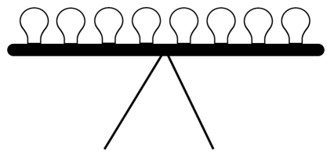
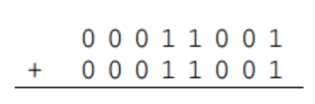
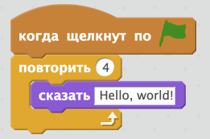
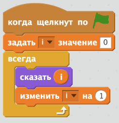
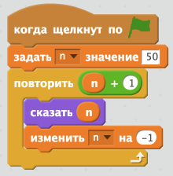
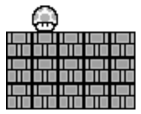

# Проверка знаний
#### Максимальное кол-во баллов 83

[Форма для заполнения ответов на тест](https://goo.gl/forms/whyenmQvcdfj2c202)

0. (2 балла). Рассмотрим «бинарные лампы» ниже, которые в совокупности представляют собой неотрицательное целое число.

    Каждая из лампочек представляет собой бит: лампочка, которая выключена, равна 0, а лампочка, которая включена, равна 1. Все лампы в настоящее время выключены. И самая правая лампочка представляет наименее значащий бит.

    

    Предположим, что вы хотите, чтобы эти лампочки представляли десятичное целое число 127. Включите необходимые лампочки, пометив любую лампочку, которая должна стать 1, например, заполнив ее ручкой или карандашом или напишите двоичное представление числа.

1. (1 балл). С 3 битами вы можете представить 8 различных значений. Почему же тогда 7 самое большое неотрицательное десятичное целое, которое вы можете представить 3 битами?

2. (1 балл). С *n* бит, сколько различных значений вы можете представить?

3. (1 балл). Сколько раз вы можете разорвать телефонную книгу из 128 страниц пополам, каждый раз выбрасывая одну из половинок, прежде чем останется только одна страница?

        a. 6
        b. 7
        c. 10
        d. 64

4. (2 балла). Преобразуйте двоичное число ниже в десятичное. Показать любую работу (т.е. любую арифметику).
    ```
    00110001
    ```

5. (1 балл). Выполните приведенный ниже расчет в двоичном формате. Показать какую-либо работу (т.е. перенос любых 1).

    

6. (2 балл). Значение ASCII `A` в двоичном выражении:

        1. 01000010.
        2. 10000010.
        3. 00100001.
        4. 01000001.

7. (4 балла). Рассмотрим скрипт на Scratch ниже.

    

    В приведенном ниже пространстве завершите перевод этого скрипта Scratch на программу C таким образом, чтобы его результат был эквивалентным. (Структура вашей программы не должна быть эквивалентной.) Предположим, что **сказать** - `printf`. Печатать `\n` после вывода каждой строки текста.

    ```c
    #include <cs50.h>
    #include <stdio.h>

    int main(void)
    {
    ```

8. (4 балла). Рассмотрим скрипт на Scratch ниже.

	

    В приведенном ниже пространстве завершите перевод этого скрипта Scratch на программу C таким образом, чтобы его результат был эквивалентным. (Структура вашей программы не обязательно должна быть эквивалентной.) Предположим, что **i** - это int, **сказать** - это `printf`, и что **изменить** означает увеличение. Выведите `\n` после вывода каждого int. Не беспокойтесь о переполнении целых чисел.

    ```c
    #include <cs50.h>
    #include <stdio.h>

    int main(void)
    {
    ```

9. (4 балла). Рассмотрим скрипт на Scratch ниже.

    

    В приведенном ниже пространстве завершите перевод этого скрипта Scratch на программу C таким образом, чтобы его результат был эквивалентным. (Структура вашей программы не обязательно должна быть эквивалентной.) Предположим, что **i** - это int, **сказать** - это `printf`, и что **изменить n на -1** означает  уменьшить. Выведите `\n` после вывода каждого int. Не беспокойтесь о переполнении целых чисел.
    ```c
    #include <stdio.h>

    int main(void)
    {
    ```

10. (6 баллов). Рассмотрим программу, `positive`, ниже.
    ```c
    #include <cs50.h>
    #include <stdio.h>

    int main(void)
    {
        printf("Positive integer please: ");
        int n = get_positive_int();
        printf("Thanks for the %i!\n", n);
    }
    ```
    Рассмотрим, как должна работать эта программа и, в свою очередь, `get_positive_int`, как показано ниже.
    ```
    /positive Positive integer please: -50
    Retry: 0
    Retry: 50
    Thanks for the 50!
    ```
    Если бы существовал только `get_positive_int`! Предположим, что вы хотите реализовать его для нас для следующей версии библиотеки CS50. Завершите реализацию `get_positive_int` ниже, используя `get_int` (который существует!) Таким образом, что вышеприведенная программа действительно будет вести себя на ввод и вывод как показано выше.
    ```c
    int get_positive_int(void)
    {
    ```

11. (4 балла). Рассмотрим программу ниже.
    ```c
    #include <cs50.h>
    #include <stdio.h>

    int main(void)
    {
        int n = GetInt();

        switch (n)
        {
            case 1:
            case 2:
                printf("small\n");
                break;

            case 3:
                printf("medium\n");
                break;

            case 4:
            case 5:
                printf("large\n");
                break;
        }
    }
    ```
    Завершите повторную реализацию этой программы ниже, не используя `switch` таким образом, чтобы она все еще вела себя точно так же.
    ```c
    #include <cs50.h>
    #include <stdio.h>

    int main(void)
    {
        int n = GetInt();
    ```

12. (4 балла). В начале World 3-7 в Super Mario Brothers 3 от Nintendo, Mario встречает сетку из кирпичей, 5 кирпичей в ширину на 3 кирпича в высоту, внутри которой жизнь! Ниже приведена скриншот.

    

    Если бы эта же сетка была напечатана (без гриба) как «искусство ASCII» с использованием хэшей (#) для кирпичей, она могла бы напоминать нижеследующую:
    ```
    #####
    #####
    #####
    ```
    Завершите реализацию `print_grid` в приведенной ниже программе таким образом, чтобы она выводила (через `printf`) сетку хэшей на указанную ширину и высоту (без гриба).

    ```c
    #include <stdio.h>

    void print_grid(int weight, int height);

    int main(void)
    {
        print_grid(5, 3);
    }

    void print_grid(int weight, int height)
    {
    ```


    Рассмотрим нижеприведенную программу, для которой номера строк были добавлены для обсуждения.

    ```c
    1  #include <cs50.h>
    2  #include <stdio.h>
    3
    4  int main(void)
    5  {
    6	    string s = get_string();
    7	    printf("hello, %s\n", s);
    8  }
    ```

13. (1 балл). Объясните, почему строка 1 присутствует.
14. (1 балл). Объясните, почему строка 2 присутствует.
15. (1 балл). Объясните, что означает void в строке 4.
16. (2 балла). Объясните, что касается памяти, именно то, что возвращает `get_string` в строке 6.

17. (2 балла). Рассмотрим программу ниже.

    ```c
    #include <stdio.h>

    int main(void)
    {
        printf("%.1f\n", 1 / 10);
    }
    ```
    После компиляции и выполнения эта программа выводит

    `0.0`

    хотя 1/10, безусловно, 0.1! Почему эта программа выводит 0.0?

18. (2 балла). Рассмотрим программу ниже.
    ```c
    #include <stdio.h>

    int main(void)
    {
        printf("%.28f\n", 0.1);
    }
    ```
    После компиляции и выполнения эта программа выводит

    `0.1000000000000000055511151231`

    хотя 0.1, безусловно, 0.1000000000000000000000000000! Почему эта программа выводит 0.1000000000000000055511151231?

19. (1 балл). Рассмотрим приведенный ниже код.
    ```c
    printf ("%i \n", 1 + 1);
    ```

    Предполагая, что он скомпилирован и выполнен (как часть какой-либо программы), точно, что напечатает эта строка?

20. (2 балла). Рассмотрим приведенный ниже код.
    ```c
    printf ("%i \n", '1' + '1');
    ```
    Предполагая, что он скомпилирован и выполнен (как часть некоторой программы), почему эта строка не печатает то же самое?

21. (3 балла). Завершите реализацию `odd` ниже таким образом, чтобы функция возвращала значение `true`, если `n` нечетно и `false`, если `n` четно.
    ```c
    bool odd(unsigned int n)
    {
    ```
22. (4 балла). Предположим, что вы не можете вспомнить заголовочный файл, в котором объявлен `toupper`, и поэтому вам нужно реализовать версию функции самостоятельно. Завершите реализацию `toupper` ниже таким образом, чтобы функция вернула c в верхнем регистре, если `c` - строчная (ASCII) буква, иначе она возвращает `c` без изменений. Напомним, что значение ASCII `a` больше, чем значение `A`. Вы не можете вызывать какие-либо функции в своей функции.
    ```c
    char toupper(char c)
    {
    ```
23. (2 балла). Сколько звездочек (*) будет выводить код ниже?
    ```c
    for (int i = 0; i > 0; i++)
        printf("*");
    ```
        1. 0
        2. 2^31 -1
        3. 2^32 -1
        4. бесконечность

24. (2 балла). Рассмотрим нижеприведенную программу, для которой номера строк были добавлены для обсуждения.
    ```c
    1 #include <stdio.h>
    2
    3 int main(void)
    4 {
    5     printf("This is Quiz 0.\n");
    6     return 0;
    7 }
    ```
    Ответьте не более чем на три предложения. Что означает `void` в строке 3?

25. (2 балла). Что такое переполнение целого числа?

26. (2 балла). Что такое переполнение буфера?

27. (6 баллов). Предположим, что вы забыли (как это происходит ежегодно), в каком заголовочном файле объявлен `strlen`, и поэтому вы должны повторно реализовать его самостоятельно. Завершите реализацию `strlen` ниже таким образом, чтобы она возвращала длину `s`. Предположим, что `s` не будет `NULL`. Предположим, что `s` будет завершено с помощью `\0`, что не считается частью его длины. Например, длина `hello` будет равна `5`. Не беспокойтесь о переполнении целых чисел.

    ```c
    int strlen (char *s)
    {
    ```

    Предположим, что вы столкнулись с сообщениями об ошибках на занятиях следующего года в качестве преподавателя! Посоветуйте, как исправить каждую из ошибок.

28. (2 балла). `undefined reference to 'get_string'`

29. (2 балла). `implicitly declaring library function 'strlen'`

30. (2 балла). `more '%' conversions than data arguments`

31. (2 балла). `definitely lost: 40 bytes in 1 blocks`

32. (2 балла). `Invalid write of size 4`

33. (2 балла). Почему шифр Вижнера более безопасен, чем Цезарь?

34. (1 балл). True или False: `NULL` - это специальный символ, который означает конец строки?

35. (1 балл). True или False: `make` - это компилятор.